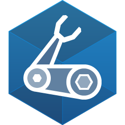

# Azure Landing Zones (ALZ) - Bicep

Welcome to the Azure Landing Zones Bicep repo.

Detailed information about how to use, deploy and extend artifacts found in this repo can be found on our Wiki:

- [Home][wiki_home]
- [Deployment Flow][wiki_deployment_flow]
  - [Network Topology: Hub and Spoke][wiki_deployment_flow_hs]
  - [Network Topology: Virtual WAN][wiki_deployment_flow_vwan]
- [Consumer Guide][wiki_consumer_guide]
- [How Does ALZ-Bicep Implement Azure Policies?][wiki_policy_deep_dive]
  - [Adding Custom Azure Policy Definitions][wiki_policy_defs]
  - [Assigning Azure Policies][wiki_policy_assignments]
- [Contributing][wiki_contributing]
- [Telemetry Tracking Using Customer Usage Attribution (PID)][wiki_cuaid]
- [Azure Container Registry Deployment - Private Bicep Registry][wiki_acrdeploy]
- [Frequently Asked Questions][wiki_faq]
- [Sample Pipelines][wiki_pipelines]
  - [GitHub Actions][wiki_pipelines_gh]
  - [Azure DevOps][wiki_pipelines_ado]
- [Code Tours][code_tours]

## Overview

The Azure Landing Zones Bicep repo provides an approach for deploying and managing the core platform capabilities of Cloud Adoption Framework Azure Landing Zones conceptual architecture using Bicep.

In its current incarnation each module can be deployed separately via command line but in future releases a more automated approach, via orchestration modules, will be published; but due to current Bicep & ARM limitations this is not possible today.

> Have you seen our page in the Azure Architecture Center here: [Azure landing zones - Bicep modules design considerations][aac_article]

## Getting Started

To get started with ALZ Bicep, please refer to the [Deployment Flow wiki page][wiki_deployment_flow] for:

1. Prerequisites and dependencies for the overall implementation.
2. High-level deployment flow.
3. Links to more detailed instructions on individual modules.

### Azure Enablement Show Videos

We have created a short 3-part series of video on the Azure Enablement Show that can be found below:

<!-- markdownlint-disable -->
#### Part 1 - Introduction to Azure Landing Zones Bicep

#### Part 2 - Azure Landing Zones Bicep - Enabling platform services

#### Part 3 - Azure Landing Zones Bicep - Enabling landing zones

<!-- markdownlint-restore -->
## Contributing

This project welcomes contributions and suggestions. Please review our [Contributing guide][wiki_contributing] in the Wiki. Once your PR is created and submitted a member of the team will triage, review and discuss with you 👍
Most contributions require you to agree to a
Contributor License Agreement (CLA) declaring that you have the right to, and actually do, grant us
the rights to use your contribution. For details, visit the [Microsoft Contributor License Agreement page](https://opensource.microsoft.com/cla/).
When you submit a pull request, a CLA bot will automatically determine whether you need to provide
a CLA and decorate the PR appropriately (e.g., status check, comment). Simply follow the instructions
provided by the bot. You will only need to do this once across all repos using our CLA.
This project has adopted the [Microsoft Open Source Code of Conduct](https://opensource.microsoft.com/codeofconduct/).
For more information see the [Code of Conduct FAQ](https://opensource.microsoft.com/codeofconduct/faq/) or
contact [opencode@microsoft.com](mailto:opencode@microsoft.com) with any additional questions or comments.

## Telemetry

When you deploy one or more modules in Azure Landing Zones Bicep repo, Microsoft can identify the installation of said module/s with the deployed Azure resources. Microsoft can correlate these resources used to support the software. Microsoft collects this information to provide the best experiences with their products and to operate their business. The telemetry is collected through customer usage attribution. The data is collected and governed by [Microsoft's privacy policies](https://www.microsoft.com/trustcenter).

If you don't wish to send usage data to Microsoft, details on how to turn it off can be found [here][wiki_cuaid].

## Trademarks

This project may contain trademarks or logos for projects, products, or services. Authorized use of Microsoft
trademarks or logos is subject to and must follow
[Microsoft's Trademark & Brand Guidelines](https://www.microsoft.com/legal/intellectualproperty/trademarks/usage/general).
Use of Microsoft trademarks or logos in modified versions of this project must not cause confusion or imply Microsoft sponsorship.
Any use of third-party trademarks or logos are subject to those third-party's policies.

## Security

If you believe you have found a security vulnerability in this repository, please refer to [this guide][vulnerability_reporting] on how to report it.

## Support

For support on the artifacts contained in this repository, please refer to [this guide][support_statement] for more details.

 [//]: # (************************)
 [//]: # (INSERT LINK LABELS BELOW)
 [//]: # (************************)

[wiki_home]:                                  https://github.com/Azure/ALZ-Bicep/wiki/home "Wiki - Home"
[wiki_deployment_flow]:                            https://github.com/Azure/ALZ-Bicep/wiki/DeploymentFlow "Wiki - Deployment Flow"
[wiki_deployment_flow_hs]:                            https://github.com/Azure/ALZ-Bicep/wiki/DeploymentFlowHS "Wiki - Deployment Flow - Hub and Spoke"
[wiki_deployment_flow_vwan]:                            https://github.com/Azure/ALZ-Bicep/wiki/DeploymentFlowVWAN "Wiki - Deployment Flow - Virtual WAN"
[wiki_consumer_guide]:                          https://github.com/Azure/ALZ-Bicep/wiki/ConsumerGuide "Wiki - Consumer Guide"
[wiki_policy_deep_dive]:                        https://github.com/Azure/ALZ-Bicep/wiki/PolicyDeepDive "Wiki - Policy Deep Dive"
[wiki_policy_defs]:                        https://github.com/Azure/ALZ-Bicep/wiki/AddingPolicyDefs "Wiki - Policy Definitions"
[wiki_policy_assignments]:                        https://github.com/Azure/ALZ-Bicep/wiki/AssigningPolicies "Wiki - Policy Assignments"
[wiki_contributing]:                          https://github.com/Azure/ALZ-Bicep/wiki/Contributing "Wiki - Contributing"
[wiki_cuaid]:                          https://github.com/Azure/ALZ-Bicep/wiki/CustomerUsage "Wiki - Telemetry Usage ID"
[wiki_acrdeploy]:                          https://github.com/Azure/ALZ-Bicep/wiki/ACRDeployment "Wiki - Private Bicep Registry"
[vulnerability_reporting]:                          https://github.com/Azure/ALZ-Bicep/blob/main/SECURITY.md "Vulnerability reporting"
[support_statement]:                          https://github.com/Azure/ALZ-Bicep/blob/main/SUPPORT.md "Microsoft Support Policy"
[wiki_faq]:                          https://github.com/Azure/ALZ-Bicep/wiki/FAQ "Wiki - FAQs"
[wiki_pipelines]:                          https://github.com/Azure/ALZ-Bicep/wiki/PipelinesOverview "Wiki - Sample Pipelines"
[wiki_pipelines_gh]:                          https://github.com/Azure/ALZ-Bicep/wiki/PipelinesGitHub "Wiki - Sample Pipelines - GitHub Actions"
[wiki_pipelines_ado]:                          https://github.com/Azure/ALZ-Bicep/wiki/PipelinesADO "Wiki - Sample Pipelines - Azure DevOps"
[code_tours]:                                   https://github.com/Azure/ALZ-Bicep/wiki/CodeTour "Wiki - Code tours"
[aac_article]:                                  https://docs.microsoft.com/azure/architecture/landing-zones/bicep/landing-zone-bicep "Azure Architecture Center - Azure landing zones - Bicep modules design considerations"
