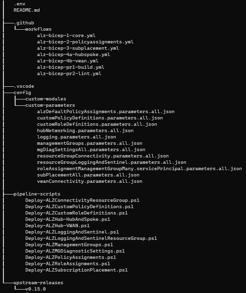

<!-- markdownlint-disable -->
## ALZ Bicep Accelerator
<!-- markdownlint-restore -->

> **Note:**
> This is an MVP release of the ALZ Bicep Accelerator. We are actively working on adding additional features and functionality to the Accelerator. Please check back often for updates.


This document provides prescriptive guidance around implementing, automating, and maintaining your ALZ Bicep module with the ALZ Bicep Accelerator.

### What is the ALZ Bicep Accelerator?

The ALZ Bicep Accelerator framework was developed to provide end-users with the following abilities:

- Allows for rapid onboarding and deployment of ALZ Bicep using full-fledged CI/CD pipelines with user provided input
  > **Note**
  > Currently we offer support for [GitHub Action Workflows](#getting-started-if-youre-using-github-actions) and [Azure DevOps Pipelines](#getting-started-if-youre-using-azure-devops-pipelines), but there are plans to add support for GitLab pipelines in the future
- Provides framework to not only stay in-sync with new [ALZ Bicep releases](https://github.com/Azure/ALZ-Bicep/releases), but also incorporates guidance around modifiying existing ALZ Bicep modules and/or associating custom modules to the framework
- Offers branching strategy guidance and pull request pipelines for linting the repository as well as validating any existing custom and/or modified Bicep modules
Accelerator Directory Tree:



### Overview of Included ALZ Deployment Pipelines

We attempted to make the pipelines as flexible as possible while also reducing overall complexity. Essentially, the ALZ Bicep Accelerator is made up four distinct deployment pipelines that represent different phases of the ALZ Bicep deployment. Each workflow shares a common set of workflow configurations and deployment scripts including the following:

- Event based triggers (i.e. pushes to main and path filters for each workflow associated Bicep parameter file)
- PowerShell deployment scripts for each module that are referenced within [Azure PowerShell Action](https://github.com/marketplace/actions/azure-powershell-action) steps
  - The PowerShell scripts reference the modules and parameter files used within the [deployment flow documentation](https://github.com/Azure/ALZ-Bicep/wiki/DeploymentFlow#module-deployment-sequence). Therefore, we recommend you review the deployment flow documentation to understand the purpose of each module and the parameters that are used within the deployment scripts.
- Environment variables file (.env) which is used to store variables that are accessed within the PowerShell scripts

The only thing that differs across the workflows is which ALZ Bicep modules are deployed as shown in the following table:

| Workflow Name            | Modules Deployed              |
|------------------------- |-------------------------------|
| ALZ-Bicep-1 Workflow | Management Groups Deployment, Logging and Sentinel Resource Group Deployment, Logging and Sentinel Deployment, Custom Policy Definitions Deployment, Custom Management Group Diagnostic Settings
| ALZ-Bicep-2 Workflow | Built-in and Custom Policy Assignments Deployment
| ALZ-Bicep-3 Workflow | Deploy Subscription Placement
| ALZ-Bicep-4a Workflow | Connectivity Resource Group Deployment, Hub (Hub-and-Spoke) Deployment
| ALZ-Bicep-4b Workflow | Connectivity Resource Group Deployment, Hub (VWAN) Deployment

### Getting Started if you're using GitHub Actions

In order to setup the Accelerator framework with the production GitHub Action Workflows, the following steps must be completed in the order listed:

1. Install the [ALZ PowerShell Module](https://github.com/Azure/ALZ-PowerShell-Module#installation) on your local development machine or within the Azure Cloud Shell using the following command:

    > **Warning:**
    > In order to use this module, [PowerShell 7.1 or higher](https://learn.microsoft.com/en-us/powershell/scripting/install/installing-powershell?view=powershell-7.3) needs to be installed

    ```powershell
    Install-Module -Name ALZ
    ```

1. Before you can utilize the module, ensure you have the prerequisites installed with the following command:

    ```powershell
    Test-ALZRequirement
    ```

    Currently this tests for:

    - Supported minimum PowerShell version
    - Azure PowerShell Module
    - Git
    - Azure CLI
    - Bicep

1. Create your ALZ Bicep Accelerator framework with the following command:

    ```powershell
    New-ALZEnvironment -o <output_directory>
    ```

    > **Note:**
    > If the directory structure specified for the output location does not exist, the module will create the directory structure programatically.
1. Depending upon your preferred [network topology deployment](https://github.com/Azure/Enterprise-Scale/wiki/ALZ-Setup-azure#2-grant-access-to-user-andor-service-principal-at-root-scope--to-deploy-enterprise-scale-reference-implementation),  remove the associated workflow file for each deployment model
    - Traditional VNet Hub and Spoke = .github\workflows\alz-bicep-4a.yml
    - Virtual WAN = .github\workflows\alz-bicep-4b.yml

    > **Note:**
    > These workflow files and associated deployment scripts will be programatically removed in the future.

1. Review all parameter files within config/custom-parameters and update the values as needed for your desired ALZ configuration.

1. Follow this [GitHub documentation](https://docs.github.com/en/enterprise-cloud@latest/get-started/quickstart/create-a-repo#create-a-repository) to create a new remote Git repository

1. If you need to authenticate Git from your local workstation or from the Azure Cloud Shell, please following the steps provided [here](https://docs.github.com/en/get-started/quickstart/set-up-git#authenticating-with-github-from-git). Otherwise, proceed to the next step.

1. Run the following Git commands to get your remote branch in-sync with the local branch

    ```shell
    # Matches the remote URL with a name
    git remote add origin https://github.com/<OrganizationName>/<RepositoryName>.git
    # Adds all changes in the working directory to the staging area.
    git add .
    # Records a snapshot of your repository's staging area.
    git commit -m "Initial commit"
    # Updates the remote branch with the local commit(s)
    git push -u origin main
    ```

1. Now that the remote branch has the latest commit(s), you can configure your OpenID Connect (OIDC) identity provider with GitHub which will give the workflows access to your Azure environment.
    1. [Create an Azure Active Directory application/service principal](https://learn.microsoft.com/en-us/azure/developer/github/connect-from-azure?tabs=azure-portal%2Cwindows#create-an-azure-active-directory-application-and-service-principal)
    1. [Add your federated credentials](https://learn.microsoft.com/en-us/azure/developer/github/connect-from-azure?tabs=azure-portal%2Cwindows#add-federated-credentials-preview)
    1. [Create GitHub secrets](https://learn.microsoft.com/en-us/azure/developer/github/connect-from-azure?tabs=azure-portal%2Cwindows#create-github-secrets)
        > **Note:**
        > The workflows reference secret names AZURE_TENANT_ID and AZURE_CLIENT_ID. If you choose to use different names, you will need to update the workflows accordingly.
    1. [Create RBAC Assignment for the application/service principal](https://github.com/Azure/Enterprise-Scale/wiki/ALZ-Setup-azure#2-grant-access-to-user-andor-service-principal-at-root-scope--to-deploy-enterprise-scale-reference-implementation)

1. All workflows are now ready to be deployed! For the initial deployment, manually trigger each workflow in the following order
    1. ALZ-Bicep-1 Workflow
    1. ALZ-Bicep-2 Workflow
    1. ALZ-Bicep-3 Workflow
    1. ALZ-Bicep-4a Workflow or ALZ-Bicep-4b Workflow

1. As part of the [branching strategy](#incoporating-a-branching-strategy), setup the branch protection rules against the main branch with the following selected as a starting point:

    - Require a pull request before merging
      - Require approvals
    - Require conversation resolution before merging
    - Do not allow bypassing the above settings

### Getting Started if you're using Azure DevOps Pipelines

In order to setup the Accelerator framework with the production ready Azure DevOps Pipelines, the following steps must be completed in the order listed:

1. Install the [ALZ PowerShell Module](https://github.com/Azure/ALZ-PowerShell-Module#installation) on your local development machine or within the Azure Cloud Shell using the following command:

    > **Warning:**
    > In order to use this module, [PowerShell 7.1 or higher](https://learn.microsoft.com/en-us/powershell/scripting/install/installing-powershell?view=powershell-7.3) needs to be installed

    ```powershell
    Install-Module -Name ALZ
    ```

1. Before you can utilize the module, ensure you have the prerequisites installed with the following command:

    ```powershell
    Test-ALZRequirement
    ```

    Currently this tests for:

    - Supported minimum PowerShell version
    - Azure PowerShell Module
    - Git
    - Azure CLI
    - Bicep

1. Create your ALZ Bicep Accelerator framework with the following command:

    ```powershell
    New-ALZEnvironment -o <output_directory> -cicd "azuredevops"
    ```

    > **Note:**
    > If the directory structure specified for the output location does not exist, the module will create the directory structure programatically.
1. Depending upon your preferred [network topology deployment](https://github.com/Azure/Enterprise-Scale/wiki/ALZ-Setup-azure#2-grant-access-to-user-andor-service-principal-at-root-scope--to-deploy-enterprise-scale-reference-implementation),  remove the associated workflow file for each deployment model
    - Traditional VNet Hub and Spoke = .azuredevops\workflows\alz-bicep-4a.yml
    - Virtual WAN = .azuredevops\workflows\alz-bicep-4b.yml

    > **Note:**
    > These workflow files and associated deployment scripts will be programatically removed in the future.

1. Review all parameter files within config/custom-parameters and update the values as needed for your desired ALZ configuration.

1. Create an [Azure Active Directory application/service principal](https://learn.microsoft.com/en-us/azure/azure-resource-manager/resource-group-create-service-principal-portal)

1. Create an [Azure Resource Manager Service Connection within Azure DevOps](https://learn.microsoft.com/en-us/azure/devops/pipelines/library/connect-to-azure?view=azure-devops#create-an-azure-resource-manager-service-connection-with-an-existing-service-principal) at the Scope Level of Management Group. All pipeline files, except for the PR pipeline files reference a variable called SERVICE_CONNECTION_NAME. You will need to update the variable with the name of the service connection you created within this step.

1. Create an [RBAC Assignment for the application/service principal](https://github.com/Azure/Enterprise-Scale/wiki/ALZ-Setup-azure#2-grant-access-to-user-andor-service-principal-at-root-scope--to-deploy-enterprise-scale-reference-implementation)

1. Follow this [Azure DevOps documentation](https://learn.microsoft.com/en-us/azure/devops/repos/git/create-new-repo?view=azure-devops#create-a-repo-using-the-web-portal) to create a new remote Git repository

1. If you need to authenticate Git from your local workstation or from the Azure Cloud Shell, please following the steps provided [here](https://learn.microsoft.com/en-us/azure/devops/repos/git/auth-overview?view=azure-devops). Otherwise, proceed to the next step.

1. Run the following Git commands to get your remote branch in-sync with the local branch

    ```shell
    # Matches the remote URL with a name
    git remote add origin https://dev.azure.com/<OrganizationName>/<ProjectName>/_git/<RepositoryName>
    # Adds all changes in the working directory to the staging area.
    git add .
    # Records a snapshot of your repository's staging area.
    git commit -m "Initial commit"
    # Updates the remote branch with the local commit(s)
    git push -u origin main

1. Create your new pipelines within Azure DevOps. Ensure you select "Existing Azure Pipelines YAML file" when prompted  and select the pipeline files from the .azuredevops/pipelines

1. [Assign pipeline permissions to access the Service Connection you created previously](https://learn.microsoft.com/en-us/azure/devops/pipelines/library/service-endpoints?view=azure-devops&tabs=yaml#pipeline-permissions)    ```

1. All pipelines are now ready to be deployed! For the initial deployment, manually trigger each workflow in the following order
    1. ALZ-Bicep-1 Workflow
    1. ALZ-Bicep-2 Workflow
    1. ALZ-Bicep-3 Workflow
    1. ALZ-Bicep-4a Workflow or ALZ-Bicep-4b Workflow

1. As part of the [branching strategy](#incoporating-a-branching-strategy), setup the branch protection rules against the main branch with the following selected as a starting point:

    - Require a pull request before merging
      - Require approvals
    - Require conversation resolution before merging
    - Do not allow bypassing the above settings

### Incoporating a Branching Strategy

Branching strategies offer the ability to manage and organize changes to a codebase, reduce errors, improve collaboration, and support best practices such as testing, continuous integration and deployment, and release management.

For this framework, we recommend utilizing the [GitHub Flow branching strategy](https://docs.github.com/en/get-started/quickstart/github-flow) which is a lightweight, branch-based workflow.


As part of the framework, we include two PR workflows. The pipelines will perform the following tasks:

| Workflow Name           | Trigger   | Tasks               |
|-------------------------|-----------|---------------------|
| ALZ-Bicep-PR-1 Workflow | Pull request against main branch and changes to any Bicep file or Bicep config file.             | Checks to see if there are any modified or custom modules residing within the config\custom-modules directory and if so, the workflow will lint the modules and ensure they can compile.
| ALZ-Bicep-PR-2 Workflow | Pull request against main branch. | Using [Super-Linter](https://github.com/github/super-linter), the workflow will lint everything in the codebase apart from the Bicep modules/files.

### Upgrading ALZ-Bicep Versions

The ALZ-Bicep repository regularly releases new [versions](https://github.com/Azure/ALZ-Bicep/releases). With each new release, the ALZ Bicep modules are updated to include new features and bug fixes. Therefore, we recommend that you upgrade to the latest version of ALZ Bicep as soon as possible.

With the ALZ Accelerator framework, we have designed the pipelines and directory structure to make it easy to upgrade to the latest ALZ Bicep version. The following steps will guide you through the upgrade process.

1. Prior to upgrading, read the release notes for the version you are upgrading to. The release notes will provide you with information on any breaking changes that may impact your deployment. This is especially important if you have created any custom modules or have [modified any of the ALZ Bicep modules](#incorporating-modified-alz-modules) that may have dependencies on the modules that are being upgraded.

1. Using the ALZ PowerShell Module, there is a cmdlet called `Get-ALZBicepRelease`. This will download a specified release version from the remote ALZ-Bicep repository and pull down to the local directory where your Accelerator framework was initially deployed.

    Here is an example of using the cmdlet to pull down version v0.15.0:

    ```powershell
    Get-ALZGithubRelease -githubRepoUrl "https://github.com/Azure/ALZ-Bicep" -releases "v0.15.0" -directoryForReleases "C:\Repos\ALZ\accelerator\upstream-releases\"
    ```

1. Once the ALZ Bicep release has been downloaded, you will need to update `upstream-releases-version` within the environment variables file (.env) with the version number of the release that you just downloaded. For example, if you downloaded v0.15.0, you would update the file with the following:

    ```text
    UPSTREAM_RELEASE_VERSION="v0.15.0"
    ```

1. You can now deploy the updated modules.

### Incorporating Modified ALZ Modules

We recommend that you do not modify the ALZ Bicep modules directly within the upstream-releases directory. Instead, we recommend that you copy the module file (e.g., logging.bicep, hubNetworking.bicep, etc.) that you would like to modify to the config\custom-modules directory. This will allow you to easily upgrade the ALZ Bicep version without having to worry about losing your customizations.

#### Example: Steps to follow for ALZ-Bicep Logging, Automation & Sentinel Module

1. Copy logging.bicep module file from upstream-releases directory to config\custom-modules directory

1. Modify the copied module file in custom-modules directory as needed. If new parameters are added to the module, you will need to update the relevant parameter file in the config\custom-parameters directory as well.

1. Update the config\custom-modules\logging.bicep file with the following comment at the top of the file:

    `// This module has been modified from the upstream-releases version <UpstreamReleaseVersion>`

1. Update the pipeline-scripts\Deploy-ALZLoggingAndSentinelResourceGroup.ps1 file and change the TemplateFile variable to point to the modified module file location as shown below:

    ```powershell
    [Parameter()]
    [String]$TemplateFile = "config\custom-modules\logging.bicep",
    ```

1. In order to trigger new deployments when subsequent changes are made, add the new module file path to the path-based filter workflow trigger in the ALZ-Bicep-1 workflow file as shown below:

    ```yaml
    on:
      push:
        paths:
          - "config/custom-modules/logging.bicep"
    ```

1. You are now ready to commit your changes to the main branch and trigger a new deployment.
