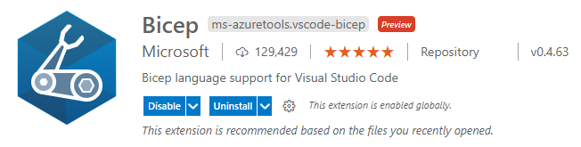
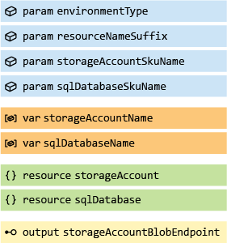

<!-- markdownlint-disable -->
## Contents
<!-- markdownlint-restore -->

- [Contents](#contents)
- [Recommended Learning](#recommended-learning)
  - [Bicep](#bicep)
  - [Git](#git)
- [Tooling](#tooling)
  - [Required Tooling](#required-tooling)
  - [Recommended Tooling](#recommended-tooling)
- [Bicep Formatting Guidelines](#bicep-formatting-guidelines)
  - [Bicep Best Practices](#bicep-best-practices)
  - [Bicep Code Styling](#bicep-code-styling)
  - [Bicep Elements Naming Standards](#bicep-elements-naming-standards)
  - [Bicep File Structure](#bicep-file-structure)
  - [Bicep File Structure Example](#bicep-file-structure-example)
- [Constructing a Bicep Module](#constructing-a-bicep-module)

---

Looking to contribute to this project, whether that be Bicep code, examples, documentation or GitHub automation, you are in the right place. Please review the rest of this wiki page for important information to help you to start contributing to the project effectively.

## Recommended Learning

Before you start contributing to the ALZ Bicep code, it is **highly recommended** that you complete the following Microsoft Learn paths, modules & courses:

### Bicep

- [Deploy and manage resources in Azure by using Bicep](https://docs.microsoft.com/learn/paths/bicep-deploy/)
- [Structure your Bicep code for collaboration](https://docs.microsoft.com/learn/modules/structure-bicep-code-collaboration/)
- [Manage changes to your Bicep code by using Git](https://docs.microsoft.com/learn/modules/manage-changes-bicep-code-git/)

### Git

- [Introduction to version control with Git](https://docs.microsoft.com/learn/paths/intro-to-vc-git/)

## Tooling

### Required Tooling

To contribute to this project the following tooling is required:

- [Git](https://git-scm.com/downloads)
- [Bicep](https://docs.microsoft.com/azure/azure-resource-manager/bicep/install#install-manually)
- [Visual Studio Code](https://code.visualstudio.com/download)
  - [Bicep extension for Visual Studio Code](https://marketplace.visualstudio.com/items?itemName=ms-azuretools.vscode-bicep)



### Recommended Tooling

The following tooling/extensions are recommended to assist you developing for the project:

- [CodeTour extension for Visual Studio Code](https://marketplace.visualstudio.com/items?itemName=vsls-contrib.codetour)
- [ARM Tools extension for Visual Studio Code](https://marketplace.visualstudio.com/items?itemName=msazurermtools.azurerm-vscode-tools)
- [ARM Template Viewer extension for Visual Studio Code](https://marketplace.visualstudio.com/items?itemName=bencoleman.armview)
- For visibility of Bracket Pairs:
  - Inside Visual Studio Code, add "editor.bracketPairColorization.enabled": true to your settings.json, to enable bracket pair colorization.

## Bicep Formatting Guidelines

The below guidelines should be adhered to whilst contributing to this projects Bicep code.

### Bicep Best Practices

Throughout the development of Bicep code you should follow the [Bicep Best Practices](https://docs.microsoft.com/azure/azure-resource-manager/bicep/best-practices).

> It is suggested to keep this page open whilst developing for easy reference

### Bicep Code Styling

- Strict `camelCasing` must be used for all elements:
  - Symbolic names for:
    - Parameters
    - Variables
    - Resource
    - Modules
    - Outputs
- All `par` and `out` values in Bicep templates should include full product name instead of `camelCased` abbreviation, for example: `parExpressRouteGwName` instead of `parErGwName`
- Services with "Azure" in the name are abbreviated "Az", for example: `parAzBastionName` instead of `parAzureBastionName`
- Use [parameter decorators](https://docs.microsoft.com/azure/azure-resource-manager/bicep/parameters#decorators) to ensure integrity of user inputs are complete and therefore enable successful deployment
  - Only use the [`@secure()` parameter decorator](https://docs.microsoft.com/azure/azure-resource-manager/bicep/parameters#secure-parameters) for inputs. Never for outputs as this is not stored securely and will be stored/shown as plain-text!
- Comments should be provided where additional information/description of what is happening is required, except when a decorator like `@description('Example description')` is providing adequate coverage
  - Single-line `// <comment here>` and multi-line `/* <comment here> */` comments are both welcomed
  - Provide contextual public Microsoft documentation recommendation references/URLs in comments to help user understanding of code implementation
- All expressions, used in conditionals and loops, should be stored in a variable to simplify code readability
- Specify default values for all parameters where possible - this improves deployment success
  - The default value should be called out in the description of the parameter for ease of visibility
  - Default values should also be documented in the appropriate location
- Tab indents should be set to `2` for all Bicep files
- Double line-breaks should exist between each element type section
- When intended for scopes above resource group deployment, targetScope should be indicated at the beginning of the file


### Bicep Elements Naming Standards

| Element Type | Naming Prefix | Example                                                              |
| :----------: | :-----------: | :------------------------------------------------------------------- |
|  Parameters  |     `par`     | `parLocation`, `parManagementGroupsNamePrefix`                       |
|  Variables   |     `var`     | `varConditionExpression`, `varIntermediateRootManagementGroupName`   |
|  Resources   |     `res`     | `resIntermediateRootManagementGroup`, `resResourceGroupLogAnalytics` |
|   Modules    |     `mod`     | `modManagementGroups`, `modLogAnalytics`                             |
|   Outputs    |     `out`     | `outIntermediateRootManagementGroupID`, `outLogAnalyticsWorkspaceID` |

### Bicep Common Parameters Naming Standards

The below guidelines should be adhered to whilst contributing to this projects Bicep code.

- `parLocation`
  - Shall be used for all module parameters specifying the Azure region to which a resource or module will be deployed.
  - The only exception to this is when two inter-related services do not have region parity and need to be deployed to different regions. (i.e. Log Analytics and Automation Accounts in China. See logging module for an example)

### Bicep File Structure

For all Bicep files created as part of this project they will follow the structure pattern of being grouped by element type, this is shown in the image below:



> Parameters, Variables, Resources, Modules & Outputs are all types of elements.

### Bicep File Structure Example

Below is an example of Bicep file complying with the structure and styling guidelines specified above:

```bicep
// SCOPE
targetScope = 'subscription' //Deploying at Subscription scope to allow resource groups to be created and resources in one deployment


// PARAMETERS
@description('Example description for parameter. - DEFAULT VALUE: "TEST"')
param parExampleResourceGroupNamePrefix string = 'TEST'


// VARIABLES
var varExampleResourceGroupName = 'rsg-${parExampleResourceGroupNamePrefix}' // Create name for the example resource group


// RESOURCE DEPLOYMENTS 
resource resExampleResourceGroup 'Microsoft.Resources/resourceGroups@2021-04-01' = {
  name: varExampleResourceGroupName
  location: 'uksouth' // Hardcoded as an example of commenting inside a resource
}

/* 
No modules being deployed in this example
*/


// OUTPUTS
output outResourceGroupExampleID string = resExampleResourceGroup.id

```

## Constructing a Bicep Module

To author Bicep modules that are in-line with the requirements for this project, the following must be true:

- Follows the [Bicep Formatting Guidelines](#bicep-formatting-guidelines) as detailed above
- A new folder per module in the following directory: `infra-as-code/bicep/modules/...`
  - Folder Name will be created with camel case: `infra-as-code/bicep/modules/moduleName`
- Each new module folder must contain:
  - A `media` folder that will contain images used in the `README.md`
  - A `README.md` for each module in the root of its own folder, as above, detailing the module, what it deploys, parameters and any other useful information for consumers.
    - The `README.md` must also contain a Bicep visualizer image of the complete module
  - A `bicepconfig.json` for each module in the root of its own folder.
    - [Bicep Linting Documentation](https://docs.microsoft.com/azure/azure-resource-manager/bicep/linter)
    - The `bicepconfig.json` file should contain the following:

      ```json
            {
              "analyzers": {
                "core": {
                  "enabled": true,
                  "verbose": true,
                  "rules": {
                    "adminusername-should-not-be-literal": {
                      "level": "error"
                    },
                    "no-hardcoded-env-urls": {
                      "level": "error"
                    },
                    "no-unnecessary-dependson": {
                      "level": "error"
                    },
                    "no-unused-params": {
                      "level": "error"
                    },
                    "no-unused-vars": {
                      "level": "error"
                    },
                    "outputs-should-not-contain-secrets": {
                      "level": "error"
                    },
                    "prefer-interpolation": {
                      "level": "error"
                    },
                    "secure-parameter-default": {
                      "level": "error"
                    },
                    "simplify-interpolation": {
                      "level": "error"
                    },
                    "protect-commandtoexecute-secrets": {
                      "level": "error"
                    },
                    "use-stable-vm-image": {
                      "level": "error"
                    },
                    "explicit-values-for-loc-params": {
                      "level": "error"
                    },
                    "no-hardcoded-location": {
                      "level": "error"
                    },
                    "no-loc-expr-outside-params": {
                      "level": "error"
                    },
                    "max-outputs": {
                      "level": "error"
                    },
                    "max-params": {
                      "level": "error"
                    },
                    "max-resources": {
                      "level": "error"
                    },
                    "max-variables": {
                      "level": "error"
                    }
                  }
                }
              }
            }
      ```

  - The Bicep module file
  - A `parameters` folder that will contain the parameters files for the module
  - Parameters `...all.json` and `...min.json` files based on file naming convention below
  - Parameter files should be named according to the convention: `<module>.<parameterSet>.parameters.<min|all>.json`
    - `<module>` denotes the current module (and scope when necessary), for example: `roleAssignmentManagementGroup`
    - `<parameterSet>` denotes a set of parameters with similar characteristics, for example: `securityGroup`
    - `parameters` constant to denote the file as a parameters file
    - `<min|all>.json` denotes whether a parameter file contains all possible parameters or only minimum necessary for deployment
