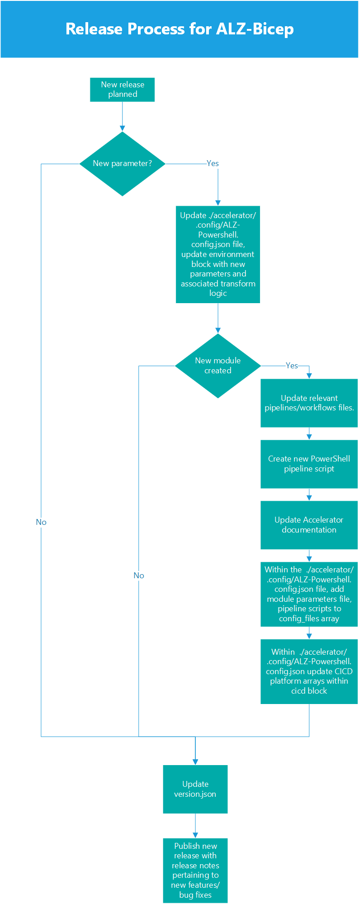

<!-- markdownlint-disable -->
## Contents
<!-- markdownlint-restore -->

- [Contents](#contents)
- [Recommended Learning](#recommended-learning)
  - [Bicep](#bicep)
  - [Git](#git)
- [Tooling](#tooling)
  - [Required Tooling](#required-tooling)
  - [Recommended Tooling](#recommended-tooling)
- [Bicep Formatting Guidelines](#bicep-formatting-guidelines)
  - [Bicep Best Practices](#bicep-best-practices)
  - [Bicep Code Styling](#bicep-code-styling)
  - [Bicep Elements Naming Standards](#bicep-elements-naming-standards)
  - [Bicep Common Parameters Naming Standards](#bicep-common-parameters-naming-standards)
  - [Bicep File Structure](#bicep-file-structure)
  - [Bicep File Structure Example](#bicep-file-structure-example)
- [Constructing a Bicep Module](#constructing-a-bicep-module)
  - [Resource API Versions](#resource-api-versions)

---

Looking to contribute to this project, whether that be Bicep code, examples, documentation or GitHub automation, you are in the right place. Please review the rest of this wiki page for important information to help you to start contributing to the project effectively.

## Recommended Learning

Before you start contributing to the ALZ Bicep code, it is **highly recommended** that you complete the following Microsoft Learn paths, modules & courses:

### Bicep

- [Deploy and manage resources in Azure by using Bicep](https://learn.microsoft.com/learn/paths/bicep-deploy/)
- [Structure your Bicep code for collaboration](https://learn.microsoft.com/learn/modules/structure-bicep-code-collaboration/)
- [Manage changes to your Bicep code by using Git](https://learn.microsoft.com/learn/modules/manage-changes-bicep-code-git/)

### Git

- [Introduction to version control with Git](https://learn.microsoft.com/learn/paths/intro-to-vc-git/)

## Tooling

### Required Tooling

To contribute to this project the following tooling is required:

- [Git](https://git-scm.com/downloads)
- [Bicep](https://learn.microsoft.com/azure/azure-resource-manager/bicep/install#install-manually)
- [Visual Studio Code](https://code.visualstudio.com/download)
  - [Bicep extension for Visual Studio Code](https://marketplace.visualstudio.com/items?itemName=ms-azuretools.vscode-bicep)
  - [EditorConfig for VS Code](https://marketplace.visualstudio.com/items?itemName=EditorConfig.EditorConfig)


### Recommended Tooling

The following tooling/extensions are recommended to assist you developing for the project:

- [CodeTour extension for Visual Studio Code](https://marketplace.visualstudio.com/items?itemName=vsls-contrib.codetour)
- [ARM Tools extension for Visual Studio Code](https://marketplace.visualstudio.com/items?itemName=msazurermtools.azurerm-vscode-tools)
- [ARM Template Viewer extension for Visual Studio Code](https://marketplace.visualstudio.com/items?itemName=bencoleman.armview)
- [PSRule extension for Visual Studio Code](https://marketplace.visualstudio.com/items?itemName=bewhite.psrule-vscode)
- [EditorConfig for VS Code](https://marketplace.visualstudio.com/items?itemName=EditorConfig.EditorConfig)
- For visibility of Bracket Pairs:
  - Inside Visual Studio Code, add `editor.bracketPairColorization.enabled`: true to your `settings.json`, to enable bracket pair colorization.

## Bicep Formatting Guidelines

The below guidelines should be adhered to whilst contributing to this projects Bicep code.

### Bicep Best Practices

Throughout the development of Bicep code you should follow the [Bicep Best Practices](https://learn.microsoft.com/azure/azure-resource-manager/bicep/best-practices).

> It is suggested to keep this page open whilst developing for easy reference

### Bicep Code Styling

- Strict `camelCasing` must be used for all elements:
  - Symbolic names for:
    - Parameters
    - Variables
    - Resource
    - Modules
    - Outputs
- All `par` and `out` values in Bicep templates should include full product name instead of `camelCased` abbreviation, for example: `parExpressRouteGwName` instead of `parErGwName`
- Services with "Azure" in the name are abbreviated "Az", for example: `parAzBastionName` instead of `parAzureBastionName`
- Use [parameter decorators](https://learn.microsoft.com/azure/azure-resource-manager/bicep/parameters#decorators) to ensure integrity of user inputs are complete and therefore enable successful deployment
  - Only use the [`@secure()` parameter decorator](https://learn.microsoft.com/azure/azure-resource-manager/bicep/parameters#secure-parameters) for inputs. Never for outputs as this is not stored securely and will be stored/shown as plain-text!
- A description is required on parameters to provide an explanation into their function. As metadata is used in Bicep modules, `sys.description('description here')` is the chosen formatting. More information can be found in the [Azure Bicep documentation](https://learn.microsoft.com/azure/azure-resource-manager/bicep/parameters#decorators)
- Comments should be provided where additional information/description of what is happening is required, except when a decorator like `@sys.description('Example description')` is providing adequate coverage
  - Single-line `// <comment here>` and multi-line `/* <comment here> */` comments are both welcomed
  - Provide contextual public Microsoft documentation recommendation references/URLs in comments to help user understanding of code implementation
- All expressions, used in conditionals and loops, should be stored in a variable to simplify code readability
- Specify default values for all parameters where possible - this improves deployment success
  - The default value should be called out in the description of the parameter for ease of visibility
  - Default values should also be documented in the appropriate location
- Tab indents should be set to `2` for all Bicep files
- Double line-breaks should exist between each element type section
- When intended for scopes above resource group deployment, targetScope should be indicated at the beginning of the file

### Bicep Elements Naming Standards

| Element Type | Naming Prefix | Example                                                              |
| :----------: | :-----------: | :------------------------------------------------------------------- |
|  Parameters  |     `par`     | `parLocation`, `parManagementGroupsNamePrefix`                       |
|  Variables   |     `var`     | `varConditionExpression`, `varIntermediateRootManagementGroupName`   |
|  Resources   |     `res`     | `resIntermediateRootManagementGroup`, `resResourceGroupLogAnalytics` |
|   Modules    |     `mod`     | `modManagementGroups`, `modLogAnalytics`                             |
|   Outputs    |     `out`     | `outIntermediateRootManagementGroupID`, `outLogAnalyticsWorkspaceID` |

### Bicep Common Parameters Naming Standards

The below guidelines should be adhered to whilst contributing to this projects Bicep code.

- `parLocation`
  - Shall be used for all module parameters specifying the Azure region to which a resource or module will be deployed.
  - The only exception to this is when two inter-related services do not have region parity and need to be deployed to different regions. (i.e. Log Analytics and Automation Accounts in China. See logging module for an example)

### Bicep File Structure

For all Bicep files created as part of this project they will follow the structure pattern of being grouped by element type, this is shown in the image below:


> Parameters, Variables, Resources, Modules & Outputs are all types of elements.

### Bicep File Structure Example

Below is an example of Bicep file complying with the structure and styling guidelines specified above:

```bicep
// SCOPE
targetScope = 'subscription' //Deploying at Subscription scope to allow resource groups to be created and resources in one deployment


// PARAMETERS
@sys.description('Example description for parameter. - DEFAULT VALUE: "TEST"')
param parExampleResourceGroupNamePrefix string = 'TEST'


// VARIABLES
var varExampleResourceGroupName = 'rsg-${parExampleResourceGroupNamePrefix}' // Create name for the example resource group


// RESOURCE DEPLOYMENTS
resource resExampleResourceGroup 'Microsoft.Resources/resourceGroups@2021-04-01' = {
  name: varExampleResourceGroupName
  location: 'uksouth' // Hardcoded as an example of commenting inside a resource
}

/*
No modules being deployed in this example
*/


// OUTPUTS
output outResourceGroupExampleID string = resExampleResourceGroup.id

```

## Constructing a Bicep Module

To author Bicep modules that are in-line with the requirements for this project, the following must be true:

- Follows the [Bicep Formatting Guidelines](#bicep-formatting-guidelines) as detailed above
- A new folder per module in the following directory: `infra-as-code/bicep/modules/...`
  - Folder Name will be created with camel case: `infra-as-code/bicep/modules/moduleName`
- Each new module folder must contain:
  - A `media` folder that will contain images used in the `README.md`
  - A `README.md` for each module in the root of its own folder, as above, detailing the module, what it deploys and any other useful information for consumers.
    - The `README.md` must also contain a Bicep visualizer image of the complete module
  - Parameter detail files are automatically generated in the `generateddocs` folder of each module after contributing to the repository. A link in the `README.md` file must be created.
  - When contributing a module to the repository, anticipate creation of the markdown for the parameters. To link to the parameters after contribution, use the following structure in the parameters section of the readme:

`- [Link to Azure Commercial Cloud/Azure China Cloud](generateddocs/<NAME-OF-BICEP-MODULE-FILE.bicep.md)`

### Parameter Markdown Generation Workflow

On your Pull Request (PR), the following steps will happen:
- PR is created.
- GitHub Action [Workflow](https://github.com/Azure/ALZ-Bicep/blob/main/.github/workflows/psdocs-mdtogit.yml) initialises.
  - The PR Branch is checked out.
  - A `Bicep Build` is run on each of the modules.
  - PSDocs For Azure generates a markdown file against each of the built JSON files in the module folders.
  - A `generateddocs` folder is created in each of the modules.
  - The markdown files are stored in this folder for each of the modules.
  - Removal of the JSON files from the Bicep Build task is done.
  - A git status and push is then done to the same PR for the created/updated generated documentation to complete the workflow.

### Manually Generating the Parameter Markdown Files

Sometimes the Parameter Markdown Generation Workflow may fail due to you not allowing maintainers to push to your PR as documented [here](https://docs.github.com/pull-requests/collaborating-with-pull-requests/working-with-forks/allowing-changes-to-a-pull-request-branch-created-from-a-fork). Or you may not wish to grant this permission but instead generate the documentation manually by running the below PowerShell Script (this is taken from the GitHub Action [Workflow](https://github.com/Azure/ALZ-Bicep/blob/main/.github/workflows/psdocs-mdtogit.yml).

To do this copy and run the below PowerShell Script in your PR Branch and then stage and commit the files that are generated/updated once it has ran and completed. **You need to be in the root of the ALZ-Bicep repo directory you have cloned to your machine and on the correct branch that your are working on for the PR before running the script!**

> Please note the script will try to install the `PSDocs.Azure` PowerShell Module as this is a requirement. You can install it by running the command `Install-Module -Name 'PSDocs.Azure' -Repository PSGallery -Force` or by following the instructions [here](https://azure.github.io/PSDocs.Azure/install-instructions/#installing-locally)

```powershell
# Build all Bicep Files in the infra-as-code/bicep/modules/ directory
Get-ChildItem -Recurse -Path infra-as-code/bicep/modules/ -Filter '*.bicep' -Exclude 'callModuleFromACR.example.bicep', 'orchHubSpoke.bicep' | ForEach-Object {
  Write-Information "==> Attempting Bicep Build For File: $_" -InformationAction Continue
  $output = bicep build $_.FullName 2>&1
  if ($LastExitCode -ne 0) {
    throw $output
  }
  Else {
    Write-Host $output
  }
}

# Generate Markdown Documentation for all Bicep Files
# Scan for Azure template file recursively in the infra-as-code/bicep/modules/ directory
Get-AzDocTemplateFile -Path infra-as-code/bicep/modules/ | ForEach-Object {
  # Generate a standard name of the markdown file. i.e. <name>_<version>.md
  $template = Get-Item -Path $_.TemplateFile;
  $templateraw = Get-Content -Raw -Path $_.Templatefile;
  $docNameWithoutExtension = [System.IO.Path]::GetFileNameWithoutExtension($template.Name);
  $jobj = ConvertFrom-Json -InputObject $templateraw
  $outputpathformds = $template.DirectoryName + '/generateddocs'
  New-Item -Path $outputpathformds -ItemType Directory -Force
  # Conversion
  $templatepath = $template.DirectoryName
  $convertedtemplatename = $template.Name
  $convertedfullpath = $templatepath + "\" + $convertedtemplatename
  $jobj | ConvertTo-Json -Depth 100 | Set-Content -Path $convertedfullpath
  $mdname = ($docNameWithoutExtension) + '.bicep'
  # Generate markdown
  Invoke-PSDocument -Module PSDocs.Azure -OutputPath $outputpathformds -InputObject $template.FullName -InstanceName $mdname -Culture en-US;
}

# Remove all generated JSON files from the Bicep Build
Get-ChildItem -Recurse -Path infra-as-code/bicep/modules/ -Filter '*.json' -Exclude 'bicepconfig.json', '*.parameters.json', '*.parameters.*.json', 'policy_*' | ForEach-Object {
  Write-Information "==> Removing generated JSON file $_ from Bicep Build" -InformationAction Continue
  Remove-Item -Path $_.FullName
}
```

> **IMPORTANT:** Once the workflow has finished all it should of generated/updated is `.md` files and nothing else. Please carefully check the git changes it has made before staging and committing anything.

### `bicepconfig.json`

- A `bicepconfig.json` for each module in the root of its own folder **is no longer required**, as we have a central one in `./infra-as-code/bicep/bicepconfig.json` to help keep maintenance simplified.
  - There are still separate `bicepconfig.json` files for networking related modules, due to specific overrides required to some linter rules
  - If you are facing linter errors that justify a override then please create a `bicepconfig.json` in the root of the module's directory to configure the override of the rules from the central one in `./infra-as-code/bicep/bicepconfig.json` by following the [Bicep Linting Documentation](https://learn.microsoft.com/azure/azure-resource-manager/bicep/linter)
- The Bicep module file itself
- A `parameters` folder that will contain the parameters files for the module
- Parameters `...all.json` and `...min.json` files based on file naming convention below
- Parameter files should be named according to the convention: `<module>.<parameterSet>.parameters.<min|all>.json`
  - `<module>` denotes the current module (and scope when necessary), for example: `roleAssignmentManagementGroup`
  - `<parameterSet>` denotes a set of parameters with similar characteristics, for example: `securityGroup`
  - `parameters` constant to denote the file as a parameters file
  - `<min|all>.json` denotes whether a parameter file contains all possible parameters or only minimum necessary for deployment

### Resource API Versions

Each resource must use the latest available, working, API version. If the latest API version cannot be used for any reason, a comment must be placed above the resource in the module file stating why and also called out as part of the PR.

> The Bicep linter rule `use-recent-api-versions` will now also check for this 👍

### Release Process Diagram

When adding new parameters to a module, changing existing parameter names, or creating a new module, there are some additional steps that must be considered to ensure the [Accelerator](https://github.com/Azure/ALZ-Bicep/wiki/Accelerator) and the associated [ALZ-PowerShell-Module](https://github.com/Azure/Alz-powershell-module) remain in-sync. The following diagram outlines the steps for release process and provides additional context for changes that may be required:


