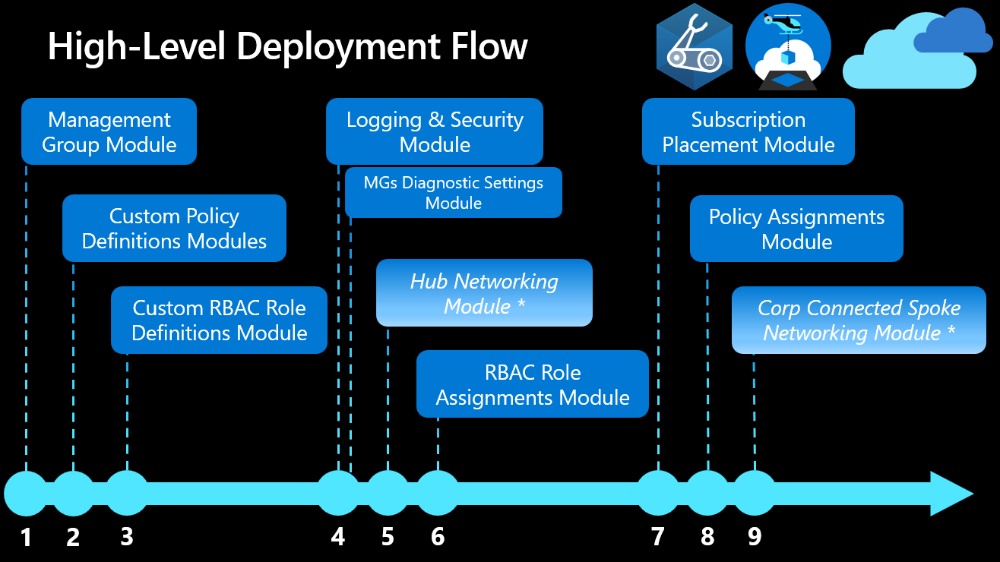

<!-- markdownlint-disable -->
## Azure Landing Zones Bicep - Deployment Flow
<!-- markdownlint-restore -->

This document outlines the prerequisites, dependencies and flow to help orchestrate an end-to-end Azure Landing Zone deployment.  The orchestration templates provided with this reference implementation have been pre-configured to follow the dependencies described in this document.

> Have you seen our page in the Azure Architecture Center here: [Azure landing zones - Bicep modules design considerations](https://learn.microsoft.com/azure/architecture/landing-zones/bicep/landing-zone-bicep).

## Azure Enablement Show Videos

We have created a short 3-part series of video on the Azure Enablement Show that can be found below:
<!-- markdownlint-disable -->
### Part 1 - Introduction to Azure Landing Zones Bicep

### Part 2 - Azure Landing Zones Bicep - Enabling platform services

### Part 3 - Azure Landing Zones Bicep - Enabling landing zones

<!-- markdownlint-restore -->

## Prerequisites

1. Microsoft Entra Tenant.
2. Minimum 1 subscription.  Subscription(s) are required when configuring `Log Analytics Workspace` & `Hub Networking` services.  Each can be deployed in the same subscription or separate subscriptions based on deployment requirements.
3. Deployment Identity with `Owner` permission to the `/` root management group.  Owner permission is required to allow the Service Principal Account to create role-based access control assignments.  See [configuration instructions below](#deployment-identity).

## High Level Deployment Flow

*To use with the network topology of your choice. See [network topology deployment instructions below](#network-topology-deployment).

## Module Deployment Sequence

Modules in this reference implementation must be deployed in the following order to ensure consistency across the environment:

| Order | Module                                 | Description                                                                                                                                                                 | Prerequisites                                                          | Module Documentation                                                                                                                                                  |
| :---: | -------------------------------------- | --------------------------------------------------------------------------------------------------------------------------------------------------------------------------- | ---------------------------------------------------------------------- | --------------------------------------------------------------------------------------------------------------------------------------------------------------------- |
|   1   | Management Groups                      | Configures the management group hierarchy to support Azure Landing Zone reference implementation.                                                                           | Owner role assignment at `/` root management group.                    | [infra-as-code/bicep/modules/managementGroups](https://github.com/Azure/ALZ-Bicep/tree/main/infra-as-code/bicep/modules/managementGroups)                             |
|   2   | Custom Policy Definitions              | Configures Custom Policy Definitions at the `organization management group`.                                                                                                | Management Groups.                                                     | [infra-as-code/bicep/modules/policy/definitions](https://github.com/Azure/ALZ-Bicep/tree/main/infra-as-code/bicep/modules/policy/definitions)                         |
|   3   | Custom Role Definitions                | Configures custom roles based on Cloud Adoption Framework's recommendations at the `organization management group`.                                                         | Management Groups.                                                     | [infra-as-code/bicep/modules/customRoleDefinitions](https://github.com/Azure/ALZ-Bicep/tree/main/infra-as-code/bicep/modules/customRoleDefinitions)                   |
|   4   | Logging & Sentinel                     | Configures a centrally managed Log Analytics Workspace, Automation Account and Sentinel in the `Logging` subscription.                                                      | Management Groups & Subscription for Log Analytics and Sentinel.       | [infra-as-code/bicep/modules/logging](https://github.com/Azure/ALZ-Bicep/tree/main/infra-as-code/bicep/modules/logging)                                               |
|  4.1  | Management Groups Diagnostic Settings  | Enable Diagnostic Settings for management Groups to the Log Analytics Workspace created in the `Logging` subscription.                                    | Management Groups & Log Analytics Workspace.       | [infra-as-code/bicep/orchestration/mgDiagSettingsAll](https://github.com/Azure/ALZ-Bicep/tree/main/infra-as-code/bicep/orchestration/mgDiagSettingsAll)                                               |
|   5   | Hub Networking                         | Azure supports two types of hub-and-spoke design, VNet hub and Virtual WAN hub. Creates resources in the `Connectivity` subscription.                                       | Management Groups, Subscription for Hub Networking.                    | [See network topology deployment below](#network-topology-deployment)                                                                                                 |
|   6   | Role Assignments                       | Creates role assignments using built-in and custom role definitions.                                                                                                        | Management Groups & Subscriptions.                                     | [infra-as-code/bicep/modules/roleAssignments](https://github.com/Azure/ALZ-Bicep/tree/main/infra-as-code/bicep/modules/roleAssignments)                               |
|   7   | Subscription Placement                 | Moves one or more subscriptions (based on IDs) to the target Management Groups in your ALZ hierarchy.                                                                       | Management Groups & Subscriptions.                                     | [infra-as-code/bicep/orchestration/subPlacementAll](https://github.com/Azure/ALZ-Bicep/tree/main/infra-as-code/bicep/orchestration/subPlacementAll)                   |
|   8   | Built-In and Custom Policy Assignments | Creates policy assignments to provide governance at scale.                                                                                                                  | Management Groups, Log Analytics Workspace & Custom Policy Definitions | [infra-as-code/bicep/modules/policy/assignments/alzDefaults](https://github.com/Azure/ALZ-Bicep/tree/main/infra-as-code/bicep/modules/policy/assignments/alzDefaults) |
|   9   | Spoke Networking                       | Creates Spoke networking infrastructure for workloads with Virtual Network Peering (optional) to support Hub & Spoke network topology or Virtual Hub Connection (optional). | Management Groups, Hub Networking & Subscription for spoke networking  | [See network topology deployment below](#network-topology-deployment)                                                                                                 |

## Network Topology Deployment

You can decide which network topology to implement that meets your requirements. Please review the network topologies [here](https://learn.microsoft.com/azure/cloud-adoption-framework/ready/azure-best-practices/define-an-azure-network-topology). The following lists examples of network topology deployment based on the recommended enterprise-scale architecture:

- [Traditional VNet Hub and Spoke](https://github.com/Azure/ALZ-Bicep/wiki/DeploymentFlowHS) - Supports communication, shared resources and centralized security policy.
- [Virtual WAN](https://github.com/Azure/ALZ-Bicep/wiki/DeploymentFlowVWAN) - Supports large-scale branch-to-branch and branch-to-Azure communications.

### What if we have no "hub" or don't need one?

If in your networking topology there is no concept of a hub then you can use either the [Hub Networking Module](https://github.com/Azure/ALZ-Bicep/tree/main/infra-as-code/bicep/modules/hubNetworking), if you require deploying resource like Azure Firewall, Bastion, VPN/ExpressRoute Gateways etc., **or** the [Spoke Networking Module](https://github.com/Azure/ALZ-Bicep/tree/main/infra-as-code/bicep/modules/spokeNetworking) to just deploy your spoke networking infrastructure based on your requirements.

## Orchestration Modules

We have some orchestration modules (Bicep files that wrap/call other Bicep modules) available to help simplify and reduce the number of deployments. These are completely optional to use but may be useful for your requirements.

> If you have any suggestions for additional orchestration modules please raise a [feature request](https://github.com/Azure/ALZ-Bicep/issues/new?assignees=&labels=enhancement&template=feature-request---.md&title=%F0%9F%92%A1+Feature+Request+-+PLEASE+CHANGE+ME+TO+SOMETHING+DESCRIPTIVE)

The current available orchestration modules are listed below:

| Module          | Description                                                                                                                                                                                                                                                                                                                                                                                                            | Module Documentation                                                                                                                                |
| --------------- | ---------------------------------------------------------------------------------------------------------------------------------------------------------------------------------------------------------------------------------------------------------------------------------------------------------------------------------------------------------------------------------------------------------------------- | --------------------------------------------------------------------------------------------------------------------------------------------------- |
| hubPeeredSpoke  | Creates Spoke networking infrastructure for workloads with Virtual Network Peering (optional) to support Hub & Spoke network topology or Virtual Hub Connection (optional). Also can optionally place Subscription in specified Management Group, create VNet Peering in both directions, create UDR and configure a next hop IP for the default route (`0.0.0.0/0`) ***Review docs of module for more information.*** | [infra-as-code/bicep/orchestration/hubPeeredSpoke](https://github.com/Azure/ALZ-Bicep/tree/main/infra-as-code/bicep/orchestration/hubPeeredSpoke)   |
| subPlacementAll | Moves Subscription IDs that are passed in via the input parameters to the specified Management Group. Useful to have a single module's parameters that are updated over time and can be tracked in git, etc.                                                                                                                                                                                                           | [infra-as-code/bicep/orchestration/subPlacementAll](https://github.com/Azure/ALZ-Bicep/tree/main/infra-as-code/bicep/orchestration/subPlacementAll) |
| mgDiagSettingsAll | Enables Diagnostic Settings to the Log Analytics Workspace created in the Logging subscription for the Management Groups that are passed in via the input parameters.                                                                                                                                                                                                           | [infra-as-code/bicep/orchestration/mgDiagSettingsAll](https://github.com/Azure/ALZ-Bicep/tree/main/infra-as-code/bicep/orchestration/mgDiagSettingsAll) |

> Orchestration modules to deliver the entire ALZ deployment in a single Bicep file are on our backlog and being worked on, stay tuned!

## Deployment Identity

When first working with Management Groups, the Microsoft Entra Global Administrator must assign the User Access Administrator role to themselves at the `/` scope first before being able to further delegate. See [Elevate access to manage all Azure subscriptions and management groups](https://learn.microsoft.com/azure/role-based-access-control/elevate-access-global-admin) documentation for further information.

In addition, the identity that wants to create a Tenant scope deployment must have the *Owner* role assigned to the `/` root management group. Whether this is your user account (even if a Global Administrator) or a Service Principal. See [Required access for Tenant deployments on Azure Docs](https://learn.microsoft.com/azure/azure-resource-manager/templates/deploy-to-tenant?tabs=azure-powershell#required-access).

### Service Principal Account

A service principal account is required to automate through Azure DevOps or GitHub Workflows. This can be created through the [Portal](https://learn.microsoft.com/azure/active-directory/develop/howto-create-service-principal-portal), [Azure PowerShell](https://learn.microsoft.com/azure/active-directory/develop/howto-authenticate-service-principal-powershell) or [Azure CLI](https://learn.microsoft.com/cli/azure/create-an-azure-service-principal-azure-cli).

- **Service Principal Name**:  any name (i.e. `spn-azure-platform-ops`)
- **RBAC Assignment**
  - Scope:  `/` (Root Management Group)
  - Role Assignment:  `Owner`

### Configure Service Principal Account in Azure DevOps or GitHub

- Azure DevOps: [Setup Service Connection](https://learn.microsoft.com/azure/devops/pipelines/library/service-endpoints?view=azure-devops&tabs=yaml)

- GitHub: [Connect GitHub Actions to Azure](https://learn.microsoft.com/azure/developer/github/connect-from-azure)

## Consumption Methods

The `ALZ-Bicep` modules can be consumed and used in a manner of different ways. For more information see the [Consumer Guide](https://github.com/Azure/ALZ-Bicep/wiki/ConsumerGuide).
