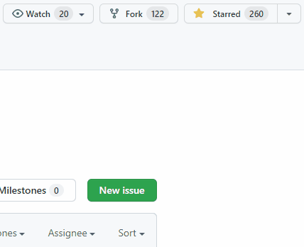

<!-- markdownlint-disable -->
## Azure Landing Zones Bicep - FAQ
<!-- markdownlint-restore -->

This wiki page answers frequently asked questions (FAQs) relating to the Azure Landing Zones Bicep modules.

Some FAQ questions that relate more to the architecture are based over in the CAF docs here: [Enterprise-scale architecture FAQ](https://docs.microsoft.com/azure/cloud-adoption-framework/ready/enterprise-scale/faq)

> Log an issue or create a pull request if you have a question that is not answered here, we are happy to help and have community contributions 👍

## List of Frequently Asked Questions

- [Why isn't `ALZ-Bicep` v1.x.x yet?](#why-isnt-alz-bicep-v1xx-yet)
- [How do I get notified of the latest releases in `ALZ-Bicep`?](#how-do-i-get-notified-of-the-latest-releases-in-alz-bicep)
- [Why are some linter rules disabled via the `#disable-next-line` Bicep function?](#why-are-some-linter-rules-disabled-via-the-disable-next-line-bicep-function)

---

## Questions & Answers

## Why isn't `ALZ-Bicep` v1.x.x yet?

Great question! Put simply this is because Bicep itself is not on a v1.X.X release yet which means there is a possibility for larger breaking changes still to occur in Bicep itself (upstream) which will in turn mean that these changes will have to be integrated into `ALZ-Bicep`.

This however, does not mean you shouldn't use ALZ-Bicep or Bicep as they are fully supported and ready for production usage.

As we use GitHub releases and tags you can clone and pin to a specific version in your codebase and upgrade when you are ready and willing to do so 👍

In summary, `ALZ-Bicep` will go v1.x.x when Bicep itself goes v1.x.x, give or take a few weeks for us to make any changes required in `ALZ-Bicep` upon the release of Bicep v1.x.x 👍

## How do I get notified of the latest releases in `ALZ-Bicep`?

There are a couple of ways you can ensure you get notified of the latest releases on the `ALZ-Bicep` repo.

1. Configure your "Watch" settings on the repo to notify you on "Releases"
    - See GitHub Docs on how to do this [here](https://docs.github.com/account-and-profile/managing-subscriptions-and-notifications-on-github/setting-up-notifications/configuring-notifications#configuring-your-watch-settings-for-an-individual-repository)

2. Sign-up to and use [newreleases.io](https://newreleases.io), add this repo `Azure/ALZ-Bicep` and select your email frequency.

## Why are some linter rules disabled via the `#disable-next-line` Bicep function?

In some of the ALZ-Bicep modules some of linter rules are disabled using the `#disable-next-line` Bicep feature. Today, this is primarily for disabling the [no-loc-expr-outside-params linter rule](https://docs.microsoft.com/azure/azure-resource-manager/bicep/linter-rule-no-loc-expr-outside-params) for the, optional, telemetry module as we want to ensure this telemetry deployment is stored in the same location as specified by the `location` input when deploying the Bicep module, instead of in the same location as specified by `parLocation` as this may be different from the region targeted by the deployment to ARM.

You may also see it in some location for resources that do not require a region for deployment, like Azure Policies, so instead of making users input an additional parameter for the region, we just use the one that was targeted by the deployment to ARM when the module was deployed.

It is not recommended to disable linter rules when it can be resolved by making changes to the Bicep code. However, in some scenarios, like above, this is necessary.
