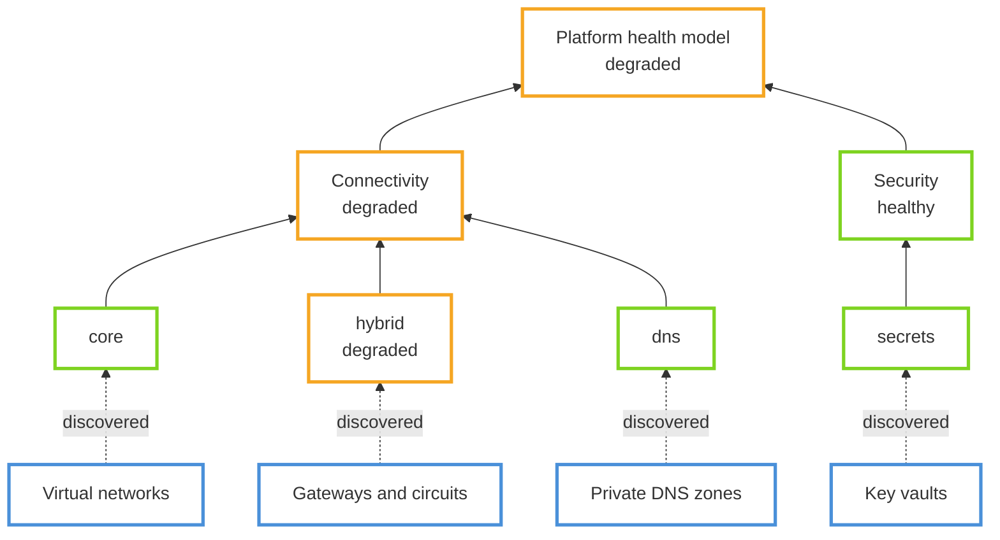

# Health Models in Azure Landing Zones

> [!NOTE]
> The health model modules in ALZ-Bicep are **preview (experimental)** and build on
> `Microsoft.CloudHealth`, which is also in preview.

## Concepts

Azure Monitor health models let you combine monitoring signals into three states of health:
Healthy, Degraded, and Unhealthy. Health modeling itself is *"an observability exercise that
combines business context with raw monitoring data to quantify the overall health of a
workload"*.

Microsoft Learn documents the building blocks:

- [Health modeling for workloads](https://learn.microsoft.com/en-us/azure/well-architected/design-guides/health-modeling): Well-Architected design guide and terminology
- [Health models in Azure Monitor](https://learn.microsoft.com/en-us/azure/azure-monitor/health-models/overview): state-based monitoring, Graph and Timeline views, health-based alerting
- [Health model concepts](https://learn.microsoft.com/en-us/azure/azure-monitor/health-models/concepts): entities, signals, relationships, aggregation
- [Discoveries](https://learn.microsoft.com/en-us/azure/azure-monitor/health-models/discoveries): adding matching Azure resources automatically

## What ALZ-Bicep provides

ALZ-Bicep enables two models by default. The platform model reports the health of shared
services to the platform team and dependent application teams. The application model
reports workload health.

| Model | Domains |
| ----- | ------- |
| Platform | Security, Connectivity, Management, Identity |
| Application landing zone | Compute, Data, Routing, AI, Config |

Each domain is a generic entity that aggregates the health of related entities, and each
domain is divided into subdomains. Discovery rules automatically add matching Azure
resources to each subdomain, complementing the explicit model design rather than replacing
it.

Subdomains keep the model navigable. A degraded VPN gateway rolls up as degraded *hybrid
connectivity*, and the dependency chain identifies the affected area.

## Deployment

[DeployIfNotExists](https://learn.microsoft.com/en-us/azure/governance/policy/concepts/effect-deploy-if-not-exists)
policy assignments deploy both models. The topology Bicep entrypoints support testing and
iteration.

ALZ-Bicep exposes two native AzureCloud-only default assignments, both enabled by default:

| Parameter | Default | Assignment scope | Target resource group parameter |
| --- | --- | --- | --- |
| `parPlatformHealthModelPolicyAssignmentEnable` | `true` | Platform management group | `parPlatformHealthModelTargetResourceGroupName` |
| `parApplicationHealthModelPolicyAssignmentEnable` | `true` | Landing Zones management group | `parApplicationHealthModelTargetResourceGroupName` |

Disable either assignment by setting its bool to `false`, or by adding `Deploy-ALZ-CloudHealth` or `Deploy-App-CloudHealth` to `parExcludedPolicyAssignments`.

1. Step 2, `customPolicyDefinitions.bicep`, deploys the CloudHealth policy definitions.
2. Step 8, `alzDefaultPolicyAssignments.bicep`, assigns the policies.
3. Remediation evaluates subscriptions under Platform and Landing Zones, creates the target
   resource group when needed, deploys the health model, and grants Reader to the model's
   system-assigned identity.

Existing subscriptions under the Platform and Landing Zones management groups come into scope after upgrade and remediation. Review exclusions before upgrading if you do not want automatic health-model deployment.

`Microsoft.CloudHealth` is preview and AzureCloud-region limited. Query `Microsoft.CloudHealth/healthmodels` provider locations before deployment and use a returned region. Unsupported regions or an unregistered provider fail remediation.

The remediation identity receives Contributor and Role Based Access Control Administrator.
At Platform or Landing Zones scope, it can write and delete role assignments in descendant
subscriptions.

Parameters, artifact regeneration, and verification guidance are in the [module README](https://github.com/Azure/ALZ-Bicep/blob/main/infra-as-code/bicep/modules/policy/healthModel/README.md).

## Policy deployment

The ALZ default path assigns both models through policy: platform at the Platform management
group and application at the Landing Zones management group.

## Related

- [Health model module README](https://github.com/Azure/ALZ-Bicep/blob/main/infra-as-code/bicep/modules/policy/healthModel/README.md)
- [Incorporate Azure Monitor Baseline Alerts](https://github.com/Azure/ALZ-Bicep/wiki/AzureMonitorBaselineAlerts)
- [Monitor platform landing zones](https://learn.microsoft.com/en-us/azure/cloud-adoption-framework/ready/landing-zone/design-area/management-monitor)
