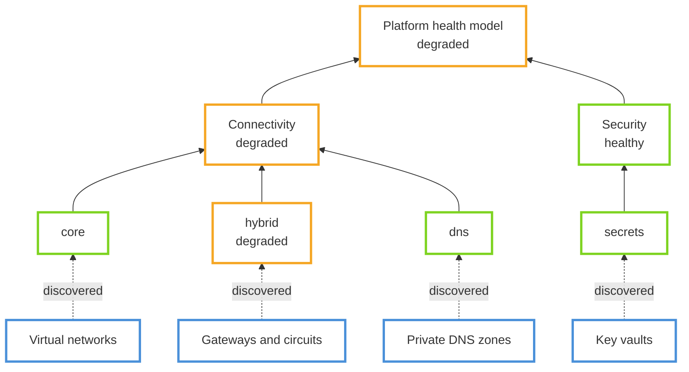
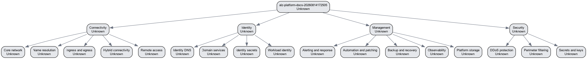
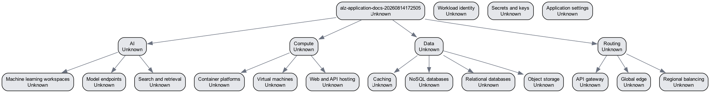

# Health Models in Azure Landing Zones

> [!NOTE]
> The health model modules in ALZ-Bicep are **preview (experimental)** and build on
> `Microsoft.CloudHealth`, which is also in preview.

## Concepts

Azure Monitor health models let you combine monitoring signals into three states of health:
Healthy, Degraded, and Unhealthy. Health modeling itself is *"an observability exercise that
combines business context with raw monitoring data to quantify the overall health of a
workload"*.

Learn the building blocks first. They are documented on Microsoft Learn and not repeated
here:

- [Health modeling for workloads](https://learn.microsoft.com/en-us/azure/well-architected/design-guides/health-modeling) — Well-Architected design guide and terminology
- [Health models in Azure Monitor](https://learn.microsoft.com/en-us/azure/azure-monitor/health-models/overview) — state-based monitoring, Graph and Timeline views, health-based alerting
- [Health model concepts](https://learn.microsoft.com/en-us/azure/azure-monitor/health-models/concepts) — entities, signals, relationships, aggregation
- [Discoveries](https://learn.microsoft.com/en-us/azure/azure-monitor/health-models/discoveries) — adding matching Azure resources automatically

## What ALZ-Bicep provides

A workload health model leads with what your users do. A platform is different: its
stakeholders are the platform team and the application teams that depend on it. ALZ-Bicep
therefore ships two models, enabled by default, whose root entities represent the health relevant to those
stakeholders, so a platform team can publish platform health for application teams to
consume without them knowing how it is operated.

| Model | Domains |
| ----- | ------- |
| Platform | Security, Connectivity, Management, Identity |
| Application landing zone | Compute, Data, Routing, AI, Config |

Each domain is a generic entity that aggregates the health of related entities, and each
domain is divided into subdomains. Discovery rules automatically add matching Azure
resources to each subdomain, complementing the explicit model design rather than replacing
it.



Bigger is not better, so the subdomains keep the model navigable. A degraded VPN gateway
rolls up as degraded *hybrid connectivity* instead of a flat "Connectivity is degraded", and
the dependency chain points at the affected area.

## Deployment

Both models are deployed by [DeployIfNotExists](https://learn.microsoft.com/en-us/azure/governance/policy/concepts/effect-deploy-if-not-exists) policy assignments. Health models also ship as standalone Bicep entrypoints for testing and iteration.

ALZ-Bicep exposes two native AzureCloud-only default assignments, both enabled by default:

| Parameter | Default | Assignment scope | Target resource group parameter |
| --- | --- | --- | --- |
| `parPlatformHealthModelPolicyAssignmentEnable` | `true` | Platform management group | `parPlatformHealthModelTargetResourceGroupName` |
| `parApplicationHealthModelPolicyAssignmentEnable` | `true` | Landing Zones management group | `parApplicationHealthModelTargetResourceGroupName` |

Disable either assignment by setting its bool to `false`, or by adding `Deploy-ALZ-CloudHealth` or `Deploy-App-CloudHealth` to `parExcludedPolicyAssignments`.

Deployment flow:

1. Step 2, `customPolicyDefinitions.bicep`, deploys the CloudHealth policy definitions from the health-model module.
2. Step 8, `alzDefaultPolicyAssignments.bicep`, assigns those policies by default.
3. Policy remediation evaluates subscriptions under Platform and Landing Zones, creates the configured target resource group when needed, deploys the health model, and grants Reader to the model's system-assigned identity.

Existing subscriptions under the Platform and Landing Zones management groups come into scope after upgrade and remediation. Review exclusions before upgrading if you do not want automatic health-model deployment.

`Microsoft.CloudHealth` is preview and AzureCloud-region limited. Query `Microsoft.CloudHealth/healthmodels` provider locations before deployment and use a returned region. Unsupported regions or an unregistered provider fail remediation.

The remediation identity receives Contributor plus Role Based Access Control Administrator. RBAC Administrator over Platform or Landing Zones descendants is a significant escalation because the remediation identity can write and delete role assignments.

Parameters, deployment commands, remediation, and verification are in the [module README](https://github.com/Azure/ALZ-Bicep/blob/main/infra-as-code/bicep/modules/policy/healthModel/README.md).

## Policy or deployment only

Short answer: keep both platform and application models policy-assigned in the ALZ default path, and keep standalone deployments as an operator option.

- Policy-assigned defaults are already wired for both models in ALZ default assignments, with scope split by intent: platform at the Platform management group and application at the Landing Zones management group.
- Standalone deployment entrypoints remain useful for testing, rapid iteration, and environment-specific validation.
- Making platform deployment-only while keeping application policy-based would create an inconsistent operator model and remove automatic compliance/remediation behavior from one side while retaining it on the other.

So the practical model is one contract with two entrypoints:
- **Default ALZ contract:** policy definitions plus assignments.
- **Direct operator path:** standalone topology or policy module deployment.

## Live deployment and visualization proof (2026-08-14)

Live run scope:

| Item | Value |
| --- | --- |
| Subscription | `b2af20ad-98fa-4aa7-94c3-059663641d9f` |
| Resource group | `rg-hm-docs-20260814172505` |
| Region | `swedencentral` |
| Platform model | `alz-platform-docs-20260814172505` (`provisioningState: Succeeded`) |
| Application model | `alz-application-docs-20260814172505` (`provisioningState: Succeeded`) |
| Platform topology counts | `22` entities, `21` relationships |
| Application topology counts | `21` entities, `17` relationships |

Application note: the model resource is live (`show` returns `Succeeded`) while the outer deployment operation did not converge to clean terminal success during this run (`Running` for extended periods, then `Failed` with `EntityCreationError` on nested entity creation in one retry). Treat the application topology snapshot as best-effort live evidence for preview RP behavior, not as full convergence proof.

Reproduction commands used in this run:

```bash
az deployment group create --resource-group <rg> --name <platform-deploy> \
  --template-file infra-as-code/bicep/modules/policy/healthModel/healthModelPlatformTopology.bicep \
  --parameters parHealthModelName=<platform-model-name> parLocation=swedencentral

az deployment group create --resource-group <rg> --name <application-deploy> \
  --template-file infra-as-code/bicep/modules/policy/healthModel/healthModelApplicationTopology.bicep \
  --parameters parHealthModelName=<application-model-name> parLocation=swedencentral

az monitor health-models show --resource-group <rg> --name <model-name>
az monitor health-models entity list --resource-group <rg> --health-model-name <model-name>
az monitor health-models relationship list --resource-group <rg> --health-model-name <model-name>
```

Deployed topologies rendered from live `entity list` and `relationship list` data:





## Related

- [Health model module README](https://github.com/Azure/ALZ-Bicep/blob/main/infra-as-code/bicep/modules/policy/healthModel/README.md)
- [ALZ alerting landscape](https://github.com/Azure/ALZ-Bicep/blob/main/infra-as-code/bicep/modules/policy/healthModel/ALZ-Alerting-Landscape.md) — where a health model helps alongside AMBA, and where it does not
- [Incorporate Azure Monitor Baseline Alerts](https://github.com/Azure/ALZ-Bicep/wiki/AzureMonitorBaselineAlerts)
- [Monitor platform landing zones](https://learn.microsoft.com/en-us/azure/cloud-adoption-framework/ready/landing-zone/design-area/management-monitor)
