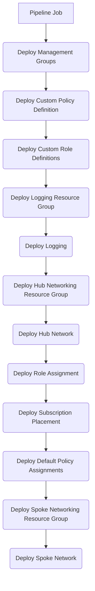

<!-- markdownlint-disable -->
## Azure Landing Zones Bicep - Pipelines
<!-- markdownlint-restore -->

This document provides high-level guidance for deploying the ALZ modules with pipelines and provides sample code for GitHub Actions and Azure DevOps Pipelines. The sample code leverages the orchestration templates, deployment sequence, and prerequisites described in the [DeploymentFlow](https://github.com/Azure/ALZ-Bicep/wiki/DeploymentFlow) document. In addition to these prerequisites, a GitHub or Azure DevOps account will be needed to run the pipelines.

## ALZ Orchestration

### Overview

A pipeline is the repeatable process defined in a configuration file that you use to test and deploy your code. A pipeline includes all the steps you want to execute and in what order. You define your pipeline in a YAML file. A YAML file is a structured text file, similar to how Bicep is a structured text file. You can create and edit YAML files by using any text editor. Because a pipeline YAML file is a code file, the file is stored with your Bicep code in your Git repository. You use Git features to collaborate on your pipeline definition. You can manage different versions of your pipeline file by using commits and branches.

### Sample Pipelines

These ALZ sample pipelines sequentially deploy the nine modules detailed in the [DeploymentFlow](https://github.com/Azure/ALZ-Bicep/wiki/DeploymentFlow) document in a single pipeline job. The pipelines have been configured with manual triggers for learning and experimentation.

### Sample Pipeline Code

- [GitHub Actions](https://github.com/Azure/ALZ-Bicep/wiki/PipelinesGitHub)
- [Azure DevOps Pipelines](https://github.com/Azure/ALZ-Bicep/wiki/PipelinesADO)

### Sample Pipeline Flowchart

### Considerations

The sample code provides a simple example of a deployment pipeline. In production environments it will likely be necessary to use more advanced pipelines to meet additional requirements. Often different teams are responsible for the various ALZ components and may need to manage their deployments separately to meet their particular requirements.

The sample code uses manually triggered pipelines for learning purposes. For GitHub Actions we use `on: [workflow_dispatch]` event for a manually triggered workflow. For Azure DevOps we use `trigger: none` for a manually triggered pipeline run.

Typically teams will want to take a more automated approach to running workflows based upon events that occur in the repository, such as a pull request to the main branch. Normally protected by a branch policies to enforce all changes to a protected branch (e.g. `main`) must be made via a PR.

For an example of an automated workflow, please review the [bicep-build-to-validate.yml](https://github.com/Azure/ALZ-Bicep/blob/main/.github/workflows/bicep-build-to-validate.yml) file in the workflows directory of this repo.

For many scenarios, it may also make sense to take a more modular approach to ALZ deployment. While a single pipeline is good for learning purposes, separate workflows aligned to ALZ components and the teams that manage them may be required for some organizations.

## Recommended Learning

### GitHub Actions

- [Deploy Azure resources by using Bicep and GitHub Actions](https://docs.microsoft.com/learn/paths/bicep-github-actions/)
- [How to automatically trigger GitHub Actions workflows](https://docs.github.com/actions/using-workflows/triggering-a-workflow)
- [Using jobs in a GitHub Actions workflow](https://docs.github.com/actions/using-jobs/using-jobs-in-a-workflow)
- [Managing a branch protection rule](https://docs.github.com/en/repositories/configuring-branches-and-merges-in-your-repository/defining-the-mergeability-of-pull-requests/managing-a-branch-protection-rule)

### Azure DevOps Pipelines

- [Deploy Azure resources by using Bicep and Azure Pipelines](https://docs.microsoft.com/learn/paths/bicep-azure-pipelines/)
- [Azure DevOps Pipelines triggers](https://docs.microsoft.com/azure/devops/pipelines/build/triggers?view=azure-devops)
- [Azure DevOps Pipelines stages, dependencies, and conditions](https://docs.microsoft.com/azure/devops/pipelines/process/stages?view=azure-devops&tabs=yaml)
- [Azure DevOps Branch policies and settings](https://docs.microsoft.com/azure/devops/repos/git/branch-policies?view=azure-devops&tabs=browser)