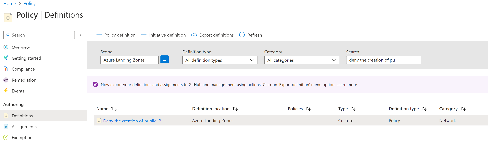
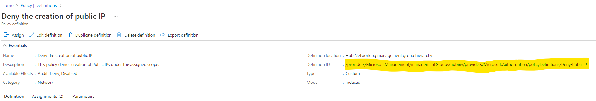
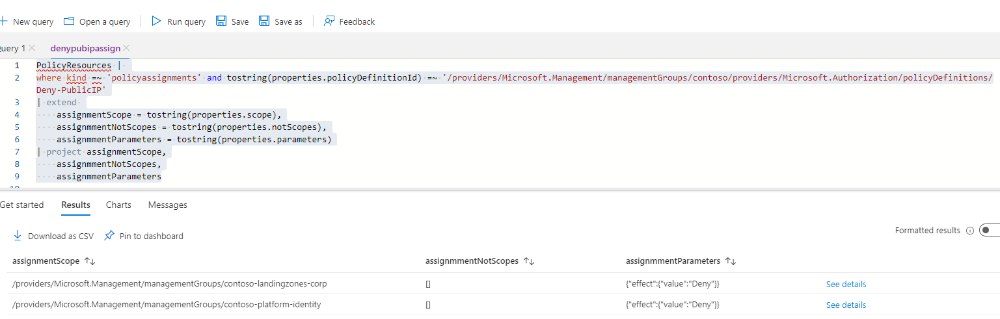
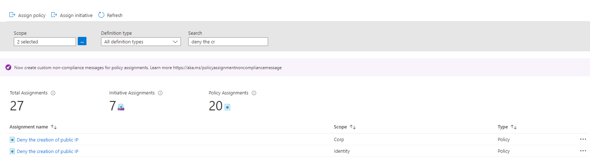
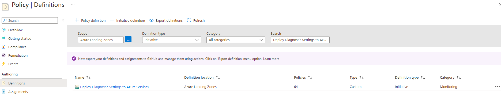
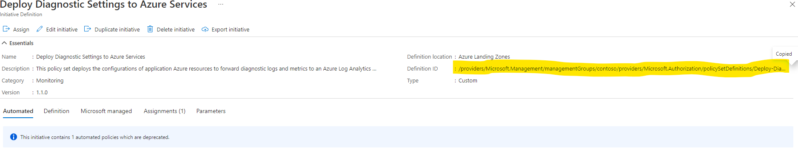
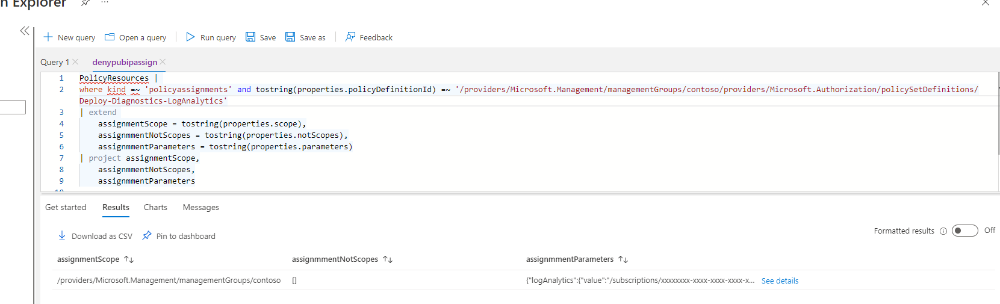
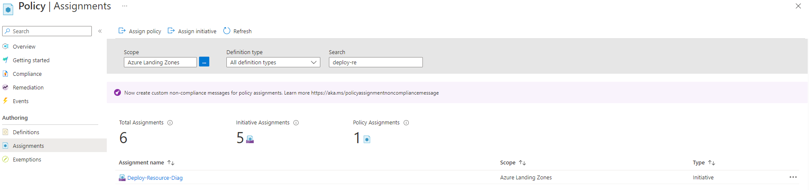

<!-- markdownlint-disable -->
## How Does ALZ-Bicep Implement Azure Policies?
<!-- markdownlint-restore -->

## Overview

In the `ALZ-Bicep` project we provide the ability to deploy all of the custom Azure Policy Definitions and Initiatives that are included as part of the [Azure Landing Zones (Enterprise-Scale) repo](https://github.com/Azure/Enterprise-Scale) by using the [Custom Policy Definitions module](https://github.com/Azure/ALZ-Bicep/tree/main/infra-as-code/bicep/modules/policy/definitions).

The definitions in the [`lib` folder](https://github.com/Azure/ALZ-Bicep/tree/main/infra-as-code/bicep/modules/policy/definitions/lib) of the [Custom Policy Definitions module](https://github.com/Azure/ALZ-Bicep/tree/main/infra-as-code/bicep/modules/policy/definitions).  are kept up-to-date with the contents of the [`eslzArm/managementGroupTemplates/PolicyDefinitions`](https://github.com/Azure/Enterprise-Scale/tree/main/eslzArm/managementGroupTemplates/policyDefinitions) folder via a [GitHub Action](https://github.com/Azure/ALZ-Bicep/blob/main/.github/workflows/update-policy.yml) and associated PowerShell scripts/modules that runs once a day.

You can also make all of the Azure Landing Zone default Azure Policy Assignments using the [ALZ Default Policy Assignments module](https://github.com/Azure/ALZ-Bicep/tree/main/infra-as-code/bicep/modules/policy/assignments/alzDefaults).

> Azure US Gov (aka Fairfax) is not covered today in ALZ-Bicep. Please raise a feature request if you would like to see this added via the [issues](https://github.com/Azure/ALZ-Bicep/issues/new/choose) 👍

## What Azure Policies does Azure Landing Zone (Enterprise-Scale) provide additionally to those already built-in?

Great question! There are around 104 custom Azure Policy Definitions included and around 7 Custom Azure Policy Initiatives included as part of Azure Landing Zones (Enterprise-Scale) implementations that add on to those already built-in within each Azure customers tenant.

All of these custom Azure Policy Definitions and Initiatives are the same across all 3 implementation options there are for Azure Landing Zones; [Terraform Module](https://aka.ms/alz/tf), [Bicep Modules](https://aka.ms/alz/bicep), [Portal Accelerator Experience](https://aka.ms/alz#azure-landing-zone-accelerator).

This is because the single source of truth is the [`Enterprise-Scale` repo](https://github.com/Azure/Enterprise-Scale) that both the Terraform and Bicep implementation options pull from to build their `lib` folders respectively.

You can see a fairly up-to-date list of these policies here: [Policies included in Enterprise-Scale Landing Zones reference implementations](https://github.com/Azure/Enterprise-Scale/blob/main/docs/ESLZ-Policies.md)

> Our goal is always to try and use built-in policies where available and also work with product teams to adopt our custom policies and make them built-in, which takes time. This means there will always be a requirement for custom policies.

### AzAdvertizer Integration

We have worked with the creator of [AzAdvertizer](https://www.azadvertizer.net) to integrate all of the custom Azure Policy Definitions and Initiatives as part of Azure Landing Zones into it to help customers use the tool to look at the policies further in easy to use tool that is popular in the community.

On either the [Policy](https://www.azadvertizer.net/azpolicyadvertizer_all.html#%7B%22col_10%22%3A%7B%22flt%22%3A%22ESLZ%22%7D%7D) or [Initiative](https://www.azadvertizer.net/azpolicyinitiativesadvertizer_all.html) section of the site, set the 'Type' column drop down (last one on the right hand side) to 'ALZ' and you will see all the policies as mentioned above in the tool for you to investigate further.

AzAdvertizer also updates once per day!


## How do the `lib` folders in the `ALZ-Bicep` Azure Policy modules stay up-to-date?

As mentioned above in Azure Landing Zones (Enterprise-Scale) we have a single source of truth for all of the custom Azure Policy Definitions and Initiatives which is the [`Enterprise-Scale` repo](https://github.com/Azure/Enterprise-Scale). This is done so we only have a single location to update the policies in and then we can use automation in the Bicep and Terraform implementations of ALZ to pull these policies from the [`Enterprise-Scale` repo](https://github.com/Azure/Enterprise-Scale).

The ALZ-Bicep repo uses a GitHub Action with a couple of PowerShell scripts/modules to pull all of the custom Azure Policy Definitions and Initiatives from the [`Enterprise-Scale` repo](https://github.com/Azure/Enterprise-Scale) and split them into individual files, make some minor changes replacing some placeholder values and generating a couple of `.txt` files that contain a Bicep friendly block of variables for all of the custom definitions with references to their new paths.

The GitHub action runs every weekday at 0800 UTC.

**Useful Links**:

- [`update-policy.yml` - GitHub Action](https://github.com/Azure/ALZ-Bicep/blob/main/.github/workflows/update-policy.yml)
- [`Invoke-LibraryUpdate.ps1` - PowerShell Script](https://github.com/Azure/ALZ-Bicep/blob/main/.github/scripts/Invoke-LibraryUpdate.ps1)
- [`Invoke-PolicyToBicep.ps1` - PowerShell Script](https://github.com/Azure/ALZ-Bicep/blob/main/.github/scripts/Invoke-PolicyToBicep.ps1)

We will explain this process further below in a series of diagrams:

> A [Code Tour](https://github.com/Azure/ALZ-Bicep/wiki/CodeTour) for this process can also be found [here](https://github.com/Azure/ALZ-Bicep/blob/main/.vscode/tours/upstreamPolicyUpdateProcess.tour)


## How do we add a custom Azure Policy definition or initiative?

Please see the following wiki article that explains this process further: [Adding Custom Azure Policy Definitions](https://github.com/Azure/ALZ-Bicep/wiki/AddingPolicyDefs)

## How do we assign a built-in or custom Azure Policy?

Please see the following wiki article that explains this process further: [Assigning Azure Policies](https://github.com/Azure/ALZ-Bicep/wiki/AssigningPolicies)

## How to migrate ALZ custom policies to Azure built-in policies

Every so often there will be a new Azure built-in policy or policy initiative that replicates functionality previously found only in ALZ custom policies. When this happens, a new release of ALZ-Bicep will contain details around the policies involved as well as upgrade considerations. The below describes generic scenarios for migrating from ALZ custom policies to Azure built-in policies, leveraging ALZ-Bicep functionality.

### Update scenarios
There are the following scenarios for ALZ custom policies being superseded by Azure built-in policies, listed in increasing order of complexity:
1. A single ALZ custom policy, which is not assigned anywhere in your Azure estate, is superseded by an Azure built-in policy. The process for managing this is described in [Migrate single ALZ custom policy to built-in policy](#migrate-single-alz-custom-policy-to-built-in-policy).
2. A single ALZ custom policy, which is assigned at one or more scopes in your Azure estate, is superseded by an Azure built-in policy. The process for managing this is described in [Migrate single ALZ custom policy to built-in policy](#migrate-single-alz-custom-policy-to-built-in-policy).
3. One or more ALZ custom policies, assigned via ALZ custom policy intiative, which are superseded by Azure built-in policies. The process for managing this is described in [Migrate ALZ custom policies in initiatives to built-in policies](#migrate-alz-custom-policies-in-initiatives-to-built-in-policies).

#### Migrate single ALZ custom policy to built-in policy
For this scenario we will use the ALZ custom policy ```Deny the creation of public IP``` which will be migrated to the built-in policy ```Not allowed resource types```

To carry out the instructions in the scenario the operator will require Resource Policy Permissions at the root of the ALZ management group hierarchy

- Go to `https://portal.azure.com`
- Open Policy
- Go to Definitions and in Search find the ALZ custom policy.

  

- Click on the hyperlink for the policy definition
- To determine if the policy is assigned at any scope in the ALZ management group structure start by getting the policy definition ID

  

- Since there is no easy way to get the various scopes a policy is assigned to, go to Azure Resource Graph Explorer
- Ensure that scope for the query is Directory and then execute the following kusto query:

  ```kusto
    PolicyResources |
    where kind =~ 'policyassignments' and tostring(properties.policyDefinitionId) =~ '/providers/Microsoft.Management/managementGroups/contoso/providers/Microsoft.Authorization/policyDefinitions/Deny-PublicIP'
    | extend
        assignmentScope = tostring(properties.scope),
        assignmmentNotScopes = tostring(properties.notScopes),
        assignmmentParameters = tostring(properties.parameters)
    | project assignmentScope,
        assignmmentNotScopes,
        assignmmentParameters
  ```

- The above command will give different results depending on whether the policy is assigned or not. If the policy is not assigned, you can jump directly to the Delete Policy Definition step in the following. If the policy is assigned though you should get a result somewhat similar to what is shown below.

  

- As can be seen this particular policy is assigned with only a simple Deny effect parameter at the following levels in the management group structure
  - `Contoso/contoso-landingzones/contoso-landingzones-corp`
  - `Contoso/contoso-platform/contoso-platform-identity`

> Note that the provided example has a simple parameter set. If more complex parameters are assigned to a policy which is to be migrated those should be noted down. In that respect the possibility to download the query results as CSV could be leveraged.

- Switch from Azure Resource Graph Explorer back to the Policy view
- Change the scope to include the scopes determined in the previous step. and search for the relevant policy

  

- For each assignment, click the ellipsis and select Delete Assignment.
- Once all policy assignments are deleted, go to the Definitions pane, search for the definition. Once found click the ellipsis and choose Delete Policy Definition
- Follow the steps in [Manually synchronize your local repo with ALZ-Bicep](#manually-synchronize-your-local-repo-with-alz-bicep) to synchronize policy updates from the ALZ-Bicep repository to your local repo.

### Migrate ALZ custom policies in initiatives to built-in policies

For this scenario we will use the ALZ custom initiative ```Deploy Diagnostic Settings to Azure Services``` which is leveraging quite a large number of ALZ custom policies to apply diagnostics settings for various resources.

To carry out the instructions in the scenario the operator will require Resource Policy Permissions at the root of the ALZ management group hierarchy

- Go to `https://portal.azure.com`
- Open Policy
- Go to Definitions and in Search find the ALZ custom policy initiative.

  

- Click on the hyperlink for the initiative definition
- To determine where the initiative is assigned at any scope in the ALZ management group structure start by getting the initiative name

  

- Since there is no easy way to get the various scopes an initiative is assigned to, got Azure Resource Graph Explorer
- Ensure that scope for the query is Directory and then execute the following kusto query:

  ```kusto
    PolicyResources |
    where kind =~ 'policyassignments' and tostring(properties.policyDefinitionId) =~ '/providers/Microsoft.Management/managementGroups/contoso/providers/Microsoft.Authorization/policySetDefinitions/Deploy-Diagnostics-LogAnalytics'
    | extend
        assignmentScope = tostring(properties.scope),
        assignmmentNotScopes = tostring(properties.notScopes),
        assignmmentParameters = tostring(properties.parameters)
    | project assignmentScope,
        assignmmentNotScopes,
        assignmmentParameters
  ```

- The above command will give a result similar to what is shown below

  

- As can be seen this particular initiative is assigned with only a single parameter at the following levels in the management group structure
  - `Contoso/`

> Note
that the provided example has a simple parameter set. If more complex parameters are assigned to a policy which is to be migrated those should be noted down. In that respect the possibility to download the query results as CSV could be leveraged.

- Switch from Azure Resource Graph Explorer back to the Policy view
- Change the scope to include the scope described above, and search for the relevant initiative

  

- For each assignment, click the ellipsis and select Delete Assignment.
- Once all initiative assignments are deleted, go to the Definitions pane, search for the initiative definition. Once found click the ellipsis and choose Delete Policy Definition

    

- Follow the steps in [Manually synchronize your local repo with ALZ-Bicep](#manually-synchronize-your-local-repo-with-alz-bicep) to synchronize policy updates from the ALZ-Bicep repository to your local repo.

### Manually synchronize your local repo with ALZ-Bicep

To get the latest updates from the ALZ-Bicep repo and download to you local repo, do the following.
- On a client where you have already cloned your version of the ALZ-Bicep repo, start a PowerShell command prompt
- Navigate to the root of the local version of the repo
- Verify that you are on the main branch and up-to-date by running the following commands

  ```posh
  git checkout main
  git pull
  ```

- If you did not already, copy the [`Invoke-GitHubReleaseFetcher.ps1`](https://github.com/Azure/ALZ-Bicep/tree/main/.github/scripts/Invoke-GitHubReleaseFetcher.ps1) script into the following location in your ALZ-Bicep repository: `.github/scripts/`
- Synchronize your local repo with the ALZ-Bicep repo by running the following
command

  ```posh
  .github/scripts/Invoke-GitHubReleaseFetcher.ps1 -githubRepoUrl "https://github.com/Azure/ALZ-Bicep" -directoryAndFilesToKeep @("infra-as-code/bicep/modules/policy")
  ```
- The above script will create a releases folder in the root of your local repo containing a version folder (e.g. v0.10.6), in that folder will be a policy folder containing all the latest updates to policy assignments and policy definitions from the ALZ-Bicep repo.
- To update your local copy of the repo with the policy changes run the following command

  ```posh
  Copy-Item -Path .\releases\<version folder>\policy\* -Destination .\infra-as-code\bicep\modules\policy\ -Recurse -Force
  ```
- After completing the above, perform the following verification tasks
  - Verify that removed policy definition has been removed from ./infra-as-code/bicep/modules/policy/definitions/customPolicyDefinitions.bicep
  - Verify that ./infra-as-code/bicep/modules/policy/assignments/alzdefaults/alzDefaultPolicyAssignments.bicep has been updated to no longer include assignments for the removed ALZ custom policy
  - Verify that the built-in policy has been added to ./infra-as-code/bicep/modules/policy/assignments/alzdefaults/alzDefaultPolicyAssignments.bicep if relevant.
  - If the built-in policy requires input parameters, verify that samples of those are included in ./infra-as-code/bicep/modules/policy/assignments/alzdefaults/parameters/alzDefaultPolicyAssignments.parameters.all.json, and modify your own version of the parameter file accordingly.

- Create a branch for the updates by running the following commands

  ```posh
  git branch <your branch name>
  git checkout <your branch name>
  ```

- Run git status to verify which files are modified
- Run git add <`filename`> to add the relevant files to staging. The following files could be in scope:
  - ./infra-as-code/bicep/modules/policy/assignments/alzdefaults/alzDefaultPolicyAssignments.bicep
  - ./infra-as-code/bicep/modules/policy/assignments/alzdefaults/parameters/alzDefaultPolicyAssignments.parameters.all.json
  - ./infra-as-code/bicep/modules/policy/assignments/alzdefaults/parameters/<your default policy assignment parameter file>
  - ./infra-as-code/bicep/modules/policy/definitions/customPolicyDefinitions.bicep
  - ./infra-as-code/bicep/modules/policy/definitions/lib/policy_definitions/<removed ALZ custom policy definition file>
  - ./infra-as-code/bicep/modules/policy/definitions/lib/policy_set_definitions/<removed ALZ custom policy initiative definition file>

- Follow the steps in [Deploy changed policy assignments](#deploy-changed-policy-assignments) to deploy and test any changed policy assignments

### Deploy changed policy assignments

- Leveraging the guidance in [Module: Custom Policy Definitions](https://github.com/Azure/ALZ-Bicep/tree/main/infra-as-code/bicep/modules/policy/definitions), deploy the updated custom policy definitions to your [canary environment](https://learn.microsoft.com/en-us/azure/cloud-adoption-framework/ready/enterprise-scale/testing-approach). After deploying verify that only the expected policy definitions has been created.
- Leveraging the guidance in [Module: ALZ Default Policy Assignments](https://github.com/Azure/ALZ-Bicep/tree/main/infra-as-code/bicep/modules/policy/assignments/alzDefaults), deploy the updated default policy assignments to your [canary environment](https://learn.microsoft.com/en-us/azure/cloud-adoption-framework/ready/enterprise-scale/testing-approach). After deploying verify that only the expected policy assignments has been created.
- Test that policies are working as intended.
- After the above steps have completed, leverage the guidance in [Module: Custom Policy Definitions](https://github.com/Azure/ALZ-Bicep/tree/main/infra-as-code/bicep/modules/policy/definitions), deploy the updated custom policy definitions to your production environment
- Leveraging the guidance in [Module: ALZ Default Policy Assignments](https://github.com/Azure/ALZ-Bicep/tree/main/infra-as-code/bicep/modules/policy/assignments/alzDefaults), deploy the updated default policy assignments to your production environment


