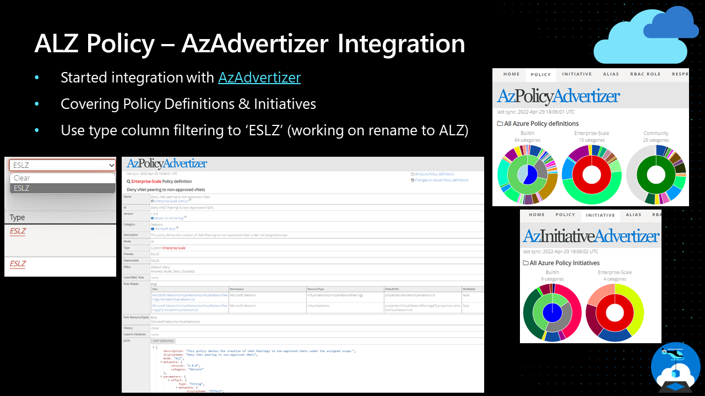
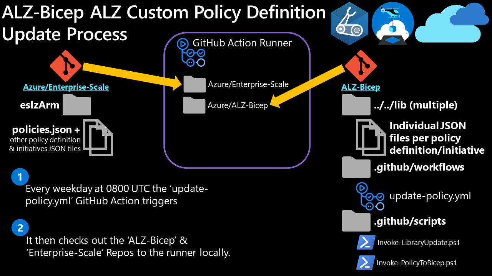
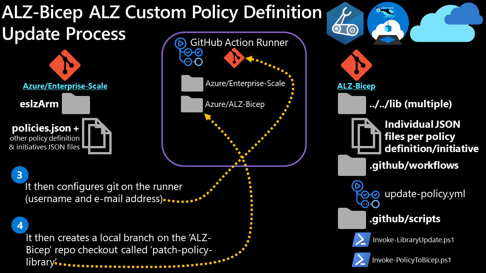
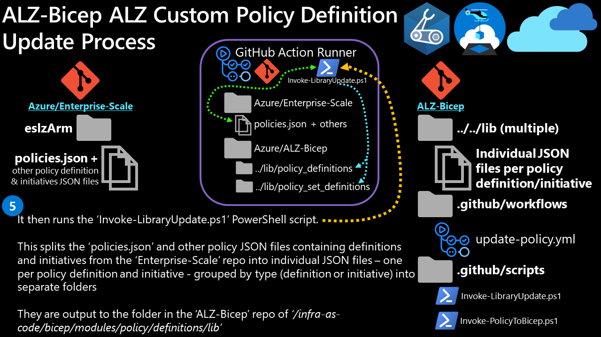
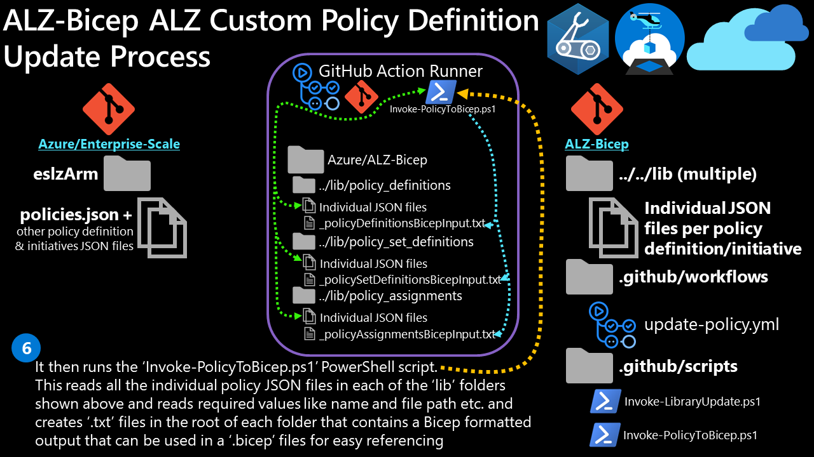
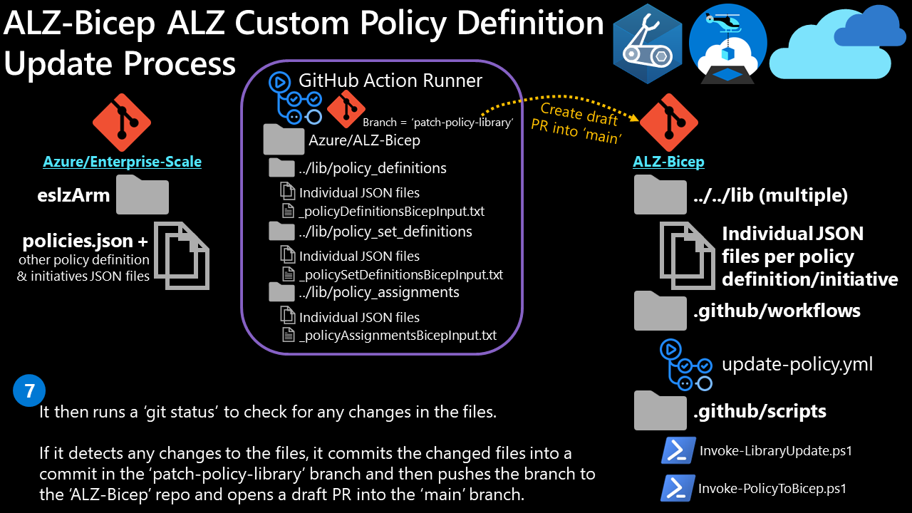
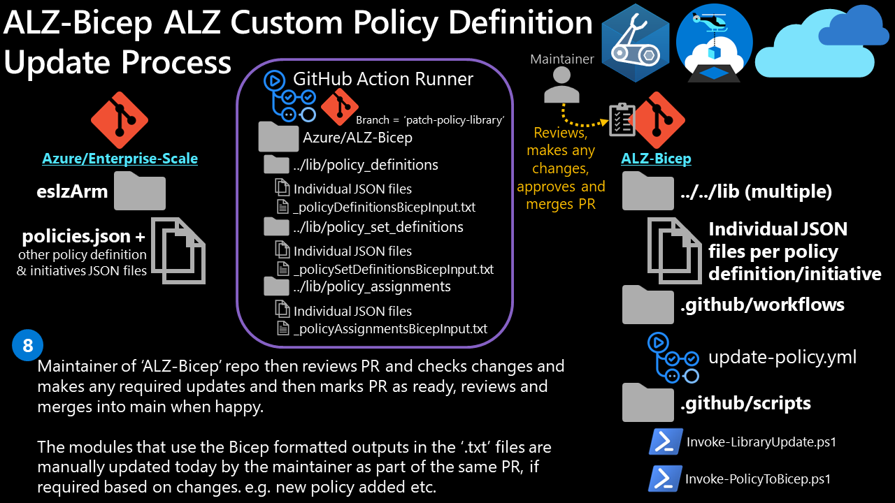

<!-- markdownlint-disable -->
## How Does ALZ-Bicep Implement Azure Policies?
<!-- markdownlint-restore -->

## Overview

In the `ALZ-Bicep` project we provide the ability to deploy all of the custom Azure Policy Definitions and Initiatives that are included as part of the [Azure Landing Zones (Enterprise-Scale) repo](https://github.com/Azure/Enterprise-Scale) by using the [Custom Policy Definitions module](https://github.com/Azure/ALZ-Bicep/tree/main/infra-as-code/bicep/modules/policy/definitions).

The definitions in the [`lib` folder](https://github.com/Azure/ALZ-Bicep/tree/main/infra-as-code/bicep/modules/policy/definitions/lib) of the [Custom Policy Definitions module](https://github.com/Azure/ALZ-Bicep/tree/main/infra-as-code/bicep/modules/policy/definitions).  are kept up-to-date with the contents of the [`eslzArm/managementGroupTemplates/PolicyDefinitions`](https://github.com/Azure/Enterprise-Scale/tree/main/eslzArm/managementGroupTemplates/policyDefinitions) folder via a [GitHub Action](https://github.com/Azure/ALZ-Bicep/blob/main/.github/workflows/update-policy.yml) and associated PowerShell scripts/modules that runs once a day.

You can also make all of the Azure Landing Zone default Azure Policy Assignments using the [ALZ Default Policy Assignments module](https://github.com/Azure/ALZ-Bicep/tree/main/infra-as-code/bicep/modules/policy/assignments/alzDefaults).

> Azure US Gov (aka Fairfax) is not covered today in ALZ-Bicep. Please raise a feature request if you would like to see this added via the [issues](https://github.com/Azure/ALZ-Bicep/issues/new/choose) 👍

## What Azure Policies does Azure Landing Zone (Enterprise-Scale) provide additionally to those already built-in?

Great question! There are around 104 custom Azure Policy Definitions included and around 7 Custom Azure Policy Initiatives included as part of Azure Landing Zones (Enterprise-Scale) implementations that add on to those already built-in within each Azure customers tenant.

All of these custom Azure Policy Definitions and Initiatives are the same across all 3 implementation options there are for Azure Landing Zones; [Terraform Module](https://aka.ms/alz/tf), [Bicep Modules](https://aka.ms/alz/bicep), [Portal Accelerator Experience](https://aka.ms/alz#azure-landing-zone-accelerator).

This is because the single source of truth is the [`Enterprise-Scale` repo](https://github.com/Azure/Enterprise-Scale) that both the Terraform and Bicep implementation options pull from to build their `lib` folders respectively.

You can see a fairly up-to-date list of these policies here: [Policies included in Enterprise-Scale Landing Zones reference implementations](https://github.com/Azure/Enterprise-Scale/blob/main/docs/ESLZ-Policies.md)

> Our goal is always to try and use built-in policies where available and also work with product teams to adopt our custom policies and make them built-in, which takes time. This means there will always be a requirement for custom policies.

### AzAdvertizer Integration

We have worked with the creator of [AzAdvertizer](https://www.azadvertizer.net) to integrate all of the custom Azure Policy Definitions and Initiatives as part of Azure Landing Zones into it to help customers use the tool to look at the policies further in easy to use tool that is popular in the community.

On either the [Policy](https://www.azadvertizer.net/azpolicyadvertizer_all.html#%7B%22col_10%22%3A%7B%22flt%22%3A%22ESLZ%22%7D%7D) or [Initiative](https://www.azadvertizer.net/azpolicyinitiativesadvertizer_all.html) section of the site, set the 'Type' column drop down (last one on the right hand side) to 'ALZ' and you will see all the policies as mentioned above in the tool for you to investigate further.

AzAdvertizer also updates once per day!

## How do the `lib` folders in the `ALZ-Bicep` Azure Policy modules stay up-to-date?

As mentioned above in Azure Landing Zones (Enterprise-Scale) we have a single source of truth for all of the custom Azure Policy Definitions and Initiatives which is the [`Enterprise-Scale` repo](https://github.com/Azure/Enterprise-Scale). This is done so we only have a single location to update the policies in and then we can use automation in the Bicep and Terraform implementations of ALZ to pull these policies from the [`Enterprise-Scale` repo](https://github.com/Azure/Enterprise-Scale).

The ALZ-Bicep repo uses a GitHub Action with a couple of PowerShell scripts/modules to pull all of the custom Azure Policy Definitions and Initiatives from the [`Enterprise-Scale` repo](https://github.com/Azure/Enterprise-Scale) and split them into individual files, make some minor changes replacing some placeholder values and generating a couple of `.txt` files that contain a Bicep friendly block of variables for all of the custom definitions with references to their new paths.

The GitHub action runs every weekday at 0800 UTC.

**Useful Links**:

- [`update-policy.yml` - GitHub Action](https://github.com/Azure/ALZ-Bicep/blob/main/.github/workflows/update-policy.yml)
- [`Invoke-LibraryUpdate.ps1` - PowerShell Script](https://github.com/Azure/ALZ-Bicep/blob/main/.github/scripts/Invoke-LibraryUpdate.ps1)
- [`Invoke-PolicyToBicep.ps1` - PowerShell Script](https://github.com/Azure/ALZ-Bicep/blob/main/.github/scripts/Invoke-PolicyToBicep.ps1)

We will explain this process further below in a series of diagrams:

> A [Code Tour](https://github.com/Azure/ALZ-Bicep/wiki/CodeTour) for this process can also be found [here](https://github.com/Azure/ALZ-Bicep/blob/main/.vscode/tours/upstreamPolicyUpdateProcess.tour)

## How do we add a custom Azure Policy definition or initiative?

Please see the following wiki article that explains this process further: [Adding Custom Azure Policy Definitions](https://github.com/Azure/ALZ-Bicep/wiki/AddingPolicyDefs)

## How do we assign a built-in or custom Azure Policy?

Please see the following wiki article that explains this process further: [Assigning Azure Policies](https://github.com/Azure/ALZ-Bicep/wiki/AssigningPolicies)