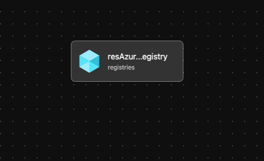

# Module: Container Registry

This module creates an Azure Container Registry to store private Bicep Modules.

Module deploys the following resources:

- Azure Container Registry

## Parameters

The module requires the following inputs:

 | Parameter   | Type   | Default                                | Description                                                     | Requirement                  | Example                         |
 | ----------- | ------ | -------------------------------------- | --------------------------------------------------------------- | ---------------------------- | ------------------------------- |
 | parAcrName  | string | acr${uniqueString(resourceGroup().id)} | Name of Azure Container Registry to deploy                      | 5-50 char                    | acr5cix6w3rcizn                 |
 | parACRSku   | string | Basic                                  | SKU of Azure Container Registry to deploy to Azure              | Basic or Standard or Premium | Basic                           |
 | parLocation | string | resourceGroup().location               | Location where Public Azure Container Registry will be deployed | Valid Azure Region           | eastus2                         |
 | parTags     | object | none                                   | Tags to be appended to resource                                 | none                         | {"Environment" : "Development"} |

## Outputs

The module will generate the following outputs:

| Output         | Type   | Example                     |
| -------------- | ------ | --------------------------- |
| outLoginServer | string | acr5cix6w3rcizna.azurecr.io |

## Deployment

In this example, the Azure Container Registry will be deployed to the resource group specified.

We will take the default values and not pass any parameters.

> For the below examples we assume you have downloaded or cloned the Git repo as-is and are in the root of the repository as your selected directory in your terminal of choice.

### Azure CLI

```bash
dateYMD=$(date +%Y%m%dT%H%M%S%NZ)
NAME="alz-ContainerRegistry-${dateYMD}"
RESOURCEGROUP="rg-bicep-acr"
PARAMETERS="@infra-as-code/bicep/CRML/containerRegistry/parameters/containerRegistry.parameters.all.json"
TEMPLATEFILE="infra-as-code/bicep/CRML/containerRegistry/containerRegistry.bicep"

az group create --location eastus \
   --name rg-bicep-acr

az deployment group create --name ${NAME:0:63} --resource-group $RESOURCEGROUP --parameters $PARAMETERS --template-file $TEMPLATEFILE
```

### PowerShell

```powershell
New-AzResourceGroup -Name 'rg-bicep-acr' `
  -Location 'EastUs'

  $inputObject = @{
  DeploymentName        = 'alz-ContainerRegistry-{0}' -f (-join (Get-Date -Format 'yyyyMMddTHHMMssffffZ')[0..63])
  ResourceGroupName     = 'rg-bicep-acr'
  TemplateParameterFile = 'infra-as-code/bicep/CRML/containerRegistry/parameters/containerRegistry.parameters.all.json'
  TemplateFile          = "infra-as-code/bicep/CRML/containerRegistry/containerRegistry.bicep"
}

New-AzResourceGroupDeployment @inputObject
```

## Bicep Visualizer


