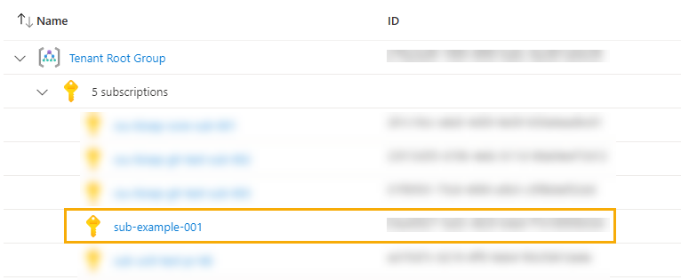

# Module:  Subscription Alias

The Subscription Alias module deploys an Azure Subscription into an existing billing scope that can be from an EA, MCA or MPA as documented in [Create Azure subscriptions programmatically](https://docs.microsoft.com/azure/cost-management-billing/manage/programmatically-create-subscription).

> Please review the [Create Azure subscriptions programmatically](https://docs.microsoft.com/azure/cost-management-billing/manage/programmatically-create-subscription) documentation as well as the documentation here [Assign roles to Azure Enterprise Agreement service principal names](https://docs.microsoft.com/azure/cost-management-billing/manage/assign-roles-azure-service-principals) for information on how this works and how to create and assign permissions to a SPN to allow it to create Subscriptions for you as part of a pipeline etc.

The Subscription will be created and placed under the Tenant Root Group, unless the default Management Group has been changed as per [Setting - Default management group](https://docs.microsoft.com/azure/governance/management-groups/how-to/protect-resource-hierarchy#setting---default-management-group)

## Parameters

The module requires the following inputs:

| Parameter | Type | Description | Required | Example | Default |
| ----------- | ---- | ----------- | ------------ | ------- | -------- |
parSubscriptionName | string | Name of the subscription to be created. Will also be used as the alias name. Whilst you can use any name you like we recommend it to be: all lowercase, no spaces, alphanumeric and hyphens only. | Yes  | `sub-example-001` | None, must be provided. |
parSubscriptionBillingScope | string | The full resource ID of billing scope associated to the EA, MCA or MPA account you wish to create the subscription in. | Yes | EA - `/providers/Microsoft.Billing/BillingAccounts/1234567/enrollmentAccounts/7654321` <br> MCA - `/providers/Microsoft.Billing/billingAccounts/5e98e158-xxxx-xxxx-xxxx-xxxxxxxxxxxx:xxxxxxxx-xxxx-xxxx-xxxx-xxxxxxxxxxxx_xxxx-xx-xx/billingProfiles/AW4F-xxxx-xxx-xxx/invoiceSections/SH3V-xxxx-xxx-xxx` <br> MPA - `/providers/Microsoft.Billing/billingAccounts/99a13315-xxxx-xxxx-xxxx-xxxxxxxxxxxx:xxxxxxxx-xxxx-xxxx-xxxx-xxxxxxxxxxxx_xxxx-xx-xx/customers/2281f543-xxxx-xxxx-xxxx-xxxxxxxxxxxx` | None, must be provided. |
parTags | object | Tags you would like to be applied. | No | `{"key": "value"}` | Empty object `{}` |
parManagementGroupId | string | The ID of the existing management group where the subscription will be placed. Also known as it's parent management group. | No | `mg-root` | Empty string |
parSubscriptionOwnerId | string | The object ID of a responsible user, AAD group or service principal. | No | `xxxxxxxx-xxxx-xxxx-xxxx-xxxxxxxxxxx` | Empty string |
parSubscriptionOfferType | string | The offer type of the EA, MCA or MPA subscription to be created. | No | `DevTest` | `Production` |
parTenantId | string | The ID of the tenant. | No | `xxxxxxxx-xxxx-xxxx-xxxx-xxxxxxxxxxx` | `tenant().tenantId` |

## Outputs

The module will generate the following outputs:

Output | Type | Example
------ | ---- | --------
outSubscriptionName | string | `sub-example-001`
outSubscriptionId | string | `5583f55f-65b2-4a3a-87c9-e499c1c587c0`

## Deployment

> **Important Note:** There are 2 parameter files examples provided in the `/parameters` folder of this module. One that contains examples of all possible parameters and another that only contains the minimum required parameters. The minimum version is used in the below examples.

In this example, the Subscription is created upon an EA Account through a tenant-scoped deployment.

> For the below examples we assume you have downloaded or cloned the Git repo as-is and are in the root of the repository as your selected directory in your terminal of choice.

### Azure CLI
```bash
az deployment tenant create \
  --template-file infra-as-code/bicep/CRML/subscriptionAlias/subscriptionAlias.bicep \
  --parameters @infra-as-code/bicep/CRML/subscriptionAlias/parameters/subscriptionAlias.parameters.all.json \
  --location eastus
```

### PowerShell

```powershell
New-AzTenantDeployment `
  -TemplateFile infra-as-code/bicep/CRML/subscriptionAlias/subscriptionAlias.bicep `
  -TemplateParameterFile infra-as-code/bicep/CRML/subscriptionAlias/parameters/subscriptionAlias.parameters.all.json `
  -Location eastus
```

### Output Screenshot



## Bicep Visualizer


