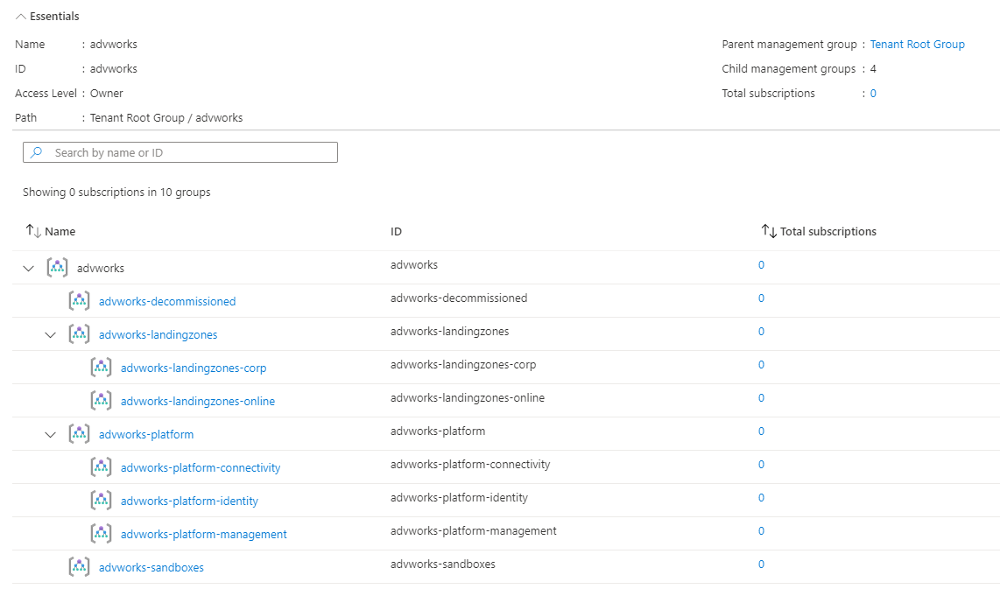
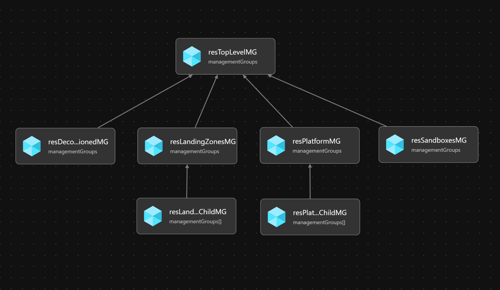

# Module:  Management Groups

Management Groups module defines defines the management group structure that will be deployed in a customer's environment.  It will deploy:

  1. Platform management group with management, connectivity, and identity child management groups; and
  2. Landing Zones management group with corp and online child management groups.
  3. Sandbox management group
  4. Decommissioned management group


## Parameters

The module requires the following required input parameters.

 Paramenter | Description | Requirement | Example
----------- | ----------- | ----------- | -------
parParentManagementGroupId | The management group that will be used to create all management groups.  Specific the management group id. | Must existing in Azure. | When deployed to **Tenant Root Group**: `Azure Active Directory Tenant Id`, or when deployed to **another management group**: `Management Group ID`
parTopLevelManagementGroupPrefix | Prefix for the management structure.  This management group will be created as part of the deployment. | Minimum two characters | `advworks` |


## Azure CLI Deployment

Module can be deployed through Azure CLI using `az deployment mg create` command.

**Example Deployment through Azure CLI**

In this example, the management group structure is being deployed to the Tenant Root Group based on the Azure Active Directory Id `343ddfdb-bef5-46d9-99cf-ed67d5948783`.  This value should be replaced with that of your organization.  The parameters file provies an example of all required parameters.

```bash
az deployment mg create \
  --template-file infra-as-code/bicep/modules/mgmtGroups.bicep \
  --parameters @infra-as-code/bicep/modules/mgmtGroups.parameters.example.json \
  --location eastus \
  --management-group-id 343ddfdb-bef5-46d9-99cf-ed67d5948783
```



## Bicep Visualizer


