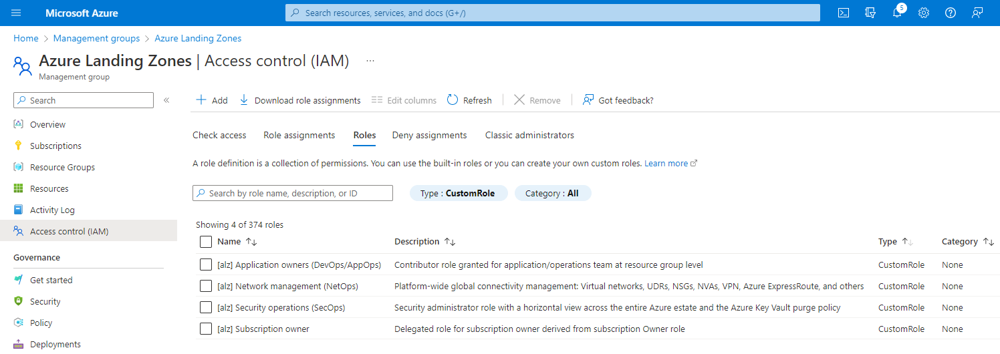
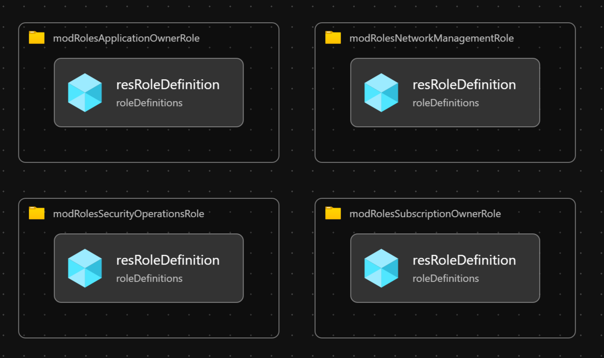

# Module:  Custom Role Definitions

This module defines custom roles based on the recommendations from the Azure Landing Zone Conceptual Architecture.  The role definitions are defined in [Identity and access management](https://docs.microsoft.com/azure/cloud-adoption-framework/ready/enterprise-scale/identity-and-access-management) recommendations.

Module supports the following custom roles:

- Subscription owner
- Application owners (DevOps/AppOps)
- Network management (NetOps)
- Security operations (SecOps)

## Parameters

The module requires the following inputs:

 | Parameter                           | Description                                                                                                                                                                                                                                                    | Requirement     | Example |
 | ----------------------------------- | -------------------------------------------------------------------------------------------------------------------------------------------------------------------------------------------------------------------------------------------------------------- | --------------- | ------- |
 | parAssignableScopeManagementGroupId | The management group scope to which the role can be assigned.  This management group ID will be used for the [assignableScopes](https://docs.microsoft.com/azure/role-based-access-control/role-definitions#assignablescopes) property in the role definition. | Mandatory input | `alz`   |
 | parTelemetryOptOut                  | Set Parameter to true to Opt-out of deployment telemetry                                                                                                                                                                                                       | None            | `false` |

## Outputs

The module will generate the following outputs:

| Output                           | Type   | Example                                                                      |
| -------------------------------- | ------ | ---------------------------------------------------------------------------- |
| outRolesSubscriptionOwnerRoleId  | string | Microsoft.Authorization/roleDefinitions/8736d87d-8d31-53be-b952-a04c8d470f69 |
| outRolesApplicationOwnerRoleId   | string | Microsoft.Authorization/roleDefinitions/4308c4e6-07d5-534f-9e18-32769872a3f4 |
| outRolesNetworkManagementRoleId  | string | Microsoft.Authorization/roleDefinitions/4a200286-e2a0-5239-aa8f-fe0a90dd2eb5 |
| outRolesSecurityOperationsRoleId | string | Microsoft.Authorization/roleDefinitions/b2960c40-d3db-5190-94c1-5b07c9547956 |

## Deployment

There are two different sets of deployment; one for deploying to Azure global regions, and another for deploying specifically to Azure China regions. This is due to the following resource provider which is not returned in the list of providers from Azure Resource Manager in Azure China cloud.

> Microsoft.Support resource provider is not supported because Azure support in China regions is independently operated and provided by 21Vianet.

 | Azure Cloud    | Bicep template                 | Input parameters file                             |
 | -------------- | ------------------------------ | ------------------------------------------------- |
 | Global regions | customRoleDefinitions.bicep    | parameters/customRoleDefinitions.parameters.all.json |
 | China regions  | mc-customRoleDefinitions.bicep | parameters/customRoleDefinitions.parameters.all.json |

In this example, the custom roles will be deployed to the `alz` management group (the intermediate root management group).

Input parameter file `parameters/customRoleDefinitions.parameters.all.json` defines the assignable scope for the roles.  In this case, it will be the same management group (i.e. `alz`) as the one specified for the deployment operation. There is no change in the input parameter file for different Azure clouds because there is no change to the intermediate root management group.

> For the examples below we assume you have downloaded or cloned the Git repo as-is and are in the root of the repository as your selected directory in your terminal of choice.

### Azure CLI
```bash
# For Azure global regions
az deployment mg create \
  --template-file infra-as-code/bicep/modules/customRoleDefinitions/customRoleDefinitions.bicep \
  --parameters @infra-as-code/bicep/modules/customRoleDefinitions/parameters/customRoleDefinitions.parameters.all.json \
  --location eastus \
  --management-group-id alz
```
OR
```bash
# For Azure China regions
az deployment mg create \
  --template-file infra-as-code/bicep/modules/customRoleDefinitions/mc-customRoleDefinitions.bicep \
  --parameters @infra-as-code/bicep/modules/customRoleDefinitions/parameters/customRoleDefinitions.parameters.all.json \
  --location chinaeast2 \
  --management-group-id alz
```

### PowerShell

```powershell
# For Azure global regions
New-AzManagementGroupDeployment `
  -TemplateFile infra-as-code/bicep/modules/customRoleDefinitions/customRoleDefinitions.bicep `
  -TemplateParameterFile infra-as-code/bicep/modules/customRoleDefinitions/parameters/customRoleDefinitions.parameters.all.json `
  -Location eastus `
  -ManagementGroupId alz
```
OR
```powershell
# For Azure China regions
New-AzManagementGroupDeployment `
  -TemplateFile infra-as-code/bicep/modules/customRoleDefinitions/mc-customRoleDefinitions.bicep `
  -TemplateParameterFile infra-as-code/bicep/modules/customRoleDefinitions/parameters/customRoleDefinitions.parameters.all.json `
  -Location chinaeast2 `
  -ManagementGroupId alz
```



## Bicep Visualizer


