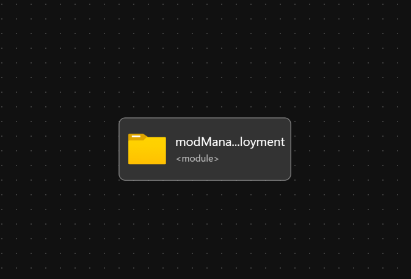

# Module: Get Management Group Name

This module is only used to get the current Management Group name when a deployment is ran against a Management Group scope.

This is a known issue with the `managementGroup()` and other resource like functions that is tracked here for resolution in the Bicep repo:

- [https://github.com/Azure/bicep/issues/2535](https://github.com/Azure/bicep/issues/2535)
- [https://github.com/Azure/bicep/pull/4478](https://github.com/Azure/bicep/pull/4478)

> This module is not meant for consumption by end users, however it may be useful until the above PR is merged and rolled into the Azure platform.
> This module is consumed by other modules within the ALZ Bicep implementation to provide the Management Group name where required in some parameters/variables.

## Parameters

The module doesn't require any parameter inputs..

## Outputs

The module will generate the following outputs:

Output | Type | Example
------ | ---- | --------
outManagementGroupName | string | alz

## Deployment

In this example, the Management Group Name will be returned based on the Management Group that the Bicep module is deployed to, in this example it will be the  `alz` Management Group (the intermediate root management group).

> For the below examples we assume you have downloaded or cloned the Git repo as-is and are in the root of the repository as your selected directory in your terminal of choice.

### Azure CLI

```bash
az deployment mg create \
  --template-file infra-as-code/bicep/modules/getManagementGroupName/getManagementGroupName.bicep \
  --location eastus \
  --management-group-id 'alz'
```

### PowerShell

```powershell
New-AzManagementGroupDeployment `
  -TemplateFile infra-as-code/bicep/modules/getManagementGroupName/getManagementGroupName.bicep `
  -Location eastus `
  -ManagementGroupId 'alz'
```

## Bicep Visualizer


