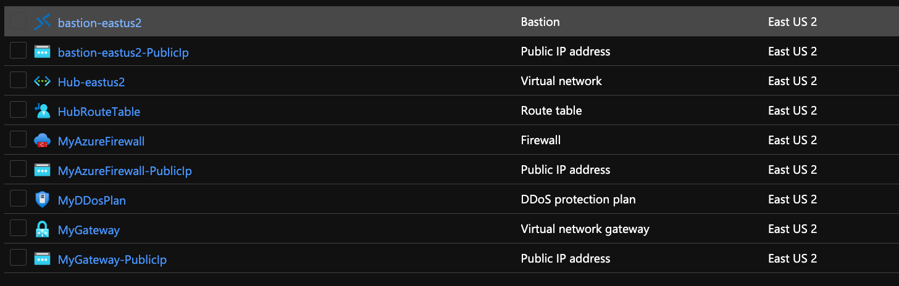

# Module:  Hub-Network

This module defines custom hub network based on the recommendations from the Azure Landing Zone Conceptual Architecture.  

Module deploys the following resources:
  * VNet
  * Subnets
  * VPN Gateway/ExpressRoute Gateway
  * Azure Firewall
  * Private DNS Zones - https://docs.microsoft.com/en-us/azure/private-link/private-endpoint-dns#azure-services-dns-zone-configuration
  * Ddos
  * Bastion 


## Parameters

The module requires the following inputs:

 Parameter | Type | Description | Requirement | Example
----------- | ---- | ----------- | ----------- | -------
parBastionEnabled | bool| Switch to enable deployment Bastion Service  | None | true
parDdosEnabled | bool | Switch to enable deployment of distributed denial of service attacks service | None | true
parAzureFirewallEnabled | bool | Switch to enable deployment Azure Firewall | None | true 
parGatewayEnabled | bool | Switch to enable deployment of Azure Virtual Network Gateway | None | true
parDdosPlanName | string | Name which will be associated with distributed denial of service protection plan | 1-80 char | MyDDosPlan
parBastionSku | string | SKU or Tier of Bastion Service to deploy | Standard or Basic | Standard
parPublicIPSku | string | SKU or Tier of Public IP to deploy | Standard or Basic | Standard
parTags | object | List of tags (Key Value Pairs) to be applied to resources | None | environment: 'development'
parGatewayType | string | Type of Virtual Network Gateway to deploy | Vpn, ExpressRoute, Local Gateway | Vpn
parGatewayName | string | Name associated with Virtual Network Gateway | 1-80 char | MyGateway
parVpnType | string | Type of virtual private network to deploy | PolicyBased or RouteBased | RouteBased
parVPNSku | string | Sku or Tier of VPN to deploy |  https://docs.microsoft.com/en-us/azure/vpn-gateway/vpn-gateway-about-skus-legacy | VpnGw1
parHubNetworkAddressPrefix string | CIDR range for Hub Network| 2-50 | Hub
parHubNetworkPrefix | string | Name prefix for Virtual Network.  Prefix will be appended with the region.| 2-50 char | Hub
parAzureFirewallName | string |Name associate with Azure Firewall | 1-80 char | MyAzureFirewall
parHubRouteTableName | string | Name of route table to be associated with Hub Network | 1-80 char | HubRouteTable
parSubnets | array | Array of objects to providing for dynamic set of subnets | Must provide array of objects | { 
  ||||| name: 'frontend'
  ||||| ipAddressRange: '10.10.5.0/24'
||||| }
||||| {
  ||||| name: 'backend'
  ||||| ipAddressRange: '10.10.5.0/24' 
||||| }
## Outputs

The module will generate the following outputs:

Output | Type | Example
------ | ---- | --------
outAzureFirewallPrivateIP | string | 192.168.100.1
outAzureFirewallName | string | MyAzureFirewall

## Deployment

In this example, the hub resources will be deployed to the resource group specified.
We will take the default values and not pass any parameters.

> For the below examples we assume you have downloaded or cloned the Git repo as-is and are in the root of the repository as your selected directory in your terminal of choice.

### Azure CLI
```bash
az deployment group hubnet create --resource-group HUB --template-file hub-network.bicep
```



## Bicep Visualizer

