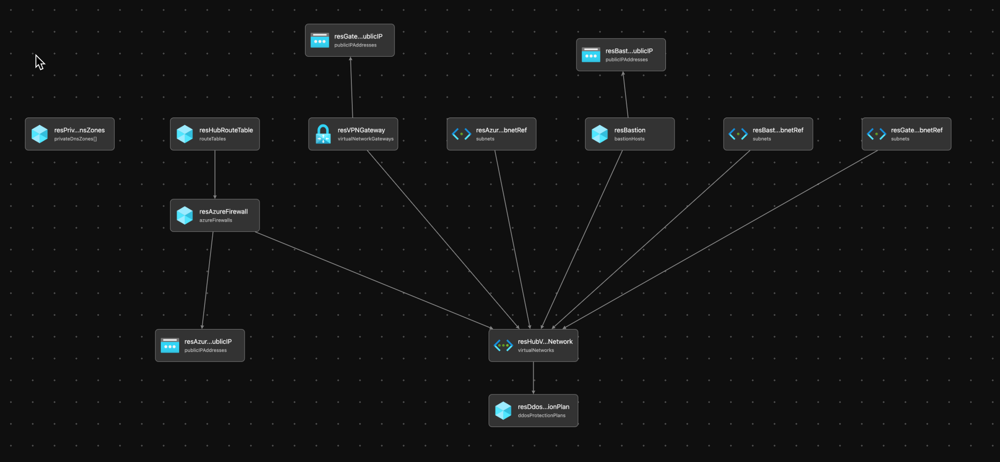

# Module:  Hub-Networking

This module defines hub networking based on the recommendations from the Azure Landing Zone Conceptual Architecture.  

Module deploys the following resources:
  * Virtual Network (VNet)
  * Subnets
  * VPN Gateway/ExpressRoute Gateway
  * Azure Firewall
  * Private DNS Zones - Details of all the Azure Private DNS zones can be found here --> https://docs.microsoft.com/en-us/azure/private-link/private-endpoint-dns#azure-services-dns-zone-configuration
  * DDos Standard Plan
  * Bastion 


## Parameters

The module requires the following inputs:

 Parameter | Type | Default | Description | Requirement | Example
----------- | ---- | ------- |----------- | ----------- | -------
parBastionEnabled | bool| true |Switch to enable deployment Bastion Service  | None | true
parDdosEnabled | bool | true | Switch to enable deployment of distributed denial of service attacks service | None | true
parAzureFirewallEnabled | bool | true | Switch to enable deployment Azure Firewall | None | true 
parPrivateDNSZonesEnabled | bool | true | Switch to enable deployment of Azure Private Dns Zones | None | true
parGatewayArray | array | 'Vpn' | Array of Gateways to be deployed. Array will consist of one or two items.  Specifically Vpn and/or ExpressRoute Default: Vpn' | None |[
||||||  'Vpn' 
||||||  'ExpressRoute'
||||||]
parCompanyPrefix | string | alz | Prefix value which will be pre-appended to all resource names | 1-10 char | alz 
parDdosPlanName | string | ${parCompanyPrefix}-DDos-Plan | Name which will be associated with distributed denial of service protection plan | 1-80 char | alz-DDos-Plan
parBastionName | string | ${parCompanyPrefix}-bastion | Name which will be associated with Bastion Service. | 1-80 char | alz-bastion
parVpnGatewayGeneration | string | Generation2 | Vpn Gateway generation to deploy | 11 char| Generation2
parBastionSku | string | Standard | SKU or Tier of Bastion Service to deploy | Standard or Basic | Standard
parPublicIPSku | string | Standard |SKU or Tier of Public IP to deploy | Standard or Basic | Standard
parTags | object | Empty Array |List of tags (Key Value Pairs) to be applied to resources | None | environment: 'development'
parHubNetworkAddressPrefix | string | 10.10.0.0/16 |CIDR range for Hub Network| CIDR Notation | 10.10.0.0/16
parHubNetworkName | string | ${parCompanyPrefix}-hub-${resourceGroup().location} |Name prefix for Virtual Network.  Prefix will be appended with the region.| 2-50 char | alz-hub-eastus2
parAzureFirewallName | string | ${parCompanyPrefix}-azure-firewall | Name associate with Azure Firewall | 1-80 char | alz-azure-firewall
parAzureFirewallTier | string | Standard | Tier associated with the Firewall to be deployed. | Standard or Premium | Premium
parHubRouteTableName | string | ${parCompanyPrefix}-hub-routetable | Name of route table to be associated with Hub Network | 1-80 char | alz-hub-routetable
parGatewayArray | array| `[{"name":"alz-Vpn-Gateway","gatewaytype":"Vpn","sku":"VpnGw1","vpntype":"RouteBased","generation":"Generation2","enableBgp":false,"activeActive":false,"enableBgpRouteTranslationForNat":false,"enableDnsForwarding":false,"asn":"65515","bgpPeeringAddress":"","bgpsettings":{"asn":"65515","bgpPeeringAddress":"","peerWeight":"5"}},{"name":"alz-ExpressRoute-Gateway","gatewaytype":"ExpressRoute","sku":"ErGw1AZ","vpntype":"RouteBased","generation":"None","enableBgp":false,"activeActive":false,"enableBgpRouteTranslationForNat":false,"enableDnsForwarding":false,"asn":"65515","bgpPeeringAddress":"","bgpsettings":{"asn":"65515","bgpPeeringAddress":"","peerWeight":"5"}}]` | Array of Gateways to create including the properties of the gateway. | None | See Default
parSubnets | array | AzureBastionSubnet, GatewaySubnet, AzureFirewallSubnet | Array of objects to providing for dynamic set of subnets | Must provide array of objects | `[{"name":"AzureBastionSubnet","ipAddressRange":"10.20.15.0/24"},{"name":"GatewaySubnet","ipAddressRange":"10.20.252.0/24"},{"name":"AzureFirewallSubnet","ipAddressRange":"10.20.254.0/24"}]`
## Outputs

The module will generate the following outputs:

Output | Type | Example
------ | ---- | --------
outAzureFirewallPrivateIP | string | 192.168.100.1
outAzureFirewallName | string | MyAzureFirewall
outDdosPlanResourceId | string | /subscriptions/xxxxxxxx-xxxx-xxxx-xxxx-xxxxxxxxxxxx/resourceGroups/HUB_Networking_POC/providers/Microsoft.Network/ddosProtectionPlans/alz-Ddos-Plan
outPrivateDnsZones | array | `["name": "privatelink.azurecr.io", "id": "/subscriptions/xxxxxxxx-xxxx-xxxx-xxxx-xxxxxxxxxxxx/resourceGroups/net-lz-spk-eastus-rg/providers/Microsoft.Network/privateDnsZones/privatelink.azurecr.io"]`

## Deployment
> **Note:** `bicepconfig.json` file is included in the module directory.  This file allows us to override Bicep Linters.  Currently there are two URLs which were removed because of linter warnings.  URLs removed are the following: database.windows.net and core.windows.net

In this example, the hub resources will be deployed to the resource group specified.
We will take the default values and not pass any parameters.

> For the below examples we assume you have downloaded or cloned the Git repo as-is and are in the root of the repository as your selected directory in your terminal of choice.

### Azure CLI
```bash
az group create --location eastus2 \
   --name Hub_Networking_POC

az deployment group create \
   --resource-group HUB_Networking_POC  \
   --template-file infra-as-code/bicep/modules/hub-networking/hub-networking.bicep \
   --parameters @infra-as-code/bicep/modules/hub-networking/hub-networking.parameters.example.json
```

### PowerShell

```powershell
New-AzResourceGroup -Name 'Hub_Networking_POC' `
  -Location 'EastUs2'
  
New-AzManagementGroupDeployment `
  -TemplateFile infra-as-code/bicep/modules/hub-networking/hub-networking.bicep `
  -TemplateParameterFile infra-as-code/bicep/modules/hub-networking/hub-networking.parameters.example.json
```

## Example Output


## Bicep Visualizer


