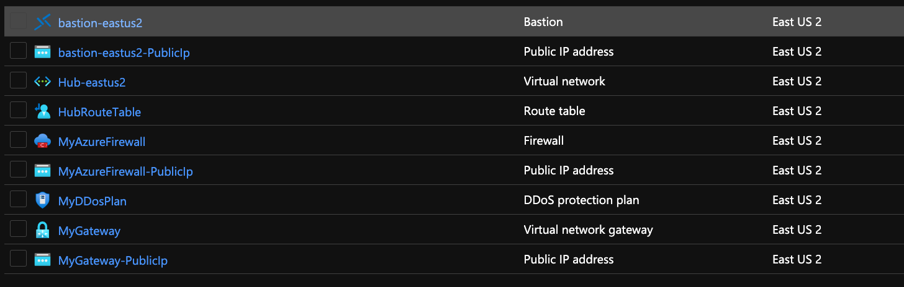
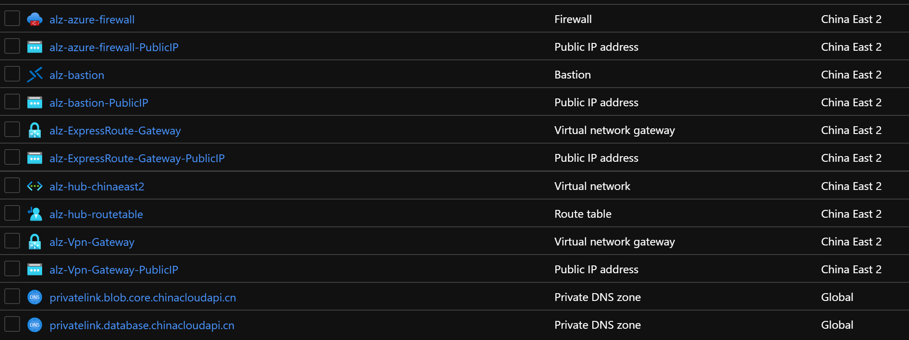
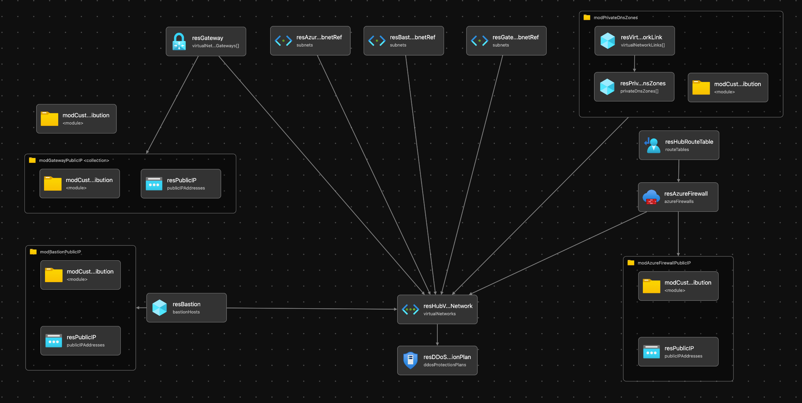

# Module:  Hub-Networking

This module defines hub networking based on the recommendations from the Azure Landing Zone Conceptual Architecture.  

Module deploys the following resources:

- Virtual Network (VNet)
- Subnets
- VPN Gateway/ExpressRoute Gateway
- Azure Firewall
- Private DNS Zones - Details of all the Azure Private DNS zones can be found here --> [https://docs.microsoft.com/en-us/azure/private-link/private-endpoint-dns#azure-services-dns-zone-configuration](https://docs.microsoft.com/en-us/azure/private-link/private-endpoint-dns#azure-services-dns-zone-configuration)
- DDos Standard Plan
- Bastion

## Parameters

The module requires the following inputs:

 | Parameter                       | Type   | Default                                                                                                                    | Description                                                                                                                                                                                                                                                                                                                                                                                                                                                                                                                                 | Requirement                   | Example                                        |
 | ------------------------------- | ------ | -------------------------------------------------------------------------------------------------------------------------- | ------------------------------------------------------------------------------------------------------------------------------------------------------------------------------------------------------------------------------------------------------------------------------------------------------------------------------------------------------------------------------------------------------------------------------------------------------------------------------------------------------------------------------------------- | ----------------------------- | ---------------------------------------------- |
 | parLocation                     | string | `resourceGroup().location`                                                                                                 | The Azure Region to deploy the resources into                                                                                                                                                                                                                                                                                                                                                                                                                                                                                               | None                          | `eastus`                                       |
 | parAzBastionEnabled             | bool   | true                                                                                                                       | Switch to enable deployment of Bastion Service                                                                                                                                                                                                                                                                                                                                                                                                                                                                                              | None                          | true                                           |
 | parDdosEnabled                  | bool   | true                                                                                                                       | Switch to enable deployment of distributed denial of service attacks service                                                                                                                                                                                                                                                                                                                                                                                                                                                                | None                          | true                                           |
 | parAzFirewallEnabled            | bool   | true                                                                                                                       | Switch to enable deployment of Azure Firewall                                                                                                                                                                                                                                                                                                                                                                                                                                                                                               | None                          | true                                           |
 | parPrivateDnsZonesEnabled       | bool   | true                                                                                                                       | Switch to enable deployment of Azure Private DNS Zones                                                                                                                                                                                                                                                                                                                                                                                                                                                                                      | None                          | true                                           |
 | parPrivateDnsZonesResourceGroup | string | `resourceGroup().name`                                                                                                     | Target Resource Group Name for Azure Private DNS Zones                                                                                                                                                                                                                                                                                                                                                                                                                                                                                      | 1-90 char                     | `Hub_PrivateDNS_POC` - Must already be present |
 | parPrivateDnsZones              | array  | See example parameters file [`parameters/hubNetworking.parameters.all.json`](parameters/hubNetworking.parameters.all.json) | Array of DNS Zones to provision in Hub Virtual Network. Default: All known Azure Private DNS Zones except for: `privatelink.batch.azure.com`, `privatelink.azmk8s.io` and `privatelink.siterecovery.windowsazure.com` as these are region specific and `privatelink.{dnsPrefix}.database.windows.net` as the DNS Prefix is individual, which you can add to the parameters file with the required region and DNS Prefix in the zone name that you wish to deploy for. For more details on private DNS Zones please refer to the above link. | None                          | See Default                                    |
 | parCompanyPrefix                | string | alz                                                                                                                        | Prefix value which will be pre-appended to all resource names                                                                                                                                                                                                                                                                                                                                                                                                                                                                               | 1-10 char                     | alz                                            |
 | parDdosPlanName                 | string | `${parCompanyPrefix}-ddos-plan`                                                                                            | Name which will be associated with distributed denial of service protection plan                                                                                                                                                                                                                                                                                                                                                                                                                                                            | 1-80 char                     | alz-ddos-plan                                  |
 | parAzBastionName                | string | `${parCompanyPrefix}-bastion`                                                                                              | Name which will be associated with Bastion Service.                                                                                                                                                                                                                                                                                                                                                                                                                                                                                         | 1-80 char                     | alz-bastion                                    |
 | parAzBastionNsgName             | string | `nsg-AzureBastionSubnet`                                                                                                   | NSG Name for Azure Bastion Subnet NSG                                                                                                                                                                                                                                                                                                                                                                                                                                                                                                          | 1-80 char                     | nsg-AzureBastionSubnet                         |
 | parAzBastionSku                 | string | Standard                                                                                                                   | SKU or Tier of Bastion Service to deploy                                                                                                                                                                                                                                                                                                                                                                                                                                                                                                    | Standard or Basic             | Standard                                       |
 | parPublicIpSku                  | string | Standard                                                                                                                   | SKU or Tier of Public IP to deploy                                                                                                                                                                                                                                                                                                                                                                                                                                                                                                          | Standard or Basic             | Standard                                       |
 | parTags                         | object | Empty Array []                                                                                                             | List of tags (Key Value Pairs) to be applied to resources                                                                                                                                                                                                                                                                                                                                                                                                                                                                                   | None                          | environment: 'development'                     |
 | parHubNetworkAddressPrefix      | string | 10.10.0.0/16                                                                                                               | CIDR range for Hub Network                                                                                                                                                                                                                                                                                                                                                                                                                                                                                                                  | CIDR Notation                 | 10.10.0.0/16                                   |
 | parHubNetworkName               | string | `${parCompanyPrefix}-hub-${parLocation}`                                                                                   | Name prefix for Virtual Network.  Prefix will be appended with the region.                                                                                                                                                                                                                                                                                                                                                                                                                                                                  | 2-50 char                     | alz-hub-eastus                                 |
 | parAzFirewallName               | string | `${parCompanyPrefix}-azfw-${parLocation}`                                                                                  | Name associated with Azure Firewall                                                                                                                                                                                                                                                                                                                                                                                                                                                                                                         | 1-80 char                     | alz-azfw-eastus                                |
 | parAzFirewallPoliciesName       | string | `${parCompanyPrefix}-azfwpolicy-${resourceGroup().location}`                                                               | Name associated with Azure Firewall Policy                                                                                                                                                                                                                                                                                                                                                                                                                                                                                                  | 1-80 char                     | alz-azfwpolicy-eastus                          |
 | parAzFirewallTier               | string | Standard                                                                                                                   | Tier associated with the Firewall to be deployed.                                                                                                                                                                                                                                                                                                                                                                                                                                                                                           | Standard or Premium           | Premium                                        |
 | parAzFirewallAvailabilityZones  | array  | Empty Array []                                                                                                             | Availability Zones to deploy the Azure Firewall across. Region must support Availability Zones to use. If it does not then leave empty.                                                                                                                                                                                                                                                                                                                                                                                                     | None                          | `['1']` or `['1' ,'2', '3']`                   |
 | parHubRouteTableName            | string | `${parCompanyPrefix}-hub-routetable`                                                                                       | Name of route table to be associated with Hub Network                                                                                                                                                                                                                                                                                                                                                                                                                                                                                       | 1-80 char                     | alz-hub-routetable                             |
 | parVpnGatewayConfig             | object | See example parameters file [`parameters/hubNetworking.parameters.all.json`](parameters/hubNetworking.parameters.all.json) | Configuration for VPN virtual network gateway to be deployed. If a VPN virtual network gateway is not desired an empty object should be used as the input parameter in the parameter file, i.e. "parVpnGatewayConfig": {"value": {} }'''                                                                                                                                                                                                                                                                                                    | None                          | See Default                                    |
 | parExpressRouteGatewayConfig    | object | See example parameters file [`parameters/hubNetworking.parameters.all.json`](parameters/hubNetworking.parameters.all.json) | Configuration for ExpressRoute virtual network gateway to be deployed. If a ExpressRoute virtual network gateway is not desired an empty object should be used as the input parameter in the parameter file, i.e. "parExpressRouteGatewayConfig": {"value": {} }'''                                                                                                                                                                                                                                                                         | None                          | See Default                                    |
 | parSubnets                      | array  | See example parameters file [`parameters/hubNetworking.parameters.all.json`](parameters/hubNetworking.parameters.all.json) | Array of objects to provide for a dynamic set of subnets                                                                                                                                                                                                                                                                                                                                                                                                                                                                                    | Must provide array of objects | See Default                                    |
 | parDnsServerIps                 | array  | Empty Array []                                                                                                             | Array of DNS Server IP addresses for VNet.                                                                                                                                                                                                                                                                                                                                                                                                                                                                                                  | None                          | `['10.10.1.4', '10.10.2.4']`                   |
 | parAzFirewallDnsProxyEnabled    | bool   | true                                                                                                                       | Switch which enables DNS Proxy to be enabled on the Azure Firewall                                                                                                                                                                                                                                                                                                                                                                                                                                                                          | None                          | true                                           |
 | parDisableBgpRoutePropagation   | bool   | false                                                                                                                      | Switch which allows BGP Propagation to be disabled on the route tables                                                                                                                                                                                                                                                                                                                                                                                                                                                                      | None                          | false                                          |
 | parTelemetryOptOut              | bool   | false                                                                                                                      | Set Parameter to true to Opt-out of deployment telemetry                                                                                                                                                                                                                                                                                                                                                                                                                                                                                    | None                          | false                                          |

> NOTE: When deploying using the `parameters/hubNetworking.parameters.all.json` you must update the `parPrivateDnsZones` parameter by replacing the `xxxxxx` placeholders with the deployment region. Failure to do so will cause these services to be unreachable over private endpoints.
> For example, if deploying to East US the following zone entries:
> - `privatelink.xxxxxx.azmk8s.io`
> - `privatelink.xxxxxx.backup.windowsazure.com`
> - `privatelink.xxxxxx.batch.azure.com`
>
> Will become:
> - `privatelink.eastus.azmk8s.io`
> - `privatelink.eastus.backup.windowsazure.com`
> - `privatelink.eastus.batch.azure.com`


## Outputs

The module will generate the following outputs:

| Output                 | Type   | Example                                                                                                                                                                                                  |
| ---------------------- | ------ | -------------------------------------------------------------------------------------------------------------------------------------------------------------------------------------------------------- |
| outAzFirewallPrivateIp | string | 192.168.100.1                                                                                                                                                                                            |
| outAzFirewallName      | string | MyAzureFirewall                                                                                                                                                                                          |
| outDdosPlanResourceId  | string | /subscriptions/xxxxxxxx-xxxx-xxxx-xxxx-xxxxxxxxxxxx/resourceGroups/HUB_Networking_POC/providers/Microsoft.Network/ddosProtectionPlans/alz-ddos-plan                                                      |
| outPrivateDnsZones     | array  | `["name": "privatelink.azurecr.io", "id": "/subscriptions/xxxxxxxx-xxxx-xxxx-xxxx-xxxxxxxxxxxx/resourceGroups/net-lz-spk-eastus-rg/providers/Microsoft.Network/privateDnsZones/privatelink.azurecr.io"]` |

## Deployment
> **Note:** `bicepconfig.json` file is included in the module directory.  This file allows us to override Bicep Linters.  Currently there are two URLs which were removed because of linter warnings.  URLs removed are the following: database.windows.net and core.windows.net

In this example, the hub resources will be deployed to the resource group specified. According to the Azure Landing Zone Conceptual Architecture, the hub resources should be deployed into the Platform connectivity subscription. During the deployment step, we will take the default values and not pass any parameters.

There are two different sets of input parameters; one for deploying to Azure global regions, and another for deploying specifically to Azure China regions. This is due to different private DNS zone names for Azure services in Azure global regions and Azure China. The recommended private DNS zone names are available [here](https://docs.microsoft.com/azure/private-link/private-endpoint-dns). Other differences in Azure China regions are as follow:
- DDoS Protection feature is not available. parDdosEnabled parameter is set as false.
- The SKUs available for an ExpressRoute virtual network gateway are Standard, HighPerformance and UltraPerformance. Sku is set as "Standard" in the example parameters file.

 | Azure Cloud    | Bicep template      | Input parameters file                           |
 | -------------- | ------------------- | ----------------------------------------------- |
 | Global regions | hubNetworking.bicep | parameters/hubNetworking.parameters.all.json    |
 | China regions  | hubNetworking.bicep | parameters/mc-hubNetworking.parameters.all.json |

> For the examples below we assume you have downloaded or cloned the Git repo as-is and are in the root of the repository as your selected directory in your terminal of choice.

### Azure CLI
```bash
# For Azure global regions
# Set Platform connectivity subscription ID as the the current subscription 
ConnectivitySubscriptionId="[your platform connectivity subscription ID]"
az account set --subscription $ConnectivitySubscriptionId

az group create --location eastus \
   --name Hub_Networking_POC

az deployment group create \
   --resource-group HUB_Networking_POC  \
   --template-file infra-as-code/bicep/modules/hubNetworking/hubNetworking.bicep \
   --parameters @infra-as-code/bicep/modules/hubNetworking/parameters/hubNetworking.parameters.all.json
```
OR
```bash
# For Azure China regions
# Set Platform connectivity subscription ID as the the current subscription 
ConnectivitySubscriptionId="[your platform connectivity subscription ID]"
az account set --subscription $ConnectivitySubscriptionId

az group create --location chinaeast2 \
   --name Hub_Networking_POC

az deployment group create \
   --resource-group HUB_Networking_POC  \
   --template-file infra-as-code/bicep/modules/hubNetworking/hubNetworking.bicep \
   --parameters @infra-as-code/bicep/modules/hubNetworking/parameters/mc-hubNetworking.parameters.all.json
```

### PowerShell

```powershell
# For Azure global regions
# Set Platform connectivity subscription ID as the the current subscription 
$ConnectivitySubscriptionId = "[your platform connectivity subscription ID]"

Select-AzSubscription -SubscriptionId $ConnectivitySubscriptionId

New-AzResourceGroup -Name 'Hub_Networking_POC' `
  -Location 'eastus'
  
New-AzResourceGroupDeployment `
  -TemplateFile infra-as-code/bicep/modules/hubNetworking/hubNetworking.bicep `
  -TemplateParameterFile infra-as-code/bicep/modules/hubNetworking/parameters/hubNetworking.parameters.all.json `
  -ResourceGroupName 'Hub_Networking_POC'
```
OR
```powershell
# For Azure China regions
# Set Platform connectivity subscription ID as the the current subscription 
$ConnectivitySubscriptionId = "[your platform connectivity subscription ID]"

Select-AzSubscription -SubscriptionId $ConnectivitySubscriptionId

New-AzResourceGroup -Name 'Hub_Networking_POC' `
  -Location 'chinaeast2'
  
New-AzResourceGroupDeployment `
  -TemplateFile infra-as-code/bicep/modules/hubNetworking/hubNetworking.bicep `
  -TemplateParameterFile infra-as-code/bicep/modules/hubNetworking/parameters/mc-hubNetworking.parameters.all.json `
  -ResourceGroupName 'Hub_Networking_POC'
```
## Example Output in Azure global regions



## Example Output in Azure China regions


## Bicep Visualizer


