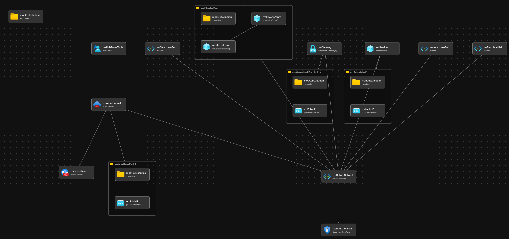

# Module:  Hub-Networking

This module defines hub networking based on the recommendations from the Azure Landing Zone Conceptual Architecture.

Module deploys the following resources:

- Virtual Network (VNet)
- Subnets
- VPN Gateway/ExpressRoute Gateway
- Azure Firewall
- Azure Firewall Policies
- Private DNS Zones
- DDoS Network Protection Plan
- Bastion
- Route Table

## Parameters

- [Parameters for Azure Commercial Cloud](generateddocs/hubNetworking.bicep.md)

> **NOTE:**
> - Although there are generated parameter markdowns for Azure Commercial Cloud, this same module can still be used in Azure China. Example parameter are in the [parameters](./parameters/) folder.
>
> - The file `parameters/hubNetworking.parameters.az.all.json` contains parameter values for SKUs that are compatible with availability zones for relevant resource types. In cases where you are deploying to a region that does not support availability zones, you should opt for the `parameters/hubNetworking.parameters.all.json` file.
>
> - When deploying using the `parameters/hubNetworking.parameters.all.json` you must update the `parPrivateDnsZones` parameter by replacing the `xxxxxx` placeholders with the deployment region or geo code, for Azure Backup. Failure to do so will cause these services to be unreachable over private endpoints.
>
> For example, if deploying to East US the following zone entries:
> - `privatelink.xxxxxx.azmk8s.io`
> - `privatelink.xxxxxx.backup.windowsazure.com`
> - `privatelink.xxxxxx.batch.azure.com`
>
> Will become:
> - `privatelink.eastus.azmk8s.io`
> - `privatelink.eus.backup.windowsazure.com`
> - `privatelink.eastus.batch.azure.com`
>
> See child module, [`privateDnsZones.bicep` docs](https://github.com/Azure/ALZ-Bicep/tree/main/infra-as-code/bicep/modules/privateDnsZones#dns-zones) for more info on how this works

To configure P2S VPN connections edit the vpnClientConfiguration value in the `parVpnGatewayConfig` parameter.

AAD Authentication Example:

```bicep
"vpnClientConfiguration": {
  "vpnClientAddressPool": {
    "addressPrefixes": [
      "172.16.0.0/24"
    ]
  },
  "vpnClientProtocols": [
    "OpenVPN"
  ],
  "vpnAuthenticationTypes": [
    "AAD"
  ],
  "aadTenant": "https://login.microsoftonline.com/{AzureAD TenantID}",
  "aadAudience": "41b23e61-6c1e-4545-b367-cd054e0ed4b4",
  "aadIssuer": "https://sts.windows.net/{AzureAD TenantID}/"
}
```

Replace the values for `aadTenant`, `aadAudience`, and `aadIssuer` as documented [here](https://learn.microsoft.com/en-us/azure/vpn-gateway/openvpn-azure-ad-tenant#enable-authentication)

## Outputs

The module will generate the following outputs:

| Output                    | Type   | Example                                                                                                                                                                                                  |
| ------------------------- | ------ | -------------------------------------------------------------------------------------------------------------------------------------------------------------------------------------------------------- |
| outAzFirewallPrivateIp    | string | 192.168.100.1                                                                                                                                                                                            |
| outAzFirewallName         | string | MyAzureFirewall                                                                                                                                                                                          |
| outDdosPlanResourceId     | string | /subscriptions/xxxxxxxx-xxxx-xxxx-xxxx-xxxxxxxxxxxx/resourceGroups/HUB_Networking_POC/providers/Microsoft.Network/ddosProtectionPlans/alz-ddos-plan                                                      |
| outPrivateDnsZones        | array  | `[{"name":"privatelink.azurecr.io","id":"/subscriptions/xxxxxxxx-xxxx-xxxx-xxxx-xxxxxxxxxxxx/resourceGroups/net-lz-spk-eastus-rg/providers/Microsoft.Network/privateDnsZones/privatelink.azurecr.io"},{"name":"privatelink.azurewebsites.net","id":"/subscriptions/xxxxxxxx-xxxx-xxxx-xxxx-xxxxxxxxxxxx/resourceGroups/net-lz-spk-eastus-rg/providers/Microsoft.Network/privateDnsZones/privatelink.azurewebsites.net"}]` |
| outPrivateDnsZonesNames  | array  | `["privatelink.azurecr.io", "privatelink.azurewebsites.net"]` |
| outHubVirtualNetworkName  | array  | MyHubVirtualNetworkName |
| outHubVirtualNetworkId    | array  | /subscriptions/xxxxxxxx-xxxx-xxxx-xxxx-xxxxxxxxxxxx/resourceGroups/HUB_Networking_POC/providers/Microsoft.Network/virtualNetworks/my-hub-vnet   |

## Deployment
> **Note:** `bicepconfig.json` file is included in the module directory.  This file allows us to override Bicep Linters.  Currently there are two URLs which were removed because of linter warnings.  URLs removed are the following: database.windows.net and core.windows.net

In this example, the hub resources will be deployed to the resource group specified. According to the Azure Landing Zone Conceptual Architecture, the hub resources should be deployed into the Platform connectivity subscription. During the deployment step, we will take the default values and not pass any parameters.

There are two different sets of input parameters; one for deploying to Azure global regions, and another for deploying specifically to Azure China regions. This is due to different private DNS zone names for Azure services in Azure global regions and Azure China. The recommended private DNS zone names are available [here](https://learn.microsoft.com/azure/private-link/private-endpoint-dns). Other differences in Azure China regions are as follow:
- DDoS Protection feature is not available. parDdosEnabled parameter is set as false.
- The SKUs available for an ExpressRoute virtual network gateway are Standard, HighPerformance and UltraPerformance. Sku is set as "Standard" in the example parameters file.

 | Azure Cloud    | Bicep template      | Input parameters file                           |
 | -------------- | ------------------- | ----------------------------------------------- |
 | Global regions | hubNetworking.bicep | parameters/hubNetworking.parameters.all.json    |
 | China regions  | hubNetworking.bicep | parameters/mc-hubNetworking.parameters.all.json |

> For the examples below we assume you have downloaded or cloned the Git repo as-is and are in the root of the repository as your selected directory in your terminal of choice.

### Azure CLI
```bash
# For Azure global regions

# Set Platform connectivity subscription ID as the the current subscription
ConnectivitySubscriptionId="[your platform connectivity subscription ID]"

az account set --subscription $ConnectivitySubscriptionId

# Set the top level MG Prefix in accordance to your environment. This example assumes default 'alz'.
TopLevelMGPrefix="alz"

dateYMD=$(date +%Y%m%dT%H%M%S%NZ)
NAME="alz-HubNetworkingDeploy-${dateYMD}"
GROUP="rg-$TopLevelMGPrefix-hub-networking-001"
TEMPLATEFILE="infra-as-code/bicep/modules/hubNetworking/hubNetworking.bicep"
PARAMETERS="@infra-as-code/bicep/modules/hubNetworking/parameters/hubNetworking.parameters.all.json"

az group create --location eastus \
   --name $GROUP

az deployment group create --name ${NAME:0:63} --resource-group $GROUP --template-file $TEMPLATEFILE --parameters $PARAMETERS
```
OR
```bash
# For Azure China regions
# Set Platform connectivity subscription ID as the the current subscription
ConnectivitySubscriptionId="[your platform connectivity subscription ID]"

az account set --subscription $ConnectivitySubscriptionId

# Set the top level MG Prefix in accordance to your environment. This example assumes default 'alz'.
TopLevelMGPrefix="alz"

dateYMD=$(date +%Y%m%dT%H%M%S%NZ)
NAME="alz-HubNetworkingDeploy-${dateYMD}"
GROUP="rg-$TopLevelMGPrefix-hub-networking-001"
TEMPLATEFILE="infra-as-code/bicep/modules/hubNetworking/hubNetworking.bicep"
PARAMETERS="@infra-as-code/bicep/modules/hubNetworking/parameters/mc-hubNetworking.parameters.all.json"

az group create --location chinaeast2 \
   --name $GROUP

az deployment group create --name ${NAME:0:63} --resource-group $GROUP --template-file $TEMPLATEFILE --parameters $PARAMETERS
```

### PowerShell

```powershell
# For Azure global regions
# Set Platform connectivity subscription ID as the the current subscription
$ConnectivitySubscriptionId = "[your platform connectivity subscription ID]"

Select-AzSubscription -SubscriptionId $ConnectivitySubscriptionId

# Set Platform management subscription ID as the the current subscription
$ManagementSubscriptionId = "[your platform management subscription ID]"

# Set the top level MG Prefix in accordance to your environment. This example assumes default 'alz'.
$TopLevelMGPrefix = "alz"

# Parameters necessary for deployment
$inputObject = @{
  DeploymentName        = 'alz-HubNetworkingDeploy-{0}' -f (-join (Get-Date -Format 'yyyyMMddTHHMMssffffZ')[0..63])
  ResourceGroupName     = "rg-$TopLevelMGPrefix-hub-networking-001"
  TemplateFile          = "infra-as-code/bicep/modules/hubNetworking/hubNetworking.bicep"
  TemplateParameterFile = "infra-as-code/bicep/modules/hubNetworking/parameters/hubNetworking.parameters.all.json"
}

New-AzResourceGroup `
  -Name $inputObject.ResourceGroupName `
  -Location 'eastus'

New-AzResourceGroupDeployment @inputObject
```
OR
```powershell
# For Azure China regions
# Set Platform connectivity subscription ID as the the current subscription
$ConnectivitySubscriptionId = "[your platform connectivity subscription ID]"

Select-AzSubscription -SubscriptionId $ConnectivitySubscriptionId

# Set the top level MG Prefix in accordance to your environment. This example assumes default 'alz'.
$TopLevelMGPrefix = "alz"

# Parameters necessary for deployment
$inputObject = @{
  DeploymentName        = 'alz-HubNetworkingDeploy-{0}' -f (-join (Get-Date -Format 'yyyyMMddTHHMMssffffZ')[0..63])
  ResourceGroupName     = "rg-$TopLevelMGPrefix-hub-networking-001"
  TemplateFile          = "infra-as-code/bicep/modules/hubNetworking/hubNetworking.bicep"
  TemplateParameterFile = "infra-as-code/bicep/modules/hubNetworking/parameters/mc-hubNetworking.parameters.all.json"
}

New-AzResourceGroup `
  -Name $inputObject.ResourceGroupName `
  -Location 'chinaeast2'

New-AzResourceGroupDeployment @inputObject
```
## Example Output in Azure global regions


## Example Output in Azure China regions


## Bicep Visualizer


