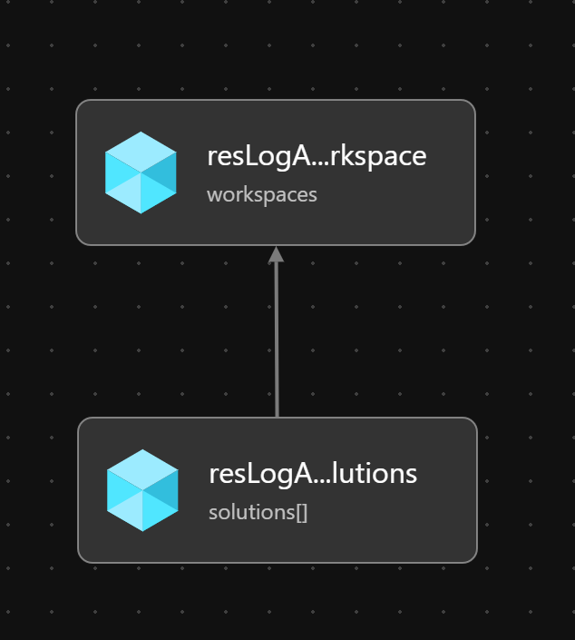

# Module:  Log Analytics Workspace & Solutions

Deploys an Azure Log Analytics Workspace & Solutions to an existing Resource Group.

The module will deploy the following solutions by default.  Solutions can be customized as required:

  * AgentHealthAssessment
  * AntiMalware
  * AzureActivity
  * ChangeTracking
  * Security
  * SecurityInsights (Azure Sentinel)
  * ServiceMap
  * SQLAssessment
  * Updates
  * VMInsights

## Parameters

The module requires the following required input parameters.

 Paramenter | Type | Description | Requirement | Example
----------- | ---- | ----------- | ----------- | -------
parName | string | Log Analytics Workspace name | Mandatory input, default: `alz-log-analytics` | `alz-log-analytics`
parRegion | string | Region name | Mandatory input, default: `resourceGroup().location` | `eastus`
parLogRetentionInDays | int | Number of days of log retention for Log Analytics Workspace | Mandatory input between 30-730, default: `365` | `365`
parLogAnalyticsSolutions | Array of string | Solutions that will be added to the Log Analytics Workspace | 1 or more of `AgentHealthAssessment`, `AntiMalware`, `AzureActivity`, `ChangeTracking`, `Security`, `SecurityInsights`, `ServiceMap`, `SQLAssessment`, `Updates`, `VMInsights`, default:  *all solutions* | Empty: `[]`<br />1 Solution: `["SecurityInsights"]`<br />Many Solutions: `["SecurityInsights","VMInsights"]`

## Outputs

The module will generate the following outputs:

Output | Type | Example
------ | ---- | -------
outLogAnalyticsWorkspaceName | string | alz-log-analytics 
outLogAnalyticsWorkspaceId | string | /subscriptions/4f9f8765-911a-4a6d-af60-4bc0473268c0/resourceGroups/alz-log-analytics/providers/Microsoft.OperationalInsights/workspaces/alz-log-analytics
outLogAnalyticsCustomerId | string | 9637d722-aefd-48d9-bbff-1a398fb7c80a
outLogAnalyticsSolutions | Array of string | ["AgentHealthAssessment", "AntiMalware","AzureActivity", "ChangeTracking", "Security", "SecurityInsights", "ServiceMap", "SQLAssessment", "Updates", "VMInsights"]


## Deployment

In this example, a Log Analytics Workspace will be deployed to the resource group `alz-log-analytics`.  The inputs for this module are defined in `logAnalyticsWorkspace.parameters.example.json`.

> For the below examples we assume you have downloaded or cloned the Git repo as-is and are in the root of the repository as your selected directory in your terminal of choice.

### Azure CLI
```bash
# Create Resource Group - optional when using an existing resource group
az group create \
  --name alz-log-analytics \
  --location eastus

# Deploy Module
az deployment group create \
  --template-file infra-as-code/bicep/modules/logAnalyticsWorkspace/logAnalyticsWorkspace.bicep \
  --parameters @infra-as-code/bicep/modules/logAnalyticsWorkspace/logAnalyticsWorkspace.parameters.example.json \
  --resource-group alz-log-analytics
```

### PowerShell

```powershell
# Create Resource Group - optional when using an existing resource group
New-AzResourceGroup `
  -Name alz-log-analytics `
  -Location eastus

# Deploy Module
New-AzResourceGroupDeployment `
  -TemplateFile infra-as-code/bicep/modules/logAnalyticsWorkspace/logAnalyticsWorkspace.bicep `
  -TemplateParameterFile infra-as-code/bicep/modules/logAnalyticsWorkspace/logAnalyticsWorkspace.parameters.example.json `
  -ResourceGroup alz-log-analytics
```

## Bicep Visualizer


