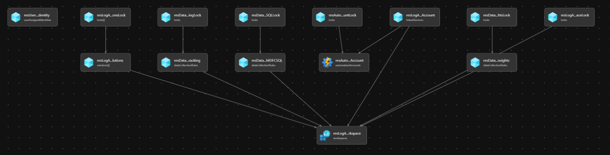

# Module: Logging, Automation & Sentinel

Deploys Azure Log Analytics Workspace, Automation Account (linked together) & multiple Solutions deploy to the Log Analytics Workspace to an existing Resource Group.

Automation Account will be linked to Log Analytics Workspace to provide integration for Update Management, Change Tracking and Inventory, and Start/Stop VMs during off-hours for your servers and virtual machines.  Only one mapping can exist between Log Analytics Workspace and Automation Account.

The module will deploy the following Log Analytics Workspace solutions by default.  Solutions can be customized as required:

- AgentHealthAssessment
- AntiMalware
- AzureActivity
- ChangeTracking
- Security
- SecurityInsights (Azure Sentinel)
- ServiceMap
- SQLAdvancedThreatProtection
- SQLVulnerabilityAssessment
- SQLAssessment
- Updates
- VMInsights

 > Only certain regions are supported to link Log Analytics Workspace & Automation Account together (linked workspaces). Reference:  [Supported regions for linked Log Analytics workspace](https://docs.microsoft.com/azure/automation/how-to/region-mappings)

## Parameters

- [Parameters for Azure Commercial Cloud](generateddocs/logging.bicep.md)

## Deployment

In this example, a Log Analytics Workspace and Automation Account will be deployed to the resource group `alz-logging`.  The inputs for this module are defined in `logging.parameters.all.json`.

There are separate input parameters files depending on which Azure cloud you are deploying because this module deploys resources into an existing resource group under the specified region. There is no change to the Bicep template file.
| Azure Cloud    | Bicep template | Input parameters file                     |
| -------------- | -------------- | ----------------------------------------- |
| Global regions | logging.bicep  | parameters/logging.parameters.all.json    |
| China regions  | logging.bicep  | parameters/mc-logging.parameters.all.json |

> For the examples below we assume you have downloaded or cloned the Git repo as-is and are in the root of the repository as your selected directory in your terminal of choice.
> If the deployment failed due an error that your alz-log-analytics/Automation resource of type 'Microsoft.OperationalInsights/workspaces/linkedServices' was not found, please retry the deployment step and it would succeed.

### Azure CLI
```bash
# For Azure Global regions
# Set Platform management subscripion ID as the the current subscription
ManagementSubscriptionId="[your platform management subscription ID]"
az account set --subscription $ManagementSubscriptionId

# Create Resource Group - optional when using an existing resource group
az group create \
  --name alz-logging \
  --location eastus

# Deploy Module
az deployment group create \
  --template-file infra-as-code/bicep/modules/logging/logging.bicep \
  --parameters @infra-as-code/bicep/modules/logging/parameters/logging.parameters.all.json \
  --resource-group alz-logging
```
OR
```bash
# For Azure China regions
# Set Platform management subscripion ID as the the current subscription
ManagementSubscriptionId="[your platform management subscription ID]"
az account set --subscription $ManagementSubscriptionId

# Create Resource Group - optional when using an existing resource group
az group create \
  --name alz-logging \
  --location chinaeast2

# Deploy Module
az deployment group create \
  --template-file infra-as-code/bicep/modules/logging/logging.bicep \
  --parameters @infra-as-code/bicep/modules/logging/parameters/mc-logging.parameters.all.json \
  --resource-group alz-logging
```

### PowerShell

```powershell
# For Azure Global regions
# Set Platform management subscripion ID as the the current subscription
$ManagementSubscriptionId = "[your platform management subscription ID]"

Select-AzSubscription -SubscriptionId $ManagementSubscriptionId

# Create Resource Group - optional when using an existing resource group
New-AzResourceGroup `
  -Name alz-logging `
  -Location eastus

New-AzResourceGroupDeployment `
  -TemplateFile infra-as-code/bicep/modules/logging/logging.bicep `
  -TemplateParameterFile infra-as-code/bicep/modules/logging/parameters/logging.parameters.all.json `
  -ResourceGroup alz-logging
```
OR
```powershell
# For Azure China regions
# Set Platform management subscripion ID as the the current subscription
$ManagementSubscriptionId = "[your platform management subscription ID]"

Select-AzSubscription -SubscriptionId $ManagementSubscriptionId

# Create Resource Group - optional when using an existing resource group
New-AzResourceGroup `
  -Name alz-logging `
  -Location chinaeast2

New-AzResourceGroupDeployment `
  -TemplateFile infra-as-code/bicep/modules/logging/logging.bicep `
  -TemplateParameterFile infra-as-code/bicep/modules/logging/parameters/mc-logging.parameters.all.json `
  -ResourceGroup alz-logging
```

## Bicep Visualizer


