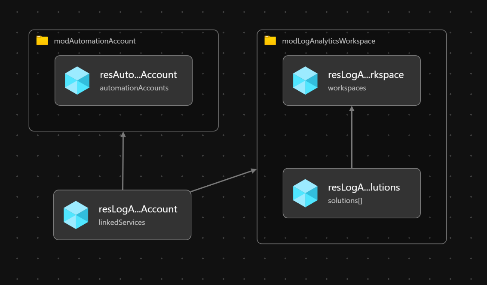

# Module:  Logging

  Deploys Azure Log Analytics Workspace & Automation Account to a Resource Group.  Automation Account will be linked to Log Analytics Workspace to provide integration for Inventory, Change Tracking and Update Management.
  
  The module will deploy the following Log Analytics Workspace solutions by default.  Solutions can be customized as required:

  * AgentHealthAssessment
  * AntiMalware
  * AzureActivity
  * ChangeTracking
  * Security
  * SecurityInsights
  * ServiceMap
  * SQLAssessment
  * Updates
  * VMInsights

## Parameters

The module requires the following required input parameters.

 Paramenter | Type | Description | Requirement | Example
----------- | ---- | ----------- | ----------- | -------
parLogAnalyticsWorkspaceName | string | Log Analytics Workspace name | Mandatory input | `alz-log-analytics`
parLogAnalyticsWorkspaceLogRetentionInDays | int | Number of days of log retention for Log Analytics Workspace.  1 year of log retention by default. | 30-730 | `365`
parLogAnalyticsWorkspaceSolutions | Array of string | Solutions that will be added to the Log Analytics Workspace | 1 or more of `AgentHealthAssessment`, `AntiMalware`, `AzureActivity`, `ChangeTracking`, `Security`, `SecurityInsights`, `ServiceMap`, `SQLAssessment`, `Updates`, `VMInsights` | Empty: `[]`<br />1 Solution: `["SecurityInsights"]`<br />Many Solutions: `["SecurityInsights","VMInsights"]`
parAutomationAccountName | string | Automation account name | Mandatory input, name must be unique in the subscription | alz-automation-account

## Outputs

The module will generate the following outputs:

Output | Type | Example
------ | ---- | --------
outLogAnalyticsWorkspaceName | string | alz-log-analytics 
outLogAnalyticsWorkspaceId | string | /subscriptions/4f9f8765-911a-4a6d-af60-4bc0473268c0/resourceGroups/alz-logging/providers/Microsoft.OperationalInsights/workspaces/alz-log-analytics
outLogAnalyticsCustomerId | string | 4192b202-f57d-4e75-a074-d215aa2acb49
outLogAnalyticsSolutions | Array of string | ["AgentHealthAssessment", "AntiMalware","AzureActivity", "ChangeTracking", "Security", "SecurityInsights", "ServiceMap", "SQLAssessment", "Updates", "VMInsights"]
outAutomationAccountName | string | alz-automation-account
outAutomationAccountId | string | /subscriptions/4f9f8765-911a-4a6d-af60-4bc0473268c0/resourceGroups/alz-logging/providers/Microsoft.Automation/automationAccounts/alz-automation-account

## Deployment

In this example, a Log Analytics Workspace and Automation Account will be deployed to the resource group `alz-logging`.  The inputs for this module are defined in `logging.parameters.example.json`.

> For the below examples we assume you have downloaded or cloned the Git repo as-is and are in the root of the repository as your selected directory in your terminal of choice.

### Azure CLI
```bash
# Create Resource Group
az group create \
  --name alz-logging \
  --location eastus

# Deploy Module
az deployment group create \
  --template-file infra-as-code/bicep/modules/logging/logging.bicep \
  --parameters @infra-as-code/bicep/modules/logging/logging.parameters.example.json \
  --resource-group alz-logging
```

### PowerShell

```powershell
# Create Resource Group
New-AzResourceGroup `
  -Name alz-logging `
  -Location eastus

# Deploy Module
New-AzResourceGroupDeployment `
  -TemplateFile infra-as-code/bicep/modules/logging/logging.bicep `
  -TemplateParameterFile infra-as-code/bicep/modules/logging/logging.parameters.example.json `
  -ResourceGroup alz-logging
```

## Bicep Visualizer


