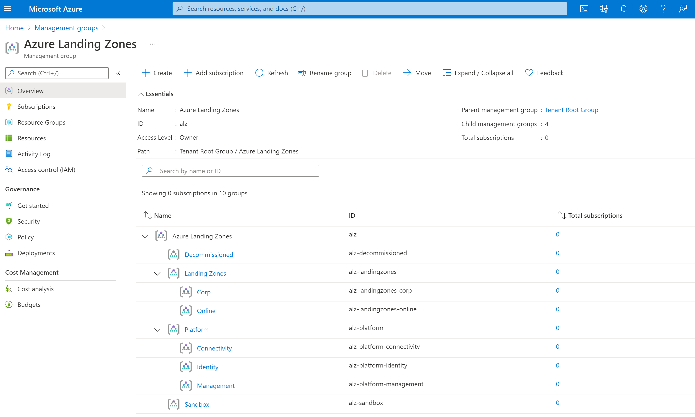

# Module:  Management Groups

Management Groups module defines the management group structure that will be deployed in a customer's environment.  It will deploy:

  1. Platform management group with child management groups:
      * management
      * connectivity
      * identity
  2. Landing Zones management group with child management groups:
      * corp
      * online
  3. Sandbox management group
  4. Decommissioned management group


## Parameters

The module requires the following required input parameters.

 Paramenter | Description | Requirement | Example
----------- | ----------- | ----------- | -------
parParentManagementGroupId | The management group that will be used to create all management groups.  Specific the management group id. | Must existing in Azure. | When deployed to **Tenant Root Group**: `Azure Active Directory Tenant Id`, or when deployed to **another management group**: `Management Group ID`
parTopLevelManagementGroupPrefix | Prefix for the management structure.  This management group will be created as part of the deployment. | Minimum two characters | `alz` |
parTopLevelManagementGroupDisplayName | Display name for top level management group prefix.  This name will be applied to the management group prefix defined in `parTopLevelManagementGroupPrefix` parameter. | Minimum two characters | `Azure Landing Zones` |


## Deployment

**Example Deployment**

In this example, the management group structure is being deployed to the `Tenant Root Group` based on the Azure Active Directory Tenant Id `343ddfdb-bef5-46d9-99cf-ed67d5948783`.  This value should be replaced with that of your organization.  The parameters file provides an example of all required parameters.

### Azure CLI
```bash
az deployment mg create \
  --template-file infra-as-code/bicep/modules/management-groups/mgmtGroups.bicep \
  --parameters @infra-as-code/bicep/modules/management-groups/mgmtGroups.parameters.example.json \
  --location eastus \
  --management-group-id 343ddfdb-bef5-46d9-99cf-ed67d5948783
```

### PowerShell

```powershell
New-AzManagementGroupDeployment `
  -TemplateFile infra-as-code/bicep/modules/management-groups/mgmtGroups.bicep `
  -TemplateParameterFile infra-as-code/bicep/modules/management-groups/mgmtGroups.parameters.example.json `
  -Location eastus `
  -ManagementGroupId 343ddfdb-bef5-46d9-99cf-ed67d5948783
```



## Bicep Visualizer


