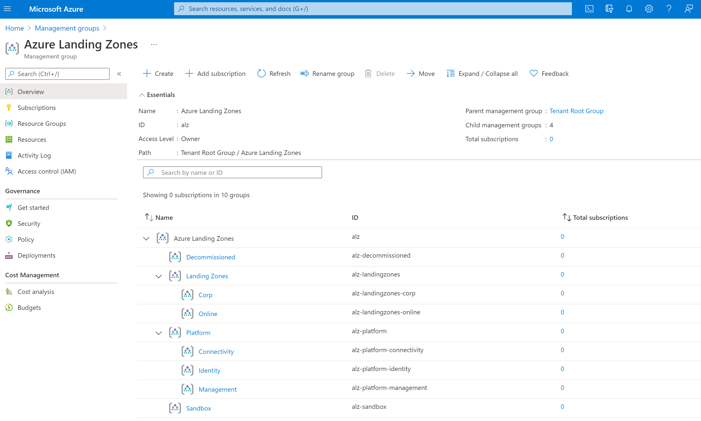
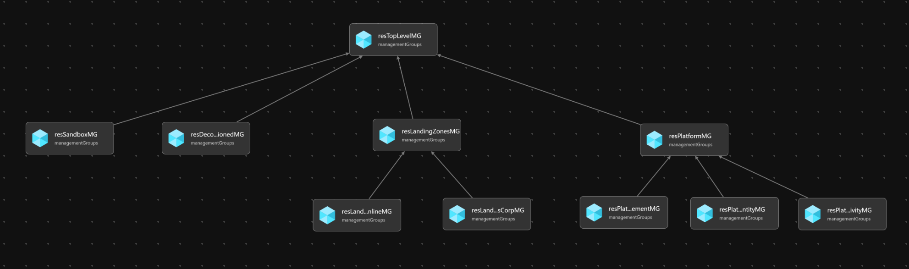

# Module:  Management Groups

The Management Groups module deploys a management group hierarchy in a customer's tenant under the `Tenant Root Group`.  This is accomplished through a tenant-scoped Azure Resource Manager (ARM) deployment. The hierarchy can be modified by editing `managementGroups.bicep`.  The hierarchy created by the deployment is:

- Tenant Root Group
  - Top Level Management Group (defined by parameter `parTopLevelManagementGroupPrefix`)
    - Platform
      - Management
      - Connectivity
      - Identity
    - Landing Zones
      - Corp
      - Online
    - Sandbox
    - Decommissioned

## Parameters

- [Link to `managementGroup.bicep` Parameters](generateddocs/managementGroups.bicep.md)
- [Link to `managementGroupsScopeEscape.bicep` Parameters](generateddocs/managementGroupsScopeEscape.bicep.md)

### Child Platform & Landing Zone Management Groups Flexibility

This module allows some flexibility for deploying child Platform & Landing Zone Management Groups, e.g. Management Groups that live beneath the Platform & Landing Zones Management Group. This flexibility is controlled by two/three parameters which are detailed below. All of these parameters can be used together to tailor the child Landing Zone Management Groups.

#### Platform
- `parPlatformMgAlzDefaultsEnable`
  - Boolean - defaults to `true`
  - **Required**
  - Deploys following child Platform Management groups if set to `true`:
    - `Management`
    - `Connectivity`
    - `Identity`
    - *These are the default ALZ Management Groups as per the conceptual architecture*
- `parPlatformMgChildren`
  - Object - default is an empty object `{}`
  - **Optional**
  - Deploys whatever you specify in the object as child Landing Zone Management groups.

These two parameters are then used to collate a single variable that is used to create the child Platform Management Groups. Duplicates are removed if entered. This is done by using the `union()` function in bicep.

> Investigate the variable called `varPlatformMgChildrenUnioned` if you want to see how this works in the module.

#### Landing Zones
- `parLandingZoneMgAlzDefaultsEnable`
  - Boolean - defaults to `true`
  - **Required**
  - Deploys following child Landing Zone Management groups if set to `true`:
    - `Corp`
    - `Online`
    - *These are the default ALZ Management Groups as per the conceptual architecture*
- `parLandingZoneMgConfidentialEnable`
  - Boolean - defaults to `false`
  - **Required**
  - Deploys following child Landing Zone Management groups if set to `true`:
    - `Confidential Corp`
    - `Confidential Online`
- `parLandingZoneMgChildren`
  - Object - default is an empty object `{}`
  - **Optional**
  - Deploys whatever you specify in the object as child Landing Zone Management groups.

These three parameters are then used to collate a single variable that is used to create the child Landing Zone Management Groups. Duplicates are removed if entered. This is done by using the `union()` function in bicep.

> Investigate the variable called `varLandingZoneMgChildrenUnioned` if you want to see how this works in the module.

#### `parLandingZoneMgChildren` and `parPlatformMgChildren` Input Examples

Below are some examples of how to use this input parameter in both Bicep & JSON formats.

##### Bicep Example

```bicep
parLandingZoneMgChildren: {
  pci: {
    displayName: 'PCI'
  }
  'another-example': {
    displayName: 'Another Example'
  }
}

parPlatformMgChildren: {
  security: {
    displayName: 'Security'
  }
  'yet-another-example': {
    displayName: 'Yet Another Example'
  }
}
```

##### JSON Parameter File Input Example

```json
"parLandingZoneMgChildren": {
    "value": {
        "pci": {
          "displayName": "PCI"
        },
        "another-example": {
          "displayName": "Another Example"
        }
    }
},
"parPlatformMgChildren": {
    "value": {
        "security": {
          "displayName": "Security"
        },
        "yet-another-example": {
          "displayName": "Yet Another Example"
        }
    }
}
```

## Outputs

The module will generate the following outputs:

| Output                                     | Type   | Example                                                                                                                                              |
| ------------------------------------------ | ------ | ---------------------------------------------------------------------------------------------------------------------------------------------------- |
| outTopLevelManagementGroupId               | string | /providers/Microsoft.Management/managementGroups/alz                                                                                                 |
| outPlatformManagementGroupId               | string | /providers/Microsoft.Management/managementGroups/alz-platform                                                                                        |
| outPlatformChildrenManagementGroupIds   | array  | `[/providers/Microsoft.Management/managementGroups/alz-platform-management, /providers/Microsoft.Management/managementGroups/alz-platform-connectivity, /providers/Microsoft.Management/managementGroups/alz-platform-identity]` |
| outLandingZonesManagementGroupId           | string | /providers/Microsoft.Management/managementGroups/alz-landingzones                                                                                    |
| outLandingZoneChildrenManagementGroupIds   | array  | `[/providers/Microsoft.Management/managementGroups/alz-landingzones-corp, /providers/Microsoft.Management/managementGroups/alz-landingzones-online]` |
| outSandboxManagementGroupId                | string | /providers/Microsoft.Management/managementGroups/alz-sandbox                                                                                         |
| outDecommissionedManagementGroupId         | string | /providers/Microsoft.Management/managementGroups/alz-decommissioned                                                                                  |
| outTopLevelManagementGroupName             | string | Azure Landing Zones                                                                                                                                                  |
| outPlatformManagementGroupName             | string | Platform                                                                                                                                         |
| outPlatformChildrenManagementGroupNames | array  | `[Management, Connectivity, Identity]`                                                                                                                                |
| outLandingZonesManagementGroupName         | string | Landing Zones                                                                                                                                     |
| outLandingZoneChildrenManagementGroupNames | array  | `[Corp, Online]`                                                                                                                                     |
| outSandboxManagementGroupName              | string | Sandbox                                                                                                                                          |
| outDecommissionedManagementGroupName       | string | Decommissioned                                                                                                                                  |

## Deployment

In this example, the management groups are created at the `Tenant Root Group` through a tenant-scoped deployment.

> For the examples below we assume you have downloaded or cloned the Git repo as-is and are in the root of the repository as your selected directory in your terminal of choice.

### Azure CLI - `managementGroups.bicep`

```bash
# For Azure global regions

dateYMD=$(date +%Y%m%dT%H%M%S%NZ)
NAME="alz-MGDeployment-${dateYMD}"
LOCATION="eastus"
TEMPLATEFILE="infra-as-code/bicep/modules/managementGroups/managementGroups.bicep"
PARAMETERS="@infra-as-code/bicep/modules/managementGroups/parameters/managementGroups.parameters.all.json"

az deployment tenant create --name ${NAME:0:63} --location $LOCATION --template-file $TEMPLATEFILE --parameters $PARAMETERS
```
OR
```bash
# For Azure China regions

dateYMD=$(date +%Y%m%dT%H%M%S%NZ)
NAME="alz-MGDeployment-${dateYMD}"
LOCATION="chinaeast2"
TEMPLATEFILE="infra-as-code/bicep/modules/managementGroups/managementGroups.bicep"
PARAMETERS="@infra-as-code/bicep/modules/managementGroups/parameters/managementGroups.parameters.all.json"

az deployment tenant create --name ${NAME:0:63} --location $LOCATION --template-file $TEMPLATEFILE --parameters $PARAMETERS
```

### Azure CLI - `managementGroupsScopeEscape.bicep`

Use this module if you do not want to grant Tenant Root Management Group Deployment permissions.

```bash
# For Azure global regions

dateYMD=$(date +%Y%m%dT%H%M%S%NZ)
NAME="alz-MGDeployment-${dateYMD}"
LOCATION="eastus"
TEMPLATEFILE="infra-as-code/bicep/modules/managementGroups/managementGroupsScopeEscape.bicep"
PARAMETERS="@infra-as-code/bicep/modules/managementGroups/parameters/managementGroups.parameters.all.json"
MGID="alz"

az deployment mg create --name ${NAME:0:63} --location $LOCATION --template-file $TEMPLATEFILE --parameters $PARAMETERS --management-group-id $MGID
```
OR
```bash
# For Azure China regions

dateYMD=$(date +%Y%m%dT%H%M%S%NZ)
NAME="alz-MGDeployment-${dateYMD}"
LOCATION="chinaeast2"
TEMPLATEFILE="infra-as-code/bicep/modules/managementGroups/managementGroupsScopeEscape.bicep"
PARAMETERS="@infra-as-code/bicep/modules/managementGroups/parameters/managementGroups.parameters.all.json"
MGID="alz"

az deployment mg create --name ${NAME:0:63} --location $LOCATION --template-file $TEMPLATEFILE --parameters $PARAMETERS --management-group-id $MGID
```

### PowerShell - `managementGroups.bicep`

```powershell
# For Azure global regions

$inputObject = @{
  DeploymentName        = 'alz-MGDeployment-{0}' -f (-join (Get-Date -Format 'yyyyMMddTHHMMssffffZ')[0..63])
  Location              = 'EastUS'
  TemplateFile          = "infra-as-code/bicep/modules/managementGroups/managementGroups.bicep"
  TemplateParameterFile = 'infra-as-code/bicep/modules/managementGroups/parameters/managementGroups.parameters.all.json'
}
New-AzTenantDeployment @inputObject
```
OR
```powershell
# For Azure China regions

$inputObject = @{
  DeploymentName        = 'alz-MGDeployment-{0}' -f (-join (Get-Date -Format 'yyyyMMddTHHMMssffffZ')[0..63])
  Location              = 'chinaeast2'
  TemplateFile          = "infra-as-code/bicep/modules/managementGroups/managementGroups.bicep"
  TemplateParameterFile = 'infra-as-code/bicep/modules/managementGroups/parameters/managementGroups.parameters.all.json'
}
New-AzTenantDeployment @inputObject
```

### PowerShell - `managementGroupsScopeEscape.bicep`

Use this module if you do not want to grant Tenant Root Management Group Deployment permissions.

```powershell
# For Azure global regions

$inputObject = @{
  DeploymentName        = 'alz-MGDeployment-{0}' -f (-join (Get-Date -Format 'yyyyMMddTHHMMssffffZ')[0..63])
  Location              = 'EastUS'
  TemplateFile          = "infra-as-code/bicep/modules/managementGroups/managementGroupsScopeEscape.bicep"
  TemplateParameterFile = 'infra-as-code/bicep/modules/managementGroups/parameters/managementGroups.parameters.all.json'
  ManagementGroupId     = 'alz'
}
New-AzManagementGroupDeployment @inputObject
```
OR
```powershell
# For Azure China regions

$inputObject = @{
  DeploymentName        = 'alz-MGDeployment-{0}' -f (-join (Get-Date -Format 'yyyyMMddTHHMMssffffZ')[0..63])
  Location              = 'chinaeast2'
  TemplateFile          = "infra-as-code/bicep/modules/managementGroups/managementGroupsScopeEscape.bicep"
  TemplateParameterFile = 'infra-as-code/bicep/modules/managementGroups/parameters/managementGroups.parameters.all.json'
  ManagementGroupId     = 'alz'
}
New-AzManagementGroupDeployment @inputObject
```



## Bicep Visualizer


