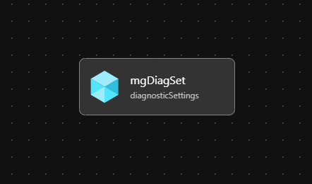

# Module: Enable Diagnostic Settings on a Management Group

This module enables the supported Diagnostic Settings categories on a Management Group to an existing Azure Log Analytics Workspace.
> Consider using the `mgDiagSettingsAll` orchestration module instead to simplify configuring the Diagnostic Settings for all your Management Group hierarchy in a single module. [infra-as-code/bicep/orchestration/mgDiagSettingsAll](https://github.com/Azure/ALZ-Bicep/tree/main/infra-as-code/bicep/orchestration/mgDiagSettingsAll)

## Parameters

- [Link to Parameters](generateddocs/mgDiagSettings.bicep.md)

## Outputs

*The module will not generate any outputs.*

## Deployment

The inputs for this module are defined in `parameters/mgDiagSettings.parameters.all.json`. The Diagnostic Settings resource will be named toLa but can be changed in the module if desired.

> For the  examples below we assume you have downloaded or cloned the Git repo as-is and are in the root of the repository as your selected directory in your terminal of choice.

### Azure CLI

```bash
# For Azure global regions

dateYMD=$(date +%Y%m%dT%H%M%S%NZ)
NAME="alz-mgDiagSettings-${dateYMD}"
LOCATION="eastus"
TEMPLATEFILE="infra-as-code/bicep/modules/mgDiagSettings/mgDiagSettings.bicep"
PARAMETERS="infra-as-code/bicep/modules/mgDiagSettings/parameters/mgDiagSettings.parameters.all.json"
# Set the top level Management Group ID in accordance to your environment. This example assumes default 'alz'.
MGID="alz"

az deployment mg create --name $NAME --location $LOCATION --template-file $TEMPLATEFILE --parameters $PARAMETERS --management-group-id $MGID
```

OR

```bash
# For Azure China regions

dateYMD=$(date +%Y%m%dT%H%M%S%NZ)
NAME="alz-mgDiagSettings-${dateYMD}"
LOCATION="chinaeast2"
TEMPLATEFILE="infra-as-code/bicep/modules/mgDiagSettings/mgDiagSettings.bicep"
PARAMETERS="infra-as-code/bicep/modules/mgDiagSettings/parameters/mgDiagSettings.parameters.all.json"
# Set the top level Management Group ID in accordance to your environment. This example assumes default 'alz'.
MGID="alz"

az deployment mg create --name $NAME --location $LOCATION --template-file $TEMPLATEFILE --parameters $PARAMETERS --management-group-id $MGID
```

### PowerShell

```powershell
# For Azure global regions

$inputObject = @{
  DeploymentName        = 'alz-mgDiagSettings-{0}' -f (-join (Get-Date -Format 'yyyyMMddTHHMMssffffZ')[0..63])
  Location              = 'eastus'
  TemplateFile          = "infra-as-code/bicep/modules/mgDiagSettings/mgDiagSettings.bicep"
  TemplateParameterFile = 'infra-as-code/bicep/modules/mgDiagSettings/parameters/mgDiagSettings.parameters.all.json'
  ManagementGroupId     = 'alz'
}
New-AzManagementGroupDeployment @inputObject
```

OR

```powershell
# For Azure China regions

$inputObject = @{
  DeploymentName        = 'alz-mgDiagSettings-{0}' -f (-join (Get-Date -Format 'yyyyMMddTHHMMssffffZ')[0..63])
  Location              = 'chinaeast2'
  TemplateFile          = "infra-as-code/bicep/modules/mgDiagSettings/mgDiagSettings.bicep"
  TemplateParameterFile = 'infra-as-code/bicep/modules/mgDiagSettings/parameters/mgDiagSettings.parameters.all.json'
  ManagementGroupId     = 'alz'
}
New-AzManagementGroupDeployment @inputObject
```

## Validation

To validate if Diagnostic Settings were correctly enabled for any specific management group, a REST API GET call can be used. Documentation and easy way to try this can be found in this link [(Management Group Diagnostic Settings - Get)](https://learn.microsoft.com/rest/api/monitor/management-group-diagnostic-settings/get?tabs=HTTP&tryIt=true&source=docs#code-try-0). There is currently not a direct way to validate this in the Azure Portal or with Azure PowerShell or the Azure CLI.

## Bicep Visualizer


