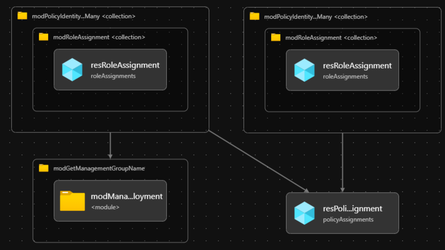

# Module: Policy Assignments

This module deploys Azure Policy Assignments to a specified Management Group and also assigns the relevant RBAC for the system-assigned Managed Identities created for policies that require them (e.g DeployIfNotExist & Modify effect policies).

> If you are looking for the default ALZ policy assignments check out [`./alzDefaults` directory](alzDefaults/README.md)

If you wish to add your own additional Azure Policy Assignments please review [How Does ALZ-Bicep Implement Azure Policies?](https://github.com/Azure/ALZ-Bicep/wiki/PolicyDeepDive) and more specifically [Adding Custom Azure Policy Definitions](https://github.com/Azure/ALZ-Bicep/wiki/AddingPolicyDefs)

## Parameters

- [Parameters for Azure Commercial Cloud](generateddocs/policyAssignmentManagementGroup.bicep.md)
- This same module can still be used in Azure China. Example parameters are in the [parameters](./parameters/) folder.

> **IMPORTANT:** Due to the size of ARM template generated from this module, we had to condense the descriptions for the parameters in certain cases. If you need more information on a parameter, please refer to the [release v0.19.0](https://github.com/Azure/ALZ-Bicep/releases/tag/v0.19.0). Otherwise, feel free to reach out by opening an issue for additional clarification.

## Outputs

The module does not generate any outputs.

## Deployment

> For the examples below we assume you have downloaded or cloned the Git repo as-is and are in the root of the repository as your selected directory in your terminal of choice.

### Deny Effect

In this example, the `Deny-PublicIP` custom policy definition will be deployed/assigned to the `alz-landingzones` management group.

#### Azure CLI - Deny

```bash
# For Azure global regions

dateYMD=$(date +%Y%m%dT%H%M%S%NZ)
NAME="alz-alz-PolicyDenyAssignmentsDeployment-${dateYMD}"

PARAMETERS="@infra-as-code/bicep/modules/policy/assignments/parameters/policyAssignmentManagementGroup.deny.parameters.all.json"
LOCATION="eastus"
MGID="alz-landingzones"
TEMPLATEFILE="infra-as-code/bicep/modules/policy/assignments/policyAssignmentManagementGroup.bicep"

az deployment mg create --name ${NAME:0:63} --location $LOCATION --management-group-id $MGID --template-file $TEMPLATEFILE --parameters $PARAMETERS
```
OR
```bash
# For Azure China regions

dateYMD=$(date +%Y%m%dT%H%M%S%NZ)
NAME="alz-alz-PolicyDenyAssignmentsDeployment-${dateYMD}"

PARAMETERS="@infra-as-code/bicep/modules/policy/assignments/parameters/policyAssignmentManagementGroup.deny.parameters.all.json"
LOCATION="chinaeast2"
MGID="alz-landingzones"
TEMPLATEFILE="infra-as-code/bicep/modules/policy/assignments/policyAssignmentManagementGroup.bicep"

az deployment mg create --name ${NAME:0:63} --location $LOCATION --management-group-id $MGID --template-file $TEMPLATEFILE --parameters $PARAMETERS
```

#### PowerShell - Deny

```powershell
# For Azure global regions

$inputObject = @{
  DeploymentName        = -join ('alz-PolicyDenyAssignments-{0}' -f (Get-Date -Format 'yyyyMMddTHHMMssffffZ'))[0..63]
  ManagementGroupId     = 'alz-landingzones'
  Location              = 'eastus'
  TemplateParameterFile = 'infra-as-code/bicep/modules/policy/assignments/parameters/policyAssignmentManagementGroup.deny.parameters.all.json'
  TemplateFile          = "infra-as-code/bicep/modules/policy/assignments/policyAssignmentManagementGroup.bicep"
}
New-AzManagementGroupDeployment @inputObject
```
OR
```powershell
# For Azure China regions

$inputObject = @{
  DeploymentName        = -join ('alz-PolicyDenyAssignments-{0}' -f (Get-Date -Format 'yyyyMMddTHHMMssffffZ'))[0..63]
  ManagementGroupId     = 'alz-landingzones'
  Location              = 'chinaeast2'
  TemplateParameterFile = 'infra-as-code/bicep/modules/policy/assignments/parameters/policyAssignmentManagementGroup.deny.parameters.all.json'
  TemplateFile          = "infra-as-code/bicep/modules/policy/assignments/policyAssignmentManagementGroup.bicep"
}
New-AzManagementGroupDeployment @inputObject
```

### DeployIfNotExists Effect

There are two different sets of input parameters files; one for deploying to Azure global regions, and another for deploying specifically to Azure China regions. This is due to a few Microsoft Defender for Cloud built-in policies which are not available in Azure China.

 | Azure Cloud    | Bicep template                        | Input parameters file                                           |
 | -------------- | ------------------------------------- | --------------------------------------------------------------- |
 | Global regions | policyAssignmentManagementGroup.bicep | parameters/policyAssignmentManagementGroup.dine.parameters.all.json    |
 | China regions  | policyAssignmentManagementGroup.bicep | parameters/mc-policyAssignmentManagementGroup.dine.parameters.all.json |


In this example, the `Deploy-MDFC-Config` custom policy definition will be deployed/assigned to the `alz-landingzones` management group (intermediate root management group). And the managed identity associated with the policy will also be assigned to the `alz-platform` management group, as defined in the parameter file: `parameters/policyAssignmentManagementGroup.dine.parameters.all.json` or `parameters/mc-policyAssignmentManagementGroup.dine.parameters.all.json`
#### Azure CLI - DINE

```bash
# For Azure global regions

dateYMD=$(date +%Y%m%dT%H%M%S%NZ)
NAME="alz-PolicyDineAssignments-${dateYMD}"
LOCATION="eastus"
MGID="alz-landingzones"
TEMPLATEFILE="infra-as-code/bicep/modules/policy/assignments/policyAssignmentManagementGroup.bicep"
PARAMETERS="@infra-as-code/bicep/modules/policy/assignments/parameters/policyAssignmentManagementGroup.dine.parameters.all.json"

az deployment mg create --name $NAME --location $LOCATION --management-group-id $MGID --template-file $TEMPLATEFILE --parameters $PARAMETERS
```
OR
```bash
# For Azure China regions

dateYMD=$(date +%Y%m%dT%H%M%S%NZ)
NAME="alz-PolicyDineAssignments-${dateYMD}"
LOCATION="eastus"
MGID="alz-landingzones"
TEMPLATEFILE="infra-as-code/bicep/modules/policy/assignments/policyAssignmentManagementGroup.bicep"
PARAMETERS="@infra-as-code/bicep/modules/policy/assignments/parameters/policyAssignmentManagementGroup.dine.parameters.all.json"

az deployment mg create --name $NAME --location $LOCATION --management-group-id $MGID --template-file $TEMPLATEFILE --parameters $PARAMETERS
```

#### PowerShell - DINE

```powershell
# For Azure global regions

$inputObject = @{
  DeploymentName        = -join ('alz-PolicyDenyAssignments-{0}' -f (Get-Date -Format 'yyyyMMddTHHMMssffffZ'))[0..63]
  Location              = 'eastus'
  ManagementGroupId     = 'alz-landingzones'
  TemplateFile          = "infra-as-code/bicep/modules/policy/assignments/policyAssignmentManagementGroup.bicep"
  TemplateParameterFile = '@infra-as-code/bicep/modules/policy/assignments/parameters/policyAssignmentManagementGroup.dine.parameters.all.json'
}

New-AzManagementGroupDeployment @inputObject
```
OR
```powershell
# For Azure China regions

$inputObject = @{
  DeploymentName        = -join ('alz-PolicyDenyAssignments-{0}' -f (Get-Date -Format 'yyyyMMddTHHMMssffffZ'))[0..63]
  Location              = 'chinaeast2'
  ManagementGroupId     = 'alz-landingzones'
  TemplateFile          = "infra-as-code/bicep/modules/policy/assignments/policyAssignmentManagementGroup.bicep"
  TemplateParameterFile = 'infra-as-code/bicep/modules/policy/assignments/parameters/mc-policyAssignmentManagementGroup.dine.parameters.all.json'
}

New-AzManagementGroupDeployment @inputObject
```

## Bicep Visualizer


