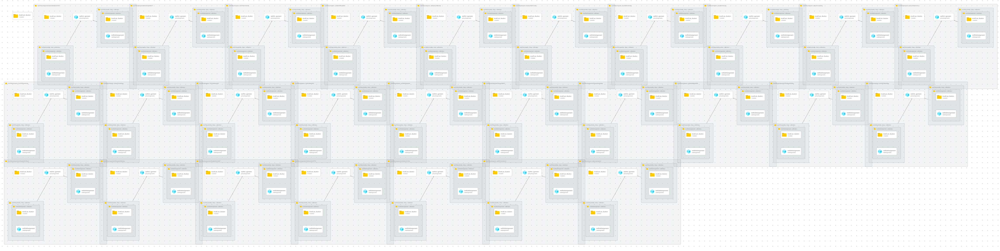

# Module: ALZ Default Policy Assignments

This module deploys the default Azure Landing Zone Azure Policy Assignments to the Management Group Hierarchy and also assigns the relevant RBAC for the system-assigned Managed Identities created for policies that require them (e.g DeployIfNotExist & Modify effect policies).

Exclusion of specific ALZ default policies which does not fit your organization is supported, check out [Exclude specific policy assignments from ALZ Default Policy Assignments](https://github.com/Azure/ALZ-Bicep/wiki/AssigningPolicies#what-if-i-want-to-exclude-specific-policy-assignments-from-alz-default-policy-assignments)

If you wish to add your own additional Azure Policy Assignments please review [How Does ALZ-Bicep Implement Azure Policies?](https://github.com/Azure/ALZ-Bicep/wiki/PolicyDeepDive) and more specifically [Adding Custom Azure Policy Definitions](https://github.com/Azure/ALZ-Bicep/wiki/AddingPolicyDefs)

## Parameters

- [Parameters for Azure Commercial Cloud](generateddocs/alzDefaultPolicyAssignments.bicep.md)
- [Parameters for Azure China Cloud](generateddocs/mc-alzDefaultPolicyAssignments.bicep.md)

## Outputs

The module does not generate any outputs.

## Deployment

> For the examples below we assume you have downloaded or cloned the Git repo as-is and are in the root of the repository as your selected directory in your terminal of choice.
<!-- markdownlint-disable -->
> **Important:** If you decide to not use a DDoS Network Protection plan in your environment and therefore leave the parameter `parDdosProtectionPlanId` as an empty string (`''`) then the policy Enable-DDoS-VNET will not be assigned at connectivity or landing zone Management Groups to avoid VNET deployment issues. For deployment in Azure China, leave the parameter `parDdosProtectionPlanId` as an empty string (`''`) because the DDoS Protection feature is not available in Azure China.
>
> However, if you later do decide to deploy an DDoS Network Protection Plan, you will need to remember to come back and update the parameter `parDdosProtectionPlanId` with the resource ID of the DDoS Network Protection Plan to ensure the policy is applied to the relevant Management Groups. You can then use a policy [remediation task](https://docs.microsoft.com/azure/governance/policy/how-to/remediate-resources) to bring all non-compliant VNETs back into compliance, once a [compliance scan](https://docs.microsoft.com/azure/governance/policy/how-to/get-compliance-data#evaluation-triggers) has taken place.
<!-- markdownlint-restore -->

### Azure CLI
```bash
# For Azure global regions

dateYMD=$(date +%Y%m%dT%H%M%S%NZ)
NAME="alz-alzPolicyAssignmentDefaults-${dateYMD}"
LOCATION="eastus"
MGID="alz"
TEMPLATEFILE="infra-as-code/bicep/modules/policy/assignments/alzDefaults/alzDefaultPolicyAssignments.bicep"
PARAMETERS="@infra-as-code/bicep/modules/policy/assignments/alzDefaults/parameters/alzDefaultPolicyAssignments.parameters.all.json"

az deployment mg create --name ${NAME:0:63} --location $LOCATION --management-group-id $MGID --template-file $TEMPLATEFILE --parameters $PARAMETERS
```
OR
```bash
# For Azure China regions

dateYMD=$(date +%Y%m%dT%H%M%S%NZ)
NAME="alz-alzPolicyAssignmentDefaults-${dateYMD}"
LOCATION="chinaeast2"
MGID="alz"
TEMPLATEFILE="infra-as-code/bicep/modules/policy/assignments/alzDefaults/alzDefaultPolicyAssignments.bicep"
PARAMETERS="@infra-as-code/bicep/modules/policy/assignments/alzDefaults/parameters/alzDefaultPolicyAssignments.parameters.all.json"

az deployment mg create --name ${NAME:0:63} --location $LOCATION --management-group-id $MGID --template-file $TEMPLATEFILE --parameters $PARAMETERS
```

### PowerShell

```powershell
# For Azure global regions

$inputObject = @{
  DeploymentName        = 'alz-alzPolicyAssignmentDefaultsDeployment-{0}' -f (-join (Get-Date -Format 'yyyyMMddTHHMMssffffZ')[0..63])
  Location              = 'eastus'
  ManagementGroupId     = 'alz'
  TemplateFile          = "infra-as-code/bicep/modules/policy/assignments/alzDefaults/alzDefaultPolicyAssignments.bicep"
  TemplateParameterFile = 'infra-as-code/bicep/modules/policy/assignments/alzDefaults/parameters/alzDefaultPolicyAssignments.parameters.all.json'
}

New-AzManagementGroupDeployment @inputObject
```
OR
```powershell
# For Azure China regions

$inputObject = @{
  DeploymentName        = 'alzPolicyAssignmentDefaultsDeployment-{0}' -f (-join (Get-Date -Format 'yyyyMMddTHHMMssffffZ')[0..63])
  Location              = 'chinaeast2'
  ManagementGroupId     = 'alz'
  TemplateFile          = "infra-as-code/bicep/modules/policy/assignments/alzDefaults/alzDefaultPolicyAssignments.bicep"
  TemplateParameterFile = 'infra-as-code/bicep/modules/policy/assignments/alzDefaults/parameters/mc-alzDefaultPolicyAssignments.parameters.all.json'
}

New-AzManagementGroupDeployment @inputObject
```

## Bicep Visualizer


