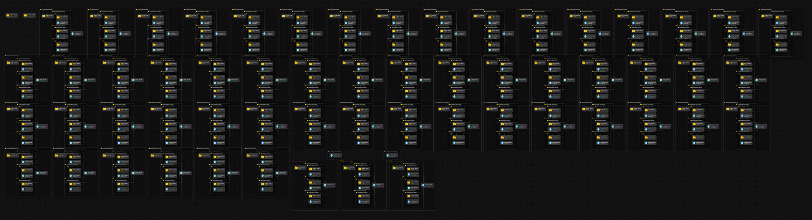

# Module: ALZ Workload Specific Policy Assignments and Regulated Industries

The Azure Landing Zone is designed to be a flexible and scalable solution that can be used by organizations in a variety of industries. However, organizations in regulated industries (FSI, Healthcare, etc.) may need to take additional steps to ensure compliance with industry-specific regulations. These regulations often have a consistent set of controls to cover, such as CMK, locking down public endpoints, TLS version enforcement, logging, etc.

This module deploys the workload-specific Azure Landing Zone Azure Policy Assignments to the Management Group Hierarchy in DoNotEnforce/Audit mode while also providing the capaiblity to deploy Sovereign Landing Zone assignments. This also assigns the relevant RBAC for the system-assigned Managed Identities created for policies that require them (e.g., DeployIfNotExist & Modify effect policies).

Exclusion of specific ALZ workload specific policies which does not fit your organization is supported, check out [Exclude specific policy assignments from ALZ Workload Specific Policy Assignments](https://github.com/Azure/ALZ-Bicep/wiki/AssigningPolicies#what-if-i-want-to-exclude-specific-policy-assignments-from-alz-default-policy-assignments)

If you wish to add your own additional Azure Policy Assignments, please review [How Does ALZ-Bicep Implement Azure Policies?](https://github.com/Azure/ALZ-Bicep/wiki/PolicyDeepDive) and more specifically [Adding Custom Azure Policy Definitions](https://github.com/Azure/ALZ-Bicep/wiki/AddingPolicyDefs)

## Parameters

- [Parameters for Azure Commercial Cloud](generateddocs/workloadSpecificPolicyAssignments.bicep.bicep.md)

## Outputs

The module does not generate any outputs.

## Deployment

> For the examples below we assume you have downloaded or cloned the Git repo as-is and are in the root of the repository as your selected directory in your terminal of choice.

### Azure CLI

```bash
# For Azure global regions

dateYMD=$(date +%Y%m%dT%H%M%S%NZ)
NAME="alz-alzPolicyAssignmentWorkloadSpecific-${dateYMD}"
LOCATION="eastus"
MGID="alz"
TEMPLATEFILE="infra-as-code/bicep/modules/policy/assignments/workloadSpecific/workloadSpecificPolicyAssignments.bicep"
PARAMETERS="@infra-as-code/bicep/modules/policy/assignments/workloadSpecific/parameters/workloadSpecificPolicyAssignments.parameters.all.json"

az deployment mg create --name ${NAME:0:63} --location $LOCATION --management-group-id $MGID --template-file $TEMPLATEFILE --parameters $PARAMETERS
```

### PowerShell

```powershell
# For Azure global regions

$inputObject = @{
  DeploymentName        = -join ('alz-alzPolicyAssignmentWorkloadSpecificDeployment-{0}' -f (Get-Date -Format 'yyyyMMddTHHMMssffffZ'))[0..63]
  Location              = 'eastus'
  ManagementGroupId     = 'alz'
  TemplateFile          = "infra-as-code/bicep/modules/policy/assignments/workloadSpecific/workloadSpecificPolicyAssignments.bicep"
  TemplateParameterFile = 'infra-as-code/bicep/modules/policy/assignments/workloadSpecific/parameters/workloadSpecificPolicyAssignments.parameters.all.json'
}

New-AzManagementGroupDeployment @inputObject
```

## Bicep Visualizer


