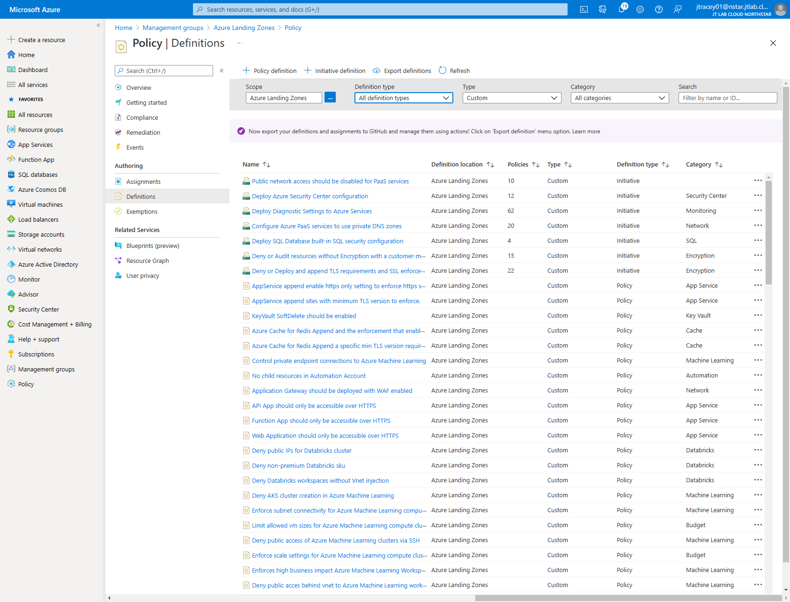
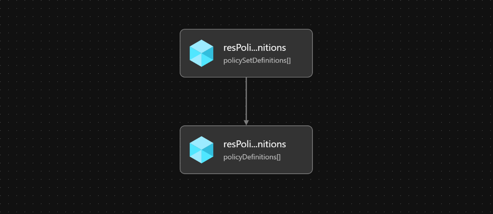

# Module: Custom Policy Definitions

This module deploys the custom Azure Policy Definitions & Initiatives supplied by the Azure Landing Zones conceptual architecture and reference implementation defined [here](https://docs.microsoft.com/azure/cloud-adoption-framework/ready/enterprise-scale/architecture) to the specified Management Group.

For a list of the custom policy definitions that are deployed, please see the below links:

- [Policies included in Enterprise-Scale Landing Zones reference implementations](https://github.com/Azure/Enterprise-Scale/blob/main/docs/ESLZ-Policies.md)
- [Enterprise Scale - What's New?](https://github.com/Azure/Enterprise-Scale/wiki/Whats-new)

If you wish to add your own additional custom Azure Policy Definitions please review [How Does ALZ-Bicep Implement Azure Policies?](https://github.com/Azure/ALZ-Bicep/wiki/PolicyDeepDive) and more specifically [Assigning Azure Policies](https://github.com/Azure/ALZ-Bicep/wiki/AssigningPolicies)

> Once you have deployed this module to add all of the custom ALZ Azure Policy Definitions & Initiatives you will need to assign the modules to the relevant Management Groups as per your requirements using the [Policy Assignments module](../assignments/README.md). <br><br>
> If you want to make all of the default Azure Policy Assignments that we recommend in the Azure Landing Zones conceptual architecture and reference implementation you can use the [ALZ Default Policy Assignments module](../assignments/alzDefaults/README.md) to do this for you👍

## Parameters

The module requires the following inputs:

 | Parameter                  | Description                                                                                                                                                             | Requirement                       | Example |
 | -------------------------- | ----------------------------------------------------------------------------------------------------------------------------------------------------------------------- | --------------------------------- | ------- |
 | parTargetManagementGroupId | The management group scope to which the the policy definitions will be stored/deployed to. This management group must already exist before deploying this bicep module. | Mandatory input                   | `alz`   |
 | parTelemetryOptOut         | Set Parameter to true to Opt-out of deployment telemetry                                                                                                                | Mandatory input, default: `false` | `false` |

## Outputs

The module does not generate any outputs.

## Deployment

There are two different sets of deployment; one for deploying to Azure global regions, and another for deploying specifically to Azure China regions. This is due to minor difference in services which are available in Azure global and in Azure China, but the feature parity gap is narrowing. As a result, there are no policy definitions for services which are not available in Azure China. Some policy definitions are not built-in in Azure China, hence those policies are defined as custom policy definitions. More details are available [here](https://github.com/Azure/Enterprise-Scale/pull/802).

 | Azure Cloud    | Bicep template                     | Input parameters file                             |
 | -------------- | ---------------------------------- | ------------------------------------------------- |
 | Global regions | customPolicyDefinitions.bicep    | parameters/customPolicyDefinitions.parameters.all.json |
 | China regions  | mc-customPolicyDefinitions.bicep | parameters/customPolicyDefinitions.parameters.all.json |

In this example, the custom policy definitions and policy set definitions will be deployed to the `alz` management group (the intermediate root management group).

The input parameter file `parameters/customPolicyDefinitions.parameters.all.json` defines the target management group to which the custom policy definitions will be deployed to. In this case, it will be the same management group (i.e. `alz`) as the one specified for the deployment operation. There is no change in the input parameter file for different Azure clouds because there is no change to the intermediate root management group.

> For the examples below we assume you have downloaded or cloned the Git repo as-is and are in the root of the repository as your selected directory in your terminal of choice.
> If the deployment provisioning state has failed due to policy definitions could not be found, this is often due to a known replication delay. Please re-run the deployment step below, and the deployment should succeed.

### Azure CLI

```bash
# For Azure global regions
az deployment mg create \
  --template-file infra-as-code/bicep/modules/policy/definitions/customPolicyDefinitions.bicep \
  --parameters @infra-as-code/bicep/modules/policy/definitions/parameters/customPolicyDefinitions.parameters.all.json \
  --location eastus \
  --management-group-id alz
```
OR
```bash
# For Azure China regions
az deployment mg create \
  --template-file infra-as-code/bicep/modules/policy/definitions/mc-customPolicyDefinitions.bicep \
  --parameters @infra-as-code/bicep/modules/policy/definitions/parameters/customPolicyDefinitions.parameters.all.json \
  --location chinaeast2 \
  --management-group-id alz
```

### PowerShell

```powershell
# For Azure global regions
New-AzManagementGroupDeployment `
  -TemplateFile infra-as-code/bicep/modules/policy/definitions/customPolicyDefinitions.bicep `
  -TemplateParameterFile infra-as-code/bicep/modules/policy/definitions/parameters/customPolicyDefinitions.parameters.all.json `
  -Location eastus `
  -ManagementGroupId alz
```
OR
```powershell
# For Azure China regions
New-AzManagementGroupDeployment `
  -TemplateFile infra-as-code/bicep/modules/policy/definitions/mc-customPolicyDefinitions.bicep `
  -TemplateParameterFile infra-as-code/bicep/modules/policy/definitions/parameters/customPolicyDefinitions.parameters.all.json `
  -Location chinaeast2 `
  -ManagementGroupId alz
```



## Bicep Visualizer


