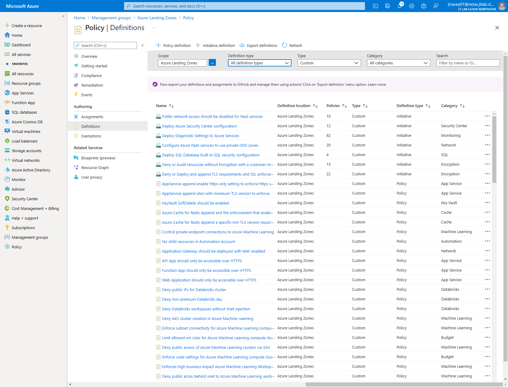

# Module: Custom Policy Definitions

This module deploys the custom Azure Policy Definitions & Initiatives supplied by the Azure Landing Zones conceptual architecture and reference implementation defined [here](https://docs.microsoft.com/azure/cloud-adoption-framework/ready/enterprise-scale/architecture) to the specified Management Group.

For a list of the custom policy definitions that are deployed, please see the below links:

- [Policies included in Enterprise-Scale Landing Zones reference implementations](https://github.com/Azure/Enterprise-Scale/blob/main/docs/ESLZ-Policies.md)
- [Enterprise Scale - What's New?](https://github.com/Azure/Enterprise-Scale/wiki/Whats-new)

## Parameters

The module requires the following inputs:

 Parameter | Description | Requirement | Example
----------- | ----------- | ----------- | -------
parTargetManagementGroupID | The management group scope to which the the policy definitions will be stored/deployed to. This management group must already exist before deploying this bicep module. | Mandatory input | `alz`

## Outputs

The module does not generate any outputs.

## Deployment

In this example, the custom roles will be deployed to the `alz` management group (the intermediate root management group).

The input parameter file `custom-policy-definitions.parameters.example.json` defines the target management group to which the custom policy definitions will be deployed to. In this case, it will be the same management group (i.e. `alz`) as the one specified for the deployment operation.

> For the below examples we assume you have downloaded or cloned the Git repo as-is and are in the root of the repository as your selected directory in your terminal of choice.

### Azure CLI

```bash
az deployment mg create \
  --template-file infra-as-code/bicep/modules/policy/definitions/custom-policy-definitions.bicep \
  --parameters @infra-as-code/bicep/modules/policy/definitions/custom-policy-definitions.parameters.example.json \
  --location eastus \
  --management-group-id alz
```

### PowerShell

```powershell
New-AzManagementGroupDeployment `
  -TemplateFile infra-as-code/bicep/modules/policy/definitions/custom-policy-definitions.bicep `
  -TemplateParameterFile infra-as-code/bicep/modules/policy/definitions/custom-policy-definitions.parameters.example.json `
  -Location eastus `
  -ManagementGroupId alz
```



## Bicep Visualizer


