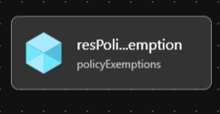

# Module: Policy Exemptions

This module defines a Policy Exemptions.

Module deploys the following resources:

- Policy Exemptions

## Parameters

- [Link to Parameters](generateddocs/policyExemptions.bicep.md)

## Outputs

None

## Deployment

Module is intended to be called from other modules as a reusable resource.

## Bicep Visualizer

