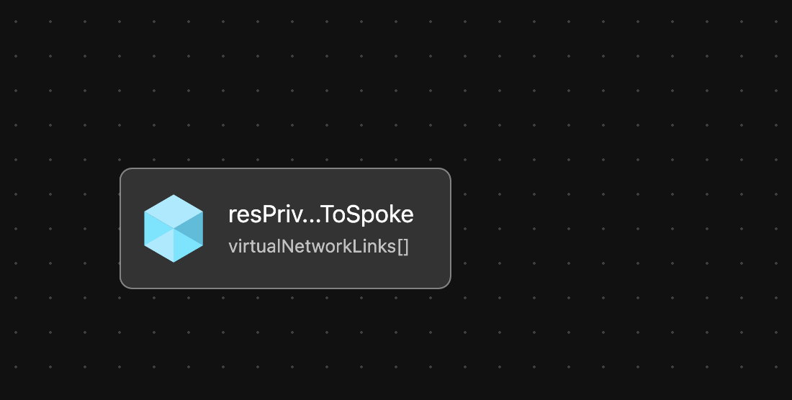

# Module: Private DNS Zone Links

This module is used by the Hub Peered Spoke orchestration module to create virtual network links from Private DNS Zones.
> Consider using the `hubPeeredSpoke` orchestration module to leverage this module to create virtual network links from Private DNS Zones to Spoke Virtual Networks. [infra-as-code/bicep/orchestration/hubPeeredSpoke](https://github.com/Azure/ALZ-Bicep/tree/main/infra-as-code/bicep/orchestration/hubPeeredSpoke)

## Parameters

- [Link to Parameters](generateddocs/privateDnsZoneLinks.bicep.md)

## Outputs

*The module will not generate any outputs.*

## Deployment

The inputs for this module are defined in `parameters/privateDnsZoneLinks.parameters.all.json`.

> For the  examples below we assume you have downloaded or cloned the Git repo as-is and are in the root of the repository as your selected directory in your terminal of choice.

### Azure CLI

```bash
# For Azure global regions
az deployment rg create \
  --template-file infra-as-code/bicep/modules/privateDnsZoneLinks/privateDnsZoneLinks.bicep \
  --parameters @infra-as-code/bicep/modules/privateDnsZoneLinks/parameters/privateDnsZoneLinks.parameters.all.json \
  --location eastus
```

OR

```bash
# For Azure China regions
az deployment rg create \
  --template-file infra-as-code/bicep/modules/privateDnsZoneLinks/privateDnsZoneLinks.bicep \
  --parameters @infra-as-code/bicep/modules/privateDnsZoneLinks/parameters/privateDnsZoneLinks.parameters.all.json \
  --location chinaeast2
  ```

### PowerShell

```powershell
# For Azure global regions
New-AzResourceGroupDeployment `
  -TemplateFile infra-as-code/bicep/modules/privateDnsZoneLinks/privateDnsZoneLinks.bicep `
  -TemplateParameterFile @infra-as-code/bicep/modules/privateDnsZoneLinks/parameters/privateDnsZoneLinks.parameters.all.json `
  -Location eastus
```

OR

```powershell
# For Azure China regions
New-AzResourceGroupDeployment `
  -TemplateFile infra-as-code/bicep/modules/privateDnsZoneLinks/privateDnsZoneLinks.bicep `
  -TemplateParameterFile @infra-as-code/bicep/modules/privateDnsZoneLinks/parameters/privateDnsZoneLinks.parameters.all.json `
  -Location chinaeast2
```

## Bicep Visualizer


