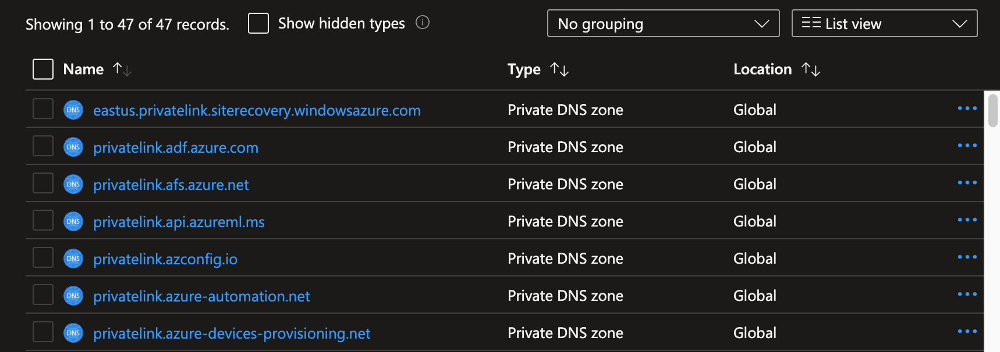
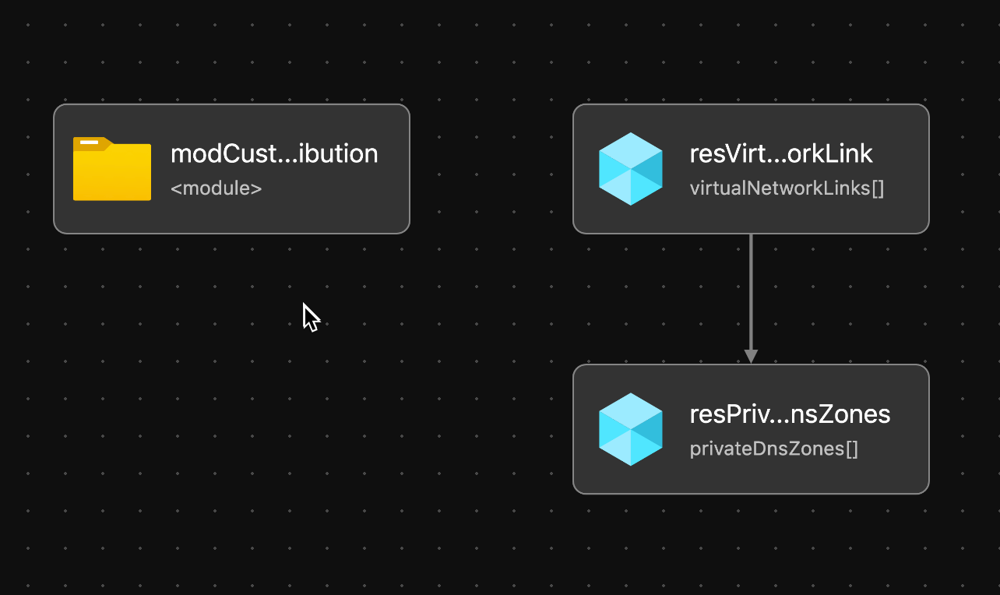

# Module: Private DNS Zones

This module deploys Private DNS Zones used for Private Link based on the recommendations from the Azure Landing Zone Conceptual Architecture.  

Module deploys the following resources:

- Private DNS Zones - See [DNS Zones](#dns-zones) for more info
- Private DNS Zone Links - Links deployed zones with provided Hub Network

## Parameters

The module requires the following inputs:

 | Parameter                 | Type   | Default                                                                                                          | Description                                                                                                                                    | Requirement                              | Example                                                                                                                                                |
 | ------------------------- | ------ | ---------------------------------------------------------------------------------------------------------------- | ---------------------------------------------------------------------------------------------------------------------------------------------- | ---------------------------------------- | ------------------------------------------------------------------------------------------------------------------------------------------------------ |
 | parLocation               | string | `resourceGroup().location`                                                                                       | The Azure Region to deploy the resources into                                                                                                  | None                                     | `eastus`                                                                                                                                               |
 | parPrivateDnsZones        | array  | See example parameters file [`privateDnsZones.parameters.all.json`](parameters/privateDnsZones.parameters.all.json) | Array of DNS Zones to provision in Hub Virtual Network. Default: All known Azure Private DNS Zones - See [DNS Zones](#dns-zones) for more info | None                                     | See Default                                                                                                                                            |
 | parTags                   | object | Empty Array []                                                                                                   | List of tags (Key Value Pairs) to be applied to resources                                                                                      | None                                     | environment: 'development'                                                                                                                             |
 | parVirtualNetworkIdToLink | string | Empty String                                                                                                     | Resource ID of VNet for Private DNS Zone VNet Links                                                                                            | Valid Resource ID of the Virtual Network | /subscriptions/[your platform connectivity subscription ID]/resourceGroups/Hub_PrivateDNS_POC/providers/Microsoft.Network/virtualNetworks/alz-hub-eastus |
 | parTelemetryOptOut        | bool   | false                                                                                                            | Set Parameter to true to Opt-out of deployment telemetry                                                                                       | None                                     | false                                                                                                                                                  |

## DNS Zones

### Regional Zones

The following DNS Zones are region specific and will be deployed with the provided region in the `parLocation` parameter by default:

- `privatelink.batch.azure.com`
- `privatelink.azmk8s.io`
- `privatelink.siterecovery.windowsazure.com`

**Note:** The region specific zones are included in the parameters files with the region set as `xxxxxx`. For these zones to deploy properly, replace `xxxxxx` with the target region. For example: `privatelink.xxxxxx.azmk8s.io` would become `privatelink.eastus.azmk8s.io` for a deployment targeting the East US region.

### Prefixed DNS Zone

The DNS Zone `privatelink.{dnsPrefix}.database.windows.net` is not deployed by default as the DNS Prefix is individual.

You can add the zone to your parameters file with the required DNS Prefix in the zone name.

### All Zones and more details

For more details on private DNS Zones please refer to this link:
[https://docs.microsoft.com/en-us/azure/private-link/private-endpoint-dns#azure-services-dns-zone-configuration](https://docs.microsoft.com/en-us/azure/private-link/private-endpoint-dns#azure-services-dns-zone-configuration)

## Outputs

The module will generate the following outputs:

| Output             | Type  | Example                                                                                                                                                                                                  |
| ------------------ | ----- | -------------------------------------------------------------------------------------------------------------------------------------------------------------------------------------------------------- |
| outPrivateDnsZones | array | `["name": "privatelink.azurecr.io", "id": "/subscriptions/xxxxxxxx-xxxx-xxxx-xxxx-xxxxxxxxxxxx/resourceGroups/net-lz-spk-eastus-rg/providers/Microsoft.Network/privateDnsZones/privatelink.azurecr.io"]` |

## Deployment
> **Note:** `bicepconfig.json` file is included in the module directory.  This file allows us to override Bicep Linters.  Currently there are two URLs which were removed because of linter warnings.  URLs removed are the following: database.windows.net and core.windows.net

In this example, the hub resources will be deployed to the resource group specified. According to the Azure Landing Zone Conceptual Architecture, the hub resources should be deployed into the Platform connectivity subscription. During the deployment step, we will take the default values and not pass any parameters.

There are two different sets of input parameters; one for deploying to Azure global regions, and another for deploying specifically to Azure China regions. This is due to different private DNS zone names for Azure services in Azure global regions and Azure China. The recommended private DNS zone names are available [here](https://docs.microsoft.com/azure/private-link/private-endpoint-dns). Other differences in Azure China regions are as follow:
- DDoS Protection feature is not available. parDdosEnabled parameter is set as false.
- The SKUs available for an ExpressRoute virtual network gateway are Standard, HighPerformance and UltraPerformance. Sku is set as "Standard" in the example parameters file.

 | Azure Cloud    | Bicep template        | Input parameters file                      |
 | -------------- | --------------------- | ------------------------------------------ |
 | Global regions | privateDnsZones.bicep | parameters/privateDnsZones.parameters.all.json    |
 | China regions  | privateDnsZones.bicep | parameters/mc-privateDnsZones.parameters.all.json |

> For the examples below we assume you have downloaded or cloned the Git repo as-is and are in the root of the repository as your selected directory in your terminal of choice.

### Azure CLI
```bash
# For Azure global regions
# Set Platform connectivity subscription ID as the the current subscription 
ConnectivitySubscriptionId="[your platform connectivity subscription ID]"
az account set --subscription $ConnectivitySubscriptionId

az group create --location eastus \
   --name Hub_PrivateDNS_POC

az deployment group create \
   --resource-group Hub_PrivateDNS_POC  \
   --template-file infra-as-code/bicep/modules/privateDnsZones/privateDnsZones.bicep \
   --parameters @infra-as-code/bicep/modules/privateDnsZones/parameters/privateDnsZones.parameters.all.json
```
OR
```bash
# For Azure China regions
# Set Platform connectivity subscription ID as the the current subscription 
ConnectivitySubscriptionId="[your platform connectivity subscription ID]"
az account set --subscription $ConnectivitySubscriptionId

az group create --location chinaeast2 \
   --name Hub_PrivateDNS_POC

az deployment group create \
   --resource-group Hub_PrivateDNS_POC  \
   --template-file infra-as-code/bicep/modules/privateDnsZones/privateDnsZones.bicep \
   --parameters @infra-as-code/bicep/modules/privateDnsZones/parameters/mc-privateDnsZones.parameters.all.json
```

### PowerShell

```powershell
# For Azure global regions
# Set Platform connectivity subscription ID as the the current subscription 
$ConnectivitySubscriptionId = "[your platform connectivity subscription ID]"

Select-AzSubscription -SubscriptionId $ConnectivitySubscriptionId

New-AzResourceGroup -Name 'Hub_PrivateDNS_POC' `
  -Location 'eastus'
  
New-AzResourceGroupDeployment `
  -TemplateFile infra-as-code/bicep/modules/privateDnsZones/privateDnsZones.bicep `
  -TemplateParameterFile infra-as-code/bicep/modules/privateDnsZones/parameters/privateDnsZones.parameters.all.json `
  -ResourceGroupName 'Hub_PrivateDNS_POC'
```
OR
```powershell
# For Azure China regions
# Set Platform connectivity subscription ID as the the current subscription 
$ConnectivitySubscriptionId = "[your platform connectivity subscription ID]"

Select-AzSubscription -SubscriptionId $ConnectivitySubscriptionId

New-AzResourceGroup -Name 'Hub_PrivateDNS_POC' `
  -Location 'chinaeast2'
  
New-AzResourceGroupDeployment `
  -TemplateFile infra-as-code/bicep/modules/privateDnsZones/privateDnsZones.bicep `
  -TemplateParameterFile infra-as-code/bicep/modules/privateDnsZones/parameters/mc-privateDnsZones.parameters.all.json
  -ResourceGroupName 'Hub_PrivateDNS_POC'
```
## Example Output in Azure global regions



## Bicep Visualizer


