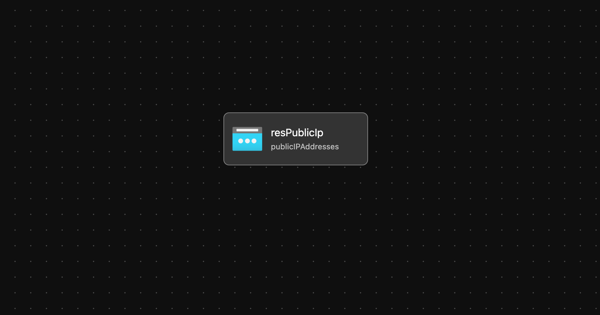

# Module: Public IP

This module defines a public IP address and outputs the id for other modules to consume.  

Module deploys the following resources:

- Public IP Address

## Parameters

The module requires the following inputs:

 | Parameter             | Type   | Default                  | Description                                                                                                                        | Requirement        | Example                              |
 | --------------------- | ------ | ------------------------ | ---------------------------------------------------------------------------------------------------------------------------------- | ------------------ | ------------------------------------ |
 | parLocation           | string | resourceGroup().location | Location where Public IP address will be deployed                                                                                  | Valid Azure Region | `eastus2`                            |
 | parPublicIpName       | string | none                     | Name associated with the Public IP to be created                                                                                   | 1-80 char          | alz-bastion-PublicIp                 |
 | parPublicIpSku        | object | none                     | SKU of IP to deploy to Azure                                                                                                       | Standard or Basic  | Standard                             |
 | parPublicIpProperties | object | none                     | N/A                                                                                                                                |
 | parAvailabilityZones  | array  | Empty Array `[]`         | Availability Zones to deploy the Public IP across. Region must support Availability Zones to use. If it does not then leave empty. | none               | `[]` or `['1']` or `['1' ,'2', '3']` |
 | parTags               | object | none                     | Tags to be appended to resource after it is created                                                                                | none               | {"Environment" : "Development"}      |
 | parTelemetryOptOut    | bool   | `false`                  | Set Parameter to true to Opt-out of deployment telemetry                                                                           | none               | `false`                              |

## Outputs

The module will generate the following outputs:

| Output        | Type   | Example                                                                                                                                                  |
| ------------- | ------ | -------------------------------------------------------------------------------------------------------------------------------------------------------- |
| outPublicIpId | string | /subscriptions/xxxxxxxx-xxxx-xxxx-xxxx-xxxxxxxxxxxx/resourceGroups/HUB_Networking_POC/providers/Microsoft.Network/publicIPAddresses/alz-bastion-PublicIp |

## Deployment

Module is intended to be called from other modules as a reusable resource.

## Bicep Visualizer

