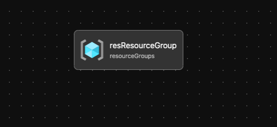

# Module: Resource Group

This module creates a Resource group to be utilized by other modules.

Module deploys the following resources:

- Resource Group

## Parameters

- [Link to Parameters](generateddocs/resourceGroup.bicep.md)

## Outputs

The module will generate the following outputs:

| Output | Type | Example |
| ------ | ---- | ------- |
| outResourceGroupName | string | `Hub` |
| outResourceGroupId | string | `/subscriptions/xxxxxxxx-xxxx-xxxx-xxxx-xxxxxxxxxxx/resourceGroups/Hub` |

## Deployment

Module is intended to be called from other modules as a reusable resource.

## Bicep Visualizer

