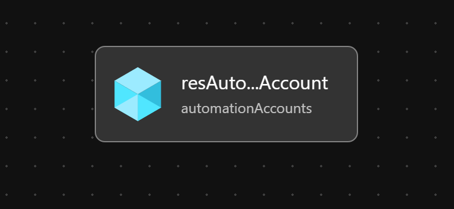

# Module:  Automation Account

Deploys an Azure Automation Account to an exisiting Resource Group.

## Parameters

The module requires the following required input parameters.

 Paramenter | Type | Description | Requirement | Example
----------- | ---- | ----------- | ----------- | -------
parName | string | Automation account name | Mandatory input, name must be unique in the subscription | `alz-automation-account`

## Outputs

The module will generate the following outputs:

Output | Type | Example
------ | ---- | --------
outAutomationAccountName | string | alz-automation-account
outAutomationAccountId | string | /subscriptions/4f9f8765-911a-4a6d-af60-4bc0473268c0/resourceGroups/alz-automation/providers/Microsoft.Automation/automationAccounts/alz-automation-account


## Deployment

In this example, an Automation Account will be deployed to the resource group `alz-automation`.  The inputs for this module are defined in `automation-account.parameters.example.json`.

> For the below examples we assume you have downloaded or cloned the Git repo as-is and are in the root of the repository as your selected directory in your terminal of choice.

### Azure CLI
```bash
# Create Resource Group - optional when using an existing resource group
az group create \
  --name alz-automation \
  --location eastus

# Deploy Module
az deployment group create \
  --template-file infra-as-code/bicep/modules/reusable/automation-account/automation-account.bicep \
  --parameters @infra-as-code/bicep/modules/reusable/automation-account/automation-account.parameters.example.json \
  --resource-group alz-automation
```

### PowerShell

```powershell
# Create Resource Group - optional when using an existing resource group
New-AzResourceGroup `
  -Name alz-automation `
  -Location eastus

# Deploy Module
New-AzResourceGroupDeployment `
  -TemplateFile infra-as-code/bicep/modules/reusable/automation-account/automation-account.bicep `
  -TemplateParameterFile infra-as-code/bicep/modules/reusable/automation-account/automation-account.parameters.example.json `
  -ResourceGroup alz-automation
```

## Bicep Visualizer


