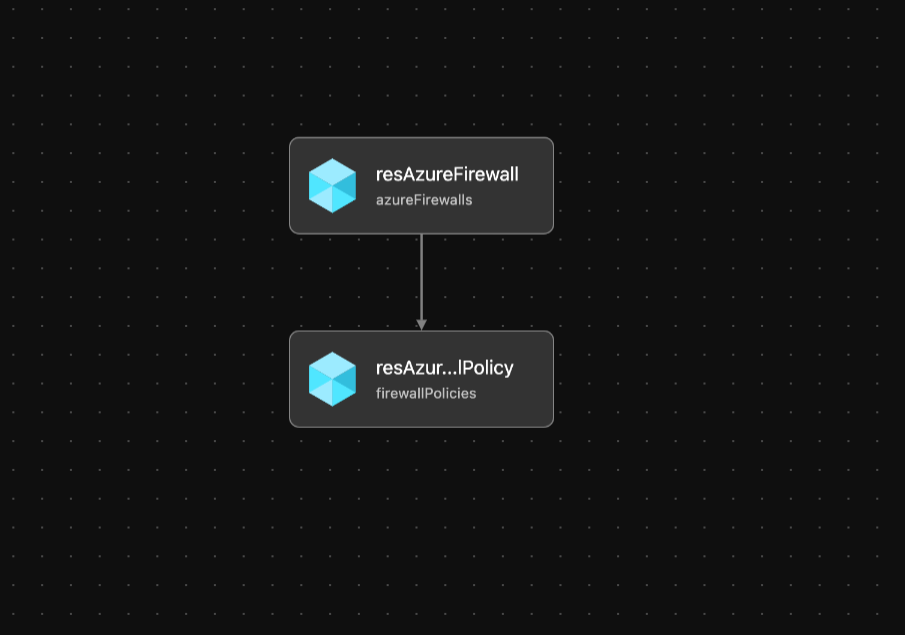

# Module: Azure Firewall

This module creates an Azure Firewall and Azure Policy based on parameters passed.  

Module deploys the following resources:
  * Azure Firewall
  * Azure Firewall Policy

## Parameters

The module requires the following inputs:

 Parameter | Type | Default | Description | Requirement | Example
----------- | ---- | ------- |----------- | ----------- | -------
 parAzureFirewallName  | string | None | Azure Firewall Name | 2-64 char | alz-azure-firewall
 location | string | resourceGroup().location | Azure Region to deploy Azure Firewall to.| 2-64 char, letters, numbers, and underscores | Hub 
 parTags | object | Empty Array |List of tags (Key Value Pairs) to be applied to resources | None | environment: 'development
 parAzureFirewallSubnetID | string | None | Resource ID of Azure Firewall Subnet to deploy Azure Firewall into. | Valid Resource ID | None
 parAzureFirewallPublicIPID | string | None | Resource ID of Public Ip which is to be utilized for Azure Firewall. | Valid Resource ID | /subscriptions/xxxxxxxx-xxxx-xxxx-xxxx-xxxxxxxxxxxx/resourceGroups/Hub_Networking_POC/providers/Microsoft.Network/publicIPAddresses/alz-azure-firewall-PublicIP
 parFirewallPolicyName | string | None | Name of Azure Firewall Policy to create | 2-64 char | alz-azure-firewall-policy
 parFirewallPolicySku | string | None | Sku of Azure Policy to deploy | To deploy Premium Sku Azure Firewall also must be Premium Sku | Premium
 parFirewallTier | string | None | Tier of Azure Firewall to deploy | Standard or Premium | Premium
 parFirewallPolicyEnableProxy | bool | true | Switch to Enable Proxy to Firewall | None | true
 parFirewallPolicyIntrusionDetection | string | Alert | Azure Firewall Policy Intrusion Detection Mode | Alert, Deny, Off | Alert
 parFirewallPolicyIntelMode | string Alert | Azure Firewall Policy Intel MOde | Alert, Deny, Off | Alert
## Outputs

The module will generate the following outputs:

Output | Type | Example
------ | ---- | --------
outAzureFirewallID | string | /subscriptions/xxxxxxxx-xxxx-xxxx-xxxx-xxxxxxxxxxxx/resourceGroups/Hub_Networking_POC/providers/Microsoft.Network/azureFirewalls/alz-azure-firewall
outAzureFirewallPolicyID | string | /subscriptions/xxxxxxxx-xxxx-xxxx-xxxx-xxxxxxxxxxxx/resourceGroups/Hub_Networking_POC/providers/Microsoft.Network/firewallPolicies/alz-firewall-policy
outAzureFirewallPrivateIp | string | 10.20.254.4

## Deployment
Module is intended to be called from other modules as a reusable resource.

## Bicep Visualizer

