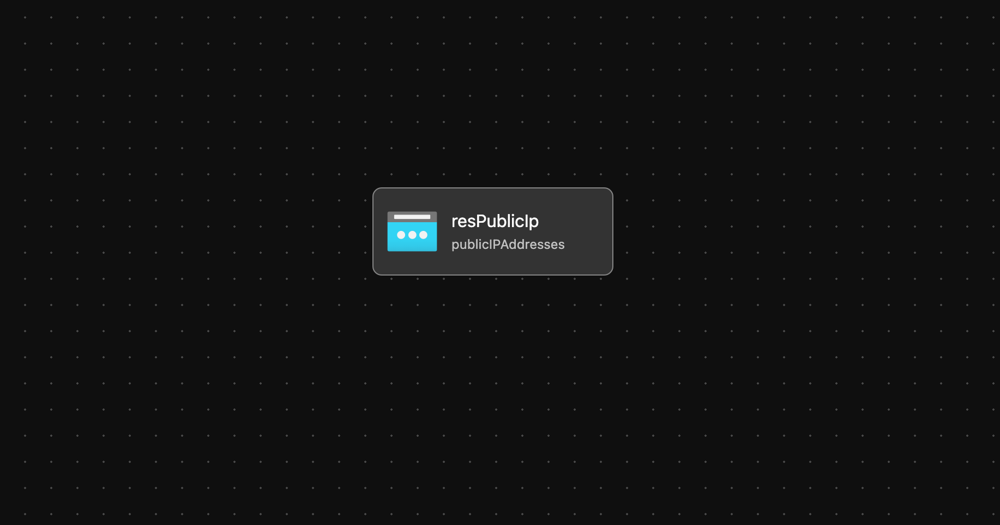

# Module: public-ip 

This module defines a public ip address and outputs the id for other modules to consume.  

Module deploys the following resources:
  * Public Ip Address

## Parameters

The module requires the following inputs:

 Parameter | Type | Default | Description | Requirement | Example
----------- | ---- | ------- |----------- | ----------- | -------
 parPublicIpName| string | none | Name associated with the Public Ip to be created | 1-80 char | alz-bastion-PublicIp
 parPublicIpSku | object | none | Sku of Ip to deploy to azure | Standard or Basic | Standard
 parPublicIpProperties | object | none | 
 location | string | resourceGroup().location | Location where Public Ip address will be deployed | Valid Azure Region | eastus2
 parTags | object | none | Tags to be appended to resource after it is created | none | {"Environment" : "Development"}

## Outputs

The module will generate the following outputs:

Output | Type | Example
------ | ---- | --------
outPublicIpID | string | /subscriptions/xxxxxxxx-xxxx-xxxx-xxxx-xxxxxxxxxxxx/resourceGroups/HUB_Networking_POC/providers/Microsoft.Network/publicIPAddresses/alz-bastion-PublicIp

## Deployment
Module is intended to be called from other modules as a reusable resource.

## Bicep Visualizer

