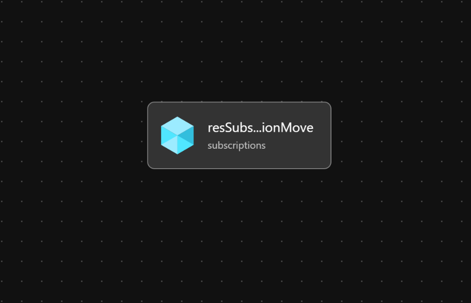

Module:  Move Subscription

Move a subscription to a new management group.  Once the subscription is moved, Azure Policies assigned to the new management group or it's parent management group(s) will begin to govern the subscription.

## Parameters

The module requires the following required input parameters.

 Paramenter | Type | Description | Requirement | Example
----------- | ---- | ----------- | ----------- | -------
parSubscriptionId | string | Subscription Id that should be moved to a new management group. | Mandatory input | `34b63c8f-1782-42e6-8fb9-ba6ee8b99735`
parTargetManagementGroupId | string | Target management group for the subscription. | Mandatory input, management group must exist | `alz-platform-connectivity` |

## Outputs

*This module does not produce any outputs.*


## Deployment

In this example, the subscription `34b63c8f-1782-42e6-8fb9-ba6ee8b99735` will be moved to `alz-platform-connectivity` management group.  The inputs for this module are defined in `subscription-move.parameters.example.json`.

> For the below examples we assume you have downloaded or cloned the Git repo as-is and are in the root of the repository as your selected directory in your terminal of choice.

### Azure CLI
```bash
az deployment tenant create \
  --template-file infra-as-code/bicep/modules/reusable/subscription-move/subscription-move.bicep \
  --parameters @infra-as-code/bicep/modules/reusable/subscription-move/subscription-move.parameters.example.json \
  --location eastus
```

### PowerShell

```powershell
New-AzTenantDeployment `
  -TemplateFile infra-as-code/bicep/modules/reusable/subscription-move/subscription-move.bicep `
  -TemplateParameterFile infra-as-code/bicep/modules/reusable/subscription-move/subscription-move.parameters.example.json `
  -Location eastus
```

## Bicep Visualizer


