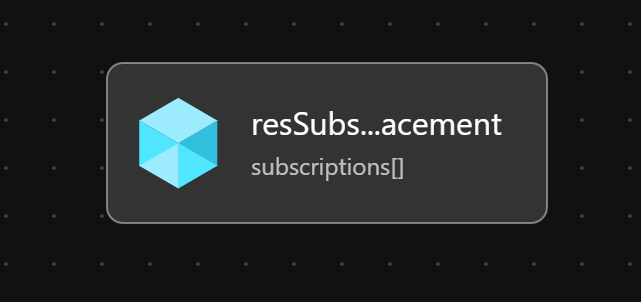

# Module:  Subscription Placement

Move one or more subscriptions to a new management group.  Once the subscription(s) are moved, Azure Policies assigned to the new management group or it's parent management group(s) will begin to govern the subscription(s).

## Parameters

The module requires the following required input parameters.

 Paramenter | Type | Description | Requirement | Example
----------- | ---- | ----------- | ----------- | -------
parSubscriptionIds | Array of string | Array of Subscription Ids that should be moved to the new management group. | Mandatory input | Empty: `[]` or <br />1 Subscription: `["4f9f8765-911a-4a6d-af60-4bc0473268c0"]` or<br />Many Subscriptions: `["34b63c8f-1782-42e6-8fb9-ba6ee8b99735", "4f9f8765-911a-4a6d-af60-4bc0473268c0"]`
parTargetManagementGroupId | string | Target management group for the subscription. | Mandatory input, management group must exist | `alz-platform-connectivity` |

## Deployment

In this example, the subscriptions `34b63c8f-1782-42e6-8fb9-ba6ee8b99735` and `4f9f8765-911a-4a6d-af60-4bc0473268c0` will be moved to `alz-platform-connectivity` management group.  The inputs for this module are defined in `subscription-placement.parameters.example.json`.

> For the below examples we assume you have downloaded or cloned the Git repo as-is and are in the root of the repository as your selected directory in your terminal of choice.

### Azure CLI
```bash
az deployment mg create \
  --template-file infra-as-code/bicep/modules/reusable/subscription-placement/subscription-placement.bicep \
  --parameters @infra-as-code/bicep/modules/reusable/subscription-placement/subscription-placement.parameters.example.json \
  --location eastus \
  --management-group-id alz
```

### PowerShell

```powershell
New-AzManagementGroupDeployment `
  -TemplateFile infra-as-code/bicep/modules/reusable/subscription-placement/subscription-placement.bicep `
  -TemplateParameterFile infra-as-code/bicep/modules/reusable/subscription-placement/subscription-placement.parameters.example.json `
  -Location eastus `
  -ManagementGroupId alz
```

## Bicep Visualizer


