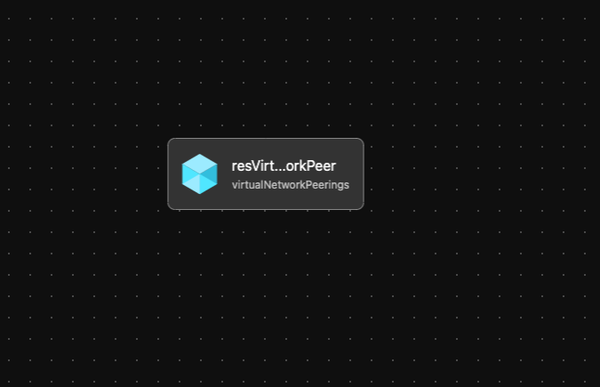

# Module: Public IP

This module creates a virtual network peer between two virtual networks and is to be utilized by other modules.  

Module deploys the following resources:
  * Network-Peering

## Parameters

The module requires the following inputs:

 Parameter | Type | Default | Description | Requirement | Example
----------- | ---- | ------- |----------- | ----------- | -------
 parDestinationVirtualNetworkId | string| None | Name of Resource Group to create in the specified region| 2-64 char, letters, numbers, and underscores | alz-identity-eastus2  
 parSourceVirtualNetworkName  | string | None | Location where Resource Group will be deployed | Valid Azure Region | eastus2
 parDestinationVirtualNetworkName | string| None | Virtual Network Id of virtual network Destination.| 2-64 char, letters, numbers, and underscores | alz-hub-eastus2 
 parAllowVirtualNetworkAccess | bool | true | Switch to enable virtual Network Access | None | true
 parAllowForwardedTraffic | bool | true | Switch to enable Forwarded Traffic | None |true
 parAllowGatewayTransit | bool | false | Switch to enable Gateway Transit | None | false
 
## Outputs

The module will generate the following outputs:

Output | Type | Example
------ | ---- | --------

## Deployment
Module is intended to be called from other modules as a reusable resource.

## Bicep Visualizer

