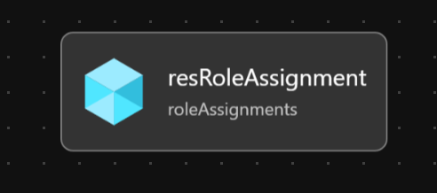
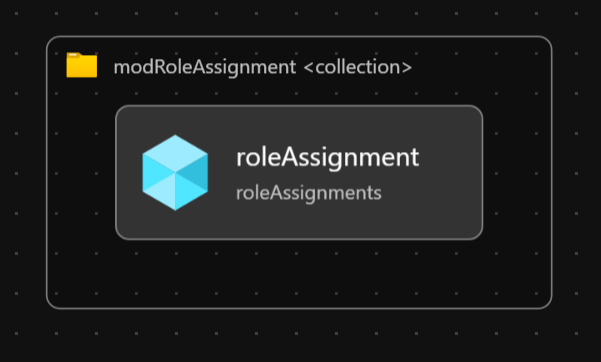
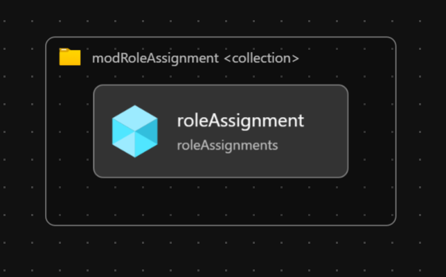

# Module:  Role Assignments for Management Groups & Subscriptions

This module provides role assignment capabilities across Management Group & Subscription scopes. Role assignments are part of [Identity and Access Management (IAM)](https://learn.microsoft.com/en-us/azure/cloud-adoption-framework/ready/enterprise-scale/identity-and-access-management), which is one of the critical design areas in Enterprise-Scale Architecture. The role assignments can be performed for:

- Managed Identities (System and User Assigned)
- Service Principals
- Security Groups

This module contains 4 Bicep templates, you may optionally choose one of these modules to deploy depending on which scope you want to assign roles from broad to narrow; management group to subscription:

| Template                                | Description                                                                                                                               | Deployment Scope |
| --------------------------------------- | ----------------------------------------------------------------------------------------------------------------------------------------- | ---------------- |
| roleAssignmentManagementGroup.bicep     | Performs role assignment on one management group                                                                                          | Management Group |
| roleAssignmentManagementGroupMany.bicep | Performs role assignment on one or more management groups.  This template uses `roleAssignmentManagementGroup.bicep` for the deployments. | Management Group |
| roleAssignmentSubscription.bicep        | Performs role assignment on one subscription                                                                                              | Subscription     |
| roleAssignmentSubscriptionMany.bicep    | Performs role assignment on one or more subscriptions.  This template uses `roleAssignmentSubscription.bicep` for the deployments.        | Management Group |
| roleAssignmentResourceGroup.bicep       | Performs role assignment on one resource group                                                                                            | Resource Group   |
| roleAssignmentResourceGroupMany.bicep   | Performs role assignment on one or more resource groups.  This template uses `roleAssignmentResourceGroup.bicep` for the deployments.     | Management Group |

## Parameters

The module requires the following required input parameters.

All templates require an input for `parAssigneeObjectId` and this value is dependent on the Service Principal type.  Azure CLI and PowerShell commands can be executed to identify the correct `object id`.  Examples:

### Azure CLI - Find Object ID

```bash
# Identify Object Id for User Assigned / System Assigned Managed Identity
# Example: az identity show --resource-group rgManagedIdentities --name alz-managed-identity  --query 'principalId'
az identity show --resource-group <RESOURCE_GROUP> --name <IDENTITY_NAME> --query 'principalId'

# Identify Object Id for Service Principal (App Registration)
# Require read permission to query Microsoft Entra
# Example: az ad sp show --id c705dc53-7c95-42bc-b1d5-75e172571370 --query id
az ad sp show --id <APP_REGISTRATION_APPLICATION_ID> --query id

# Identify Object Id for Service Principal (App Registration)
# Require read permission to query Microsoft Entra
# Beware of duplicates, since app registation names are not unique.
# Example: az ad sp list --filter "displayName eq '<APP_REGISTRATION_NAME>'" --query '[].{name:appDisplayName, objectId:id}'
az ad sp list --filter "displayName eq '<APP_REGISTRATION_NAME>'" --query '[].{name:appDisplayName, objectId:id}'

# Identify Object Id for Security Group
# Require read permission to query Microsoft Entra
# Example: az ad group show --group SG_ALZ_SECURITY --query id
az ad group show --group <SECURITY_GROUP_NAME> --query id
```

### PowerShell - Find Object ID

```powershell
# Identify Object Id for User Assigned / System Assigned Managed Identity
# Example: (Get-AzADServicePrincipal -DisplayName 'alz-managed-identity').Id
(Get-AzADServicePrincipal -DisplayName '<IDENTITY_NAME>').Id

# Identify Object Id for Service Principal (App Registration)
# Require read permission to query Microsoft Entra
# Example:  (Get-AzADServicePrincipal -DisplayName 'Azure Landing Zone SPN').Id
(Get-AzADServicePrincipal -DisplayName '<APP_REGISTRATION_DISPLAY_NAME>').Id

# Identify Object Id for Security Group
# Require read permission to query Microsoft Entra
# Example: Get-AzureADGroup -SearchString 'SG_ALZ_SECURITY'
Connect-AzureAD
(Get-AzureADGroup -SearchString '<SECURITY_GROUP_NAME>').ObjectId
```

### roleAssignmentManagementGroup.bicep

- [Link to Parameters](generateddocs/roleAssignmentManagementGroup.bicep.md)

### roleAssignmentManagementGroupMany.bicep

- [Link to Parameters](generateddocs/roleAssignmentManagementGroupMany.bicep.md)

### roleAssignmentSubscription.bicep

- [Link to Parameters](generateddocs/roleAssignmentSubscription.bicep.md)

### roleAssignmentSubscriptionMany.bicep

- [Link to Parameters](generateddocs/roleAssignmentSubscriptionMany.bicep.md)

### roleAssignmentResourceGroup.bicep

- [Link to Parameters](generateddocs/roleAssignmentResourceGroup.bicep.md)

### roleAssignmentResourceGroupMany.bicep

- [Link to Parameters](generateddocs/roleAssignmentResourceGroupMany.bicep.md)

## Outputs

*This module does not produce any outputs.*

## Deployment

In this example, the built-in Reader role will be assigned to a Service Principal account at the `alz-platform` management group scope.  The inputs for this module are defined in `parameters/roleAssignmentManagementGroup.*.parameters.all.json`.

> For the examples below we assume you have downloaded or cloned the Git repo as-is and are in the root of the repository as your selected directory in your terminal of choice.

### Azure CLI

```bash
# For Azure global regions

dateYMD=$(date +%Y%m%dT%H%M%S%NZ)
NAME="alz-RoleAssignmentsDeployment-${dateYMD}"
LOCATION="eastus"
MGID="alz"
TEMPLATEFILE="infra-as-code/bicep/modules/roleAssignments/roleAssignmentManagementGroup.bicep"
PARAMETERS="@infra-as-code/bicep/modules/roleAssignments/parameters/roleAssignmentManagementGroup.servicePrincipal.parameters.all.json"

az deployment mg create --name ${NAME:0:63} --location $LOCATION --management-group-id $MGID --template-file $TEMPLATEFILE --parameters $PARAMETERS
```
OR
```bash
# For Azure China regions

dateYMD=$(date +%Y%m%dT%H%M%S%NZ)
NAME="alz-RoleAssignmentsDeployment-${dateYMD}"
LOCATION="chinaeast2"
MGID="alz"
TEMPLATEFILE="infra-as-code/bicep/modules/roleAssignments/roleAssignmentManagementGroup.bicep"
PARAMETERS="@infra-as-code/bicep/modules/roleAssignments/parameters/roleAssignmentManagementGroup.servicePrincipal.parameters.all.json"

az deployment mg create --name ${NAME:0:63} --location $LOCATION --management-group-id $MGID --template-file $TEMPLATEFILE --parameters $PARAMETERS
```

### PowerShell

```powershell
# For Azure global regions

$inputObject = @{
  DeploymentName        = -join ('alz-RoleAssignmentsDeployment-{0}' -f (Get-Date -Format 'yyyyMMddTHHMMssffffZ'))[0..63]
  Location              = 'eastus'
  ManagementGroupId     = 'alz'
  TemplateFile          = "infra-as-code/bicep/modules/roleAssignments/roleAssignmentManagementGroup.bicep"
  TemplateParameterFile = 'infra-as-code/bicep/modules/roleAssignments/parameters/roleAssignmentManagementGroup.servicePrincipal.parameters.all.json'
}

New-AzManagementGroupDeployment @inputObject
```
OR
```powershell
# For Azure China regions

$inputObject = @{
  DeploymentName        = -join ('alz-RoleAssignmentsDeployment-{0}' -f (Get-Date -Format 'yyyyMMddTHHMMssffffZ'))[0..63]
  Location              = 'chinaeast2'
  ManagementGroupId     = 'alz'
  TemplateFile          = "infra-as-code/bicep/modules/roleAssignments/roleAssignmentManagementGroup.bicep"
  TemplateParameterFile = 'infra-as-code/bicep/modules/roleAssignments/parameters/roleAssignmentManagementGroup.servicePrincipal.parameters.all.json'
}

New-AzManagementGroupDeployment @inputObject
```

## Bicep Visualizer

### Single Management Group Role Assignment



### Many Management Group Role Assignments



### Single Subscription Role Assignment


### Many Subscription Role Assignments



### Single Resource Group Role Assignment


### Many Resource Group Role Assignments


## Role assignment delegation

For each module, you can add a role assignment condition to securely delegate role assignments to others. Only built-in and custom RBAC roles with `Microsoft.Authorization/roleAssignments/write` and/or `Microsoft.Authorization/roleAssignments/delete` permissions can have a condition defined. Example: (Owner, User Access Administrator and Role Based Access Control Administrator). To generate the condition code:

- Create a role assignemnt with a condition from the portal for the privileged role that will be assigned.
- Select the code view from the advanced editor and copy the condition's code.
- Remove all newlines from the condition code.
- Escape any single quote using a backslash (only in Bicep, no need in JSON parameters file).

> **NOTE:**
> Make sure to review the [limitations](https://learn.microsoft.com/azure/role-based-access-control/delegate-role-assignments-overview?tabs=template#known-issues) related to delegating role assignment management with conditions.

Example:

```json
"parRoleAssignmentNameGuid": {
    "value": "xxxxxxxx-xxxx-xxxx-xxxx-xxxxxxxxxxxx"
},
"parRoleDefinitionId": {
    "value": "xxxxxxxx-xxxx-xxxx-xxxx-xxxxxxxxxxxx"
},
"parAssigneePrincipalType": {
    "value": "ServicePrincipal"
},
"parAssigneeObjectId": {
    "value": "xxxxxxxx-xxxx-xxxx-xxxx-xxxxxxxxxxxx"
},
"parRoleAssignmentCondition": {
    "value": "((!(ActionMatches{'Microsoft.Authorization/roleAssignments/write'}) OR (@Request[Microsoft.Authorization/roleAssignments:RoleDefinitionId] ForAnyOfAnyValues:GuidEquals {xxxxxxxx-xxxx-xxxx-xxxx-xxxxxxxxxxxx,xxxxxxxx-xxxx-xxxx-xxxx-xxxxxxxxxxxx} AND @Request[Microsoft.Authorization/roleAssignments:PrincipalType] ForAnyOfAnyValues:StringEqualsIgnoreCase {'Group','ServicePrincipal'})) AND ((!(ActionMatches{'Microsoft.Authorization/roleAssignments/delete'})) OR (@Resource[Microsoft.Authorization/roleAssignments:RoleDefinitionId] ForAnyOfAnyValues:GuidEquals {xxxxxxxx-xxxx-xxxx-xxxx-xxxxxxxxxxxx,xxxxxxxx-xxxx-xxxx-xxxx-xxxxxxxxxxxx} AND @Resource[Microsoft.Authorization/roleAssignments:PrincipalType] ForAnyOfAnyValues:StringEqualsIgnoreCase {'Group','ServicePrincipal'})))"
},
"parRoleAssignmentConditionVersion": {
    "value": "2.0"
},
"parTelemetryOptOut": {
    "value": false
}
```
