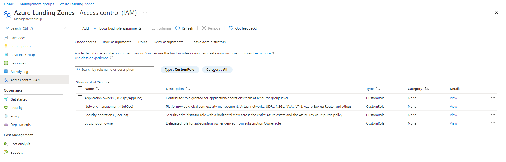
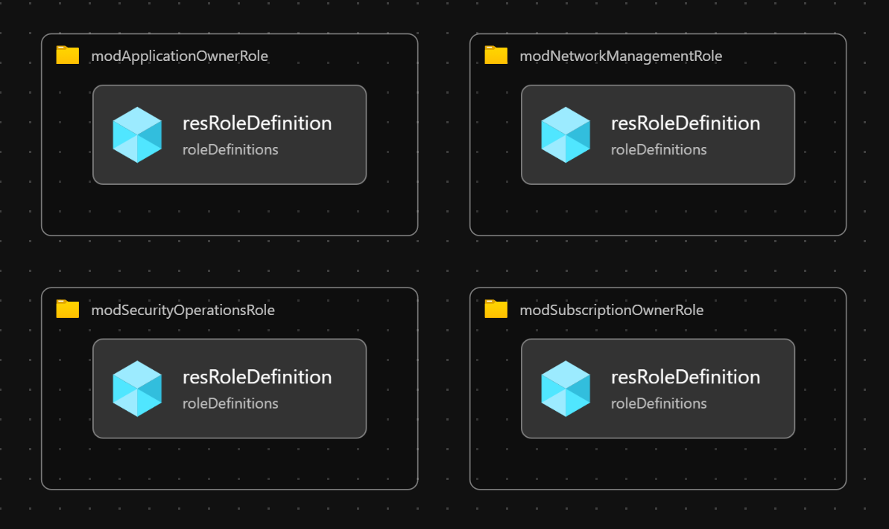

# Module:  Roles

This module defines custom Roles based on Cloud Adoption Framework for Azure.  The role definitions are defined in [Identity and access management](https://docs.microsoft.com/azure/cloud-adoption-framework/ready/enterprise-scale/identity-and-access-management) recommendations.

Module supports the following custom roles:

  * Subscription owner
  * Application owners (DevOps/AppOps)
  * Network management (NetOps)
  * Security operations (SecOps)


## Parameters

The module requires the following inputs:

 Paramenter | Description | Requirement | Example
----------- | ----------- | ----------- | -------
parAssignableScopeManagementGroupId | The management group scope to which the role can be assigned. | Mandatory input | `alz`

## Outputs

The module will generate the following outputs:

Output | Type | Example
------ | ---- | --------
outSubscriptionOwnerRoleId | string | Microsoft.Authorization/roleDefinitions/8736d87d-8d31-53be-b952-a04c8d470f69
outApplicationOwnerRoleId | string | Microsoft.Authorization/roleDefinitions/4308c4e6-07d5-534f-9e18-32769872a3f4
outNetworkManagementRoleId | string | Microsoft.Authorization/roleDefinitions/4a200286-e2a0-5239-aa8f-fe0a90dd2eb5
outSecurityOperationsRoleId | string | Microsoft.Authorization/roleDefinitions/b2960c40-d3db-5190-94c1-5b07c9547956

## Deployment

In this example, the custom roles will be deployed to the `alz` management group.

Input parameter file `roles.parameters.example.json` defines the assignable scope for the roles.  In this case, it will be the same management group (i.e. `alz`) as the one specified for the deployment operation.

> For the below examples we assume you have downloaded or cloned the Git repo as-is and are in the root of the repository as your selected directory in your terminal of choice.

### Azure CLI
```bash
az deployment mg create \
  --template-file infra-as-code/bicep/modules/roles/roles.bicep \
  --parameters @infra-as-code/bicep/modules/roles/roles.parameters.example.json \
  --location eastus \
  --management-group-id alz
```

### PowerShell

```powershell
New-AzManagementGroupDeployment `
  -TemplateFile infra-as-code/bicep/modules/roles/roles.bicep `
  -TemplateParameterFile infra-as-code/bicep/modules/roles/roles.parameters.example.json `
  -Location eastus `
  -ManagementGroupId alz
```



## Bicep Visualizer


