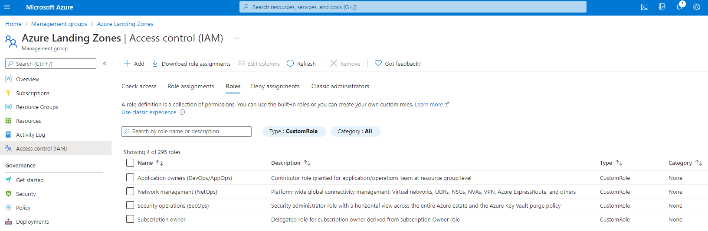
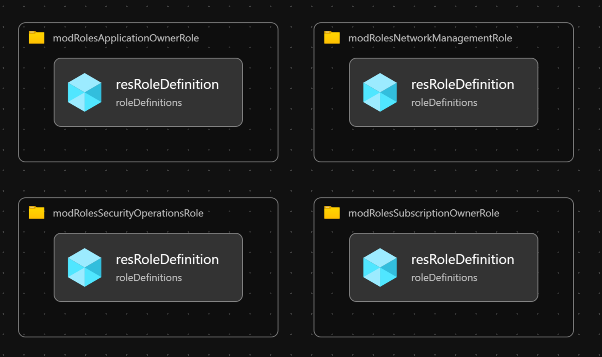

# Module:  Roles

Defines Custom Roles based on Cloud Adoption Framework for Azure guidance. Custom roles based on the following personas:
  * Subscription owner
  * Application owners (DevOps/AppOps)
  * Network management (NetOps)
  * Security operations (SecOps)

The role definitions are defined in [Identity and access management](https://docs.microsoft.com/azure/cloud-adoption-framework/ready/enterprise-scale/identity-and-access-management) recommendations.

## Parameters

The module requires the following required input parameters.

 Paramenter | Description | Requirement | Example
----------- | ----------- | ----------- | -------
parAssignableScopeManagementGroupId | The management group scope to which the role can be assigned. | Mandatory input | `alz`


## Deployment

**Example Deployment**

In this example, the custom roles will be defined at the `alz` management group.

### Azure CLI
```bash
az deployment mg create \
  --template-file infra-as-code/bicep/modules/roles/roles.bicep \
  --parameters @infra-as-code/bicep/modules/roles/roles.parameters.example.json \
  --location eastus \
  --management-group-id alz
```

### PowerShell

```powershell
New-AzManagementGroupDeployment `
  -TemplateFile infra-as-code/bicep/modules/roles/roles.bicep `
  -TemplateParameterFile infra-as-code/bicep/modules/roles/roles.parameters.example.json `
  -Location eastus `
  -ManagementGroupId alz
```



## Bicep Visualizer


