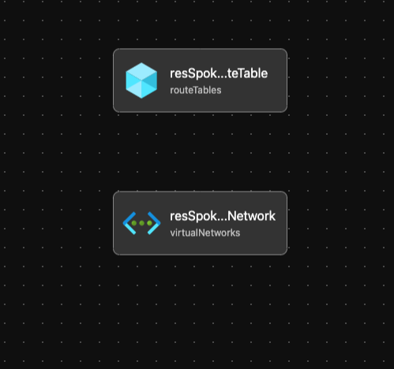

# Module: Public IP

This module defines spoke networking based on the recommendations from the Azure Landing Zone Conceptual Architecture.  

Module deploys the following resources:
  * VirtualNetwork(Spoke Vnet)
  * Subnets
  * UDR - if Firewall is enabled
  * Private DNS Link

## Parameters

The module requires the following inputs:

 Parameter | Type | Default | Description | Requirement | Example
----------- | ---- | ------- |----------- | ----------- | -------
 parHubNVAEnabled | bool| true | Switch to enable use of NVA for Hub| None | true
 parDdosEnabled  | bool | true | Switch to enable Ddos on Vnet | None | true
 parNetworkDnsEnableProxy | bool | true | Switch to enable Network Dns Proxy on Vnet | None | true
 parBGPRoutePropogation | bool | false | Switch to enable BGP Route Propogation on Vnet | None | false
 parTags | object| empty array | Array of Tags to be applied to all resources in the Spoke Network | None | 
 parDdosProtectionPlanId | string | Empty String | Existing Ddos Protection plan to utilize| Valid Ddos Plan Id | 
 parSpokeNetworkAddressPrefix | string | '10.11.0.0/16' | Cidr for Spoke Network | Valid Cidr for Spoke Network |'10.11.0.0/16' 
 parSpokeNetworkPrefix | string | Corp-Spoke | Name Prefix which will be leveraged when creating vnet |  2-50 char  | Corp-Spoke
 parDNSServerIPArray | array | empty array | Array Ip DNS Servers to use for Vnet Dns Resolution | None | None
 parNextHopIPAddress | string | empty string | Ip Address where network traffic should route to leverage DNS Proxy | 192.168.50.1
 parSpokeToHubRouteTableName | string | udr-spoke-to_hub | Name of Route table to create for the default route of Hub. |udr-spoke-to_hub

## Outputs

The module will generate the following outputs:

Output | Type | Example
------ | ---- | --------
outSpookeVirtualNetworkName | string | Corp-Spoke-eastus
outSpokeVirtualNetworkid | string |

## Deployment
Module is intended to be called from other modules as a reusable resource.

## Bicep Visualizer

