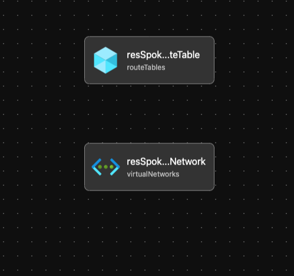

# Module: Spoke Networking

> [!IMPORTANT]
> We recommend utilizing the [Bicep Landing Zone Vending Module](https://github.com/Azure/bicep-lz-vending) in place of this Spoke Networking Module. Not only does the module handle spoke networking, but it also handles many other aspects of setting up the > foundational components of the application landing zones which are out of scope for this module.

This module defines spoke networking based on the recommendations from the Azure Landing Zone Conceptual Architecture. If enabled spoke will route traffic to Hub Network with NVA.

Module deploys the following resources:

- Virtual Network (Spoke VNet)
- Route Table with route to NVA - if Firewall is enabled

> [!NOTE]
> This module only deploys the skeleton of a virtual network. Subnet(s) are not created nor does this module support declaring them. This is a blank vNet with the expectation of handing it over to the app/workload team to create their subnet(s), etc. The ALZ-Bicep core team decided not to add subnet support due to:
>
> - Complexity of managing all of the subnet properties, including NSG, UDR, service endpoints, subnet delegations, etc.
> - Intellisense will be a challenge as we'll be using an array of objects to define the subnet properties
> - Feature parity with ALZ Azure Portal and Terraform experience
> - Future updates to the virtual network resource provider could change the way we manage subnets as a child and/or a separate resource object. All to say this future change could make it easier to manage a subnet declaration within this module
>
> To customize spoke networking to include subnet declarations, we recommend the use of the following ordered methods:
>
> 1. [AVM](https://aka.ms/avm) - Utilize Azure Verified Modules to deploy the subnets
> 2. [Fork](https://docs.github.com/en/get-started/quickstart/fork-a-repo) this repo and customize the modules accordingly
> 3. Write your own custom module

## Parameters

- [Link to Parameters](generateddocs/spokeNetworking.bicep.md)

## Outputs

The module will generate the following outputs:

| Output                      | Type   | Example                                                                                                                                             |
| --------------------------- | ------ | --------------------------------------------------------------------------------------------------------------------------------------------------- |
| outSpokeVirtualNetworkName | string | Corp-Spoke-eastus                                                                                                                                   |
| outSpokeVirtualNetworkId    | string | /subscriptions/xxxxxxxx-xxxx-xxxx-xxxxx-xxxxxxxxx/resourceGroups/net-core-hub-eastus-rg/providers/Microsoft.Network/virtualNetworks/vnet-hub-eastus |

## Deployment

This module is intended to be called from other modules as a reusable resource, but an example on how to deploy has been added below for completeness.

In this example, the spoke resources will be deployed to the resource group specified. According to the Azure Landing Zone Conceptual Architecture, the spoke resources should be deployed into the Landing Zones subscriptions. During the deployment step, we will take the parameters provided in the example parameter files.

> For the examples below we assume you have downloaded or cloned the Git repo as-is and are in the root of the repository as your selected directory in your terminal of choice.

### Azure CLI

```bash
# For Azure global regions
# Set Azure Landing zone subscription ID as the the current subscription
LandingZoneSubscriptionId="[your landing zone subscription ID]"

az account set --subscription $LandingZoneSubscriptionId

# Set the top level MG Prefix in accordance to your environment. This example assumes default 'alz'.
TopLevelMGPrefix="alz"

dateYMD=$(date +%Y%m%dT%H%M%S%NZ)
NAME="alz-SpokeNetworkingDeployment-${dateYMD}"
GROUP="rg-$TopLevelMGPrefix-spoke-networking-001"
TEMPLATEFILE="infra-as-code/bicep/modules/spokeNetworking/spokeNetworking.bicep"
PARAMETERS="@infra-as-code/bicep/modules/spokeNetworking/parameters/spokeNetworking.parameters.all.json"

# Create Resource Group - optional when using an existing resource group
az group create \
  --name $GROUP \
  --location eastus

az deployment group create --name ${NAME:0:63} --resource-group $GROUP --template-file $TEMPLATEFILE --parameters $PARAMETERS
```
OR
```bash
# For Azure China regions
# Set Platform connectivity subscription ID as the the current subscription
LandingZoneSubscriptionId="[your landing zone subscription ID]"

az account set --subscription $LandingZoneSubscriptionId

# Set the top level MG Prefix in accordance to your environment. This example assumes default 'alz'.
TopLevelMGPrefix="alz"

dateYMD=$(date +%Y%m%dT%H%M%S%NZ)
NAME="alz-SpokeNetworkingDeployment-${dateYMD}"
GROUP="rg-$TopLevelMGPrefix-spoke-networking-001"
TEMPLATEFILE="infra-as-code/bicep/modules/spokeNetworking/spokeNetworking.bicep"
PARAMETERS="@infra-as-code/bicep/modules/spokeNetworking/parameters/spokeNetworking.parameters.all.json"

# Create Resource Group - optional when using an existing resource group
az group create \
  --name $GROUP \
  --location chinaeast2

az deployment group create --name ${NAME:0:63} --resource-group $GROUP --template-file $TEMPLATEFILE --parameters $PARAMETERS
```

### PowerShell

```powershell
# For Azure global regions
# Set Platform connectivity subscription ID as the the current subscription
$LandingZoneSubscriptionId = "[your landing zone subscription ID]"

Select-AzSubscription -SubscriptionId $LandingZoneSubscriptionId

# Set the top level MG Prefix in accordance to your environment. This example assumes default 'alz'.
$TopLevelMGPrefix = "alz"

# Parameters necessary for deployment
$inputObject = @{
  DeploymentName        = 'alz-SpokeNetworkingDeploy-{0}' -f (-join (Get-Date -Format 'yyyyMMddTHHMMssffffZ')[0..63])
  ResourceGroupName     = "rg-$TopLevelMGPrefix-spoke-networking-001"
  TemplateParameterFile = "infra-as-code/bicep/modules/spokeNetworking/parameters/spokeNetworking.parameters.all.json"
  TemplateFile          = "infra-as-code/bicep/modules/spokeNetworking/spokeNetworking.bicep"
}

New-AzResourceGroup `
  -Name $inputObject.ResourceGroupName `
  -Location 'eastus'

New-AzResourceGroupDeployment @inputObject
```
OR
```powershell
# For Azure China regions
# Set Platform connectivity subscription ID as the the current subscription
$LandingZoneSubscriptionId = "[your landing zone subscription ID]"

Select-AzSubscription -SubscriptionId $LandingZoneSubscriptionId

# Set the top level MG Prefix in accordance to your environment. This example assumes default 'alz'.
$TopLevelMGPrefix = "alz"

# Parameters necessary for deployment
$inputObject = @{
  DeploymentName        = 'alz-SpokeNetworkingDeploy-{0}' -f (-join (Get-Date -Format 'yyyyMMddTHHMMssffffZ')[0..63])
  ResourceGroupName     = "rg-$TopLevelMGPrefix-spoke-networking-001"
  TemplateParameterFile = "infra-as-code/bicep/modules/spokeNetworking/parameters/spokeNetworking.parameters.all.json"
  TemplateFile          = "infra-as-code/bicep/modules/spokeNetworking/spokeNetworking.bicep"
}

New-AzResourceGroup `
  -Name $inputObject.ResourceGroupName `
  -Location 'chinaeast2'

New-AzResourceGroupDeployment @inputObject
```
## Example Output in Azure global regions


## Bicep Visualizer


