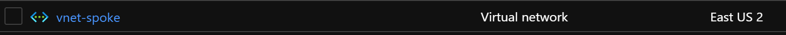

# Module: Spoke Networking

This module defines spoke networking based on the recommendations from the Azure Landing Zone Conceptual Architecture. If enabled spoke will route traffic to Hub Network with NVA.

Module deploys the following resources:

- Virtual Network (Spoke VNet)
- UDR - if Firewall is enabled

> Consider using the `hubPeeredSpoke` orchestration module instead to simplify spoke networking deployment, VNET Peering, UDR configuration and Subscription placement in a single module. [infra-as-code/bicep/orchestration/hubPeeredSpoke](https://github.com/Azure/ALZ-Bicep/tree/main/infra-as-code/bicep/orchestration/hubPeeredSpoke)

## Parameters

The module requires the following inputs:

 | Parameter                    | Type   | Default                    | Description                                                         | Requirement | Example                                                                                                                                               |
 | ---------------------------- | ------ | -------------------------- | ------------------------------------------------------------------- | ----------- | ----------------------------------------------------------------------------------------------------------------------------------------------------- |
 | parLocation                    | string | `resourceGroup().location` | The Azure Region to deploy the resources into                       | None        | `eastus`                                                                                                                                              |
 | parDisableBgpRoutePropagation | bool   | false                      | Switch which allows BGP Propagation to be disabled on the route table          | None        | false                                                                                                                                                 |
 | parTags                      | object | Empty object `{}`          | Array of Tags to be applied to all resources in the Spoke Network   | None        | `{"key": "value"}`                                                                                                                                    |
 | parDdosProtectionPlanId      | string | Empty string `''`          | Existing DDoS Protection plan to utilize                            | None        | `/subscriptions/xxxxxxxx-xxxx-xxxx-xxxx-xxxxxxxxxxxx/resourceGroups/Hub_Networking_POC/providers/Microsoft.Network/ddosProtectionPlans/alz-ddos-plan` |
 | parSpokeNetworkAddressPrefix | string | '10.11.0.0/16'             | CIDR for Spoke Network                                              | None        | '10.11.0.0/16'                                                                                                                                        |
 | parSpokeNetworkName          | string | 'vnet-spoke'               | The Name of the Spoke Virtual Network.                              | None        | 'vnet-spoke'                                                                                                                                          |
 | parDnsServerIps          | array  | Empty array `[]`           | DNS Servers to use for VNet DNS Resolution                 | None        | `['10.10.1.4', '10.20.1.5']`                                                                                                                          |
 | parNextHopIpAddress          | string | Empty string `''`          | IP Address where network traffic should route to leverage DNS Proxy | None        | '192.168.50.4'                                                                                                                                        |
 | parSpokeToHubRouteTableName  | string | 'rtb-spoke-to-hub'         | Name of Route table to create for the default route of Hub.         | None        | 'rtb-spoke-to-hub '                                                                                                                                   |
 | parTelemetryOptOut           | bool   | false                      | Set Parameter to true to Opt-out of deployment telemetry            | None        | false                                                                                                                                                 |

## Outputs

The module will generate the following outputs:

| Output                      | Type   | Example                                                                                                                                             |
| --------------------------- | ------ | --------------------------------------------------------------------------------------------------------------------------------------------------- |
| outSpokeVirtualNetworkName | string | Corp-Spoke-eastus                                                                                                                                   |
| outSpokeVirtualNetworkId    | string | /subscriptions/xxxxxxxx-xxxx-xxxx-xxxxx-xxxxxxxxx/resourceGroups/net-core-hub-eastus-rg/providers/Microsoft.Network/virtualNetworks/vnet-hub-eastus |

## Deployment

This module is intended to be called from other modules as a reusable resource, but an example on how to deploy has been added below for completeness.

In this example, the spoke resources will be deployed to the resource group specified. According to the Azure Landing Zone Conceptual Architecture, the spoke resources should be deployed into the Landing Zones subscriptions. During the deployment step, we will take the parameters provided in the example parameter files.

> For the examples below we assume you have downloaded or cloned the Git repo as-is and are in the root of the repository as your selected directory in your terminal of choice.

### Azure CLI
**NOTE: As there is some PowerShell code within the CLI, there is a requirement to execute the deployments in a cross-platform terminal which has PowerShell installed.**
```bash
# For Azure global regions
# Set Azure Landing zone subscription ID as the the current subscription 
LandingZoneSubscriptionId="[your landing zone subscription ID]"

az account set --subscription $LandingZoneSubscriptionId

# Set the top level MG Prefix in accordance to your environment. This example assumes default 'alz'.
TopLevelMGPrefix="alz"

ResourceGroupName="rg-$TopLevelMGPrefix-spoke-networking-001"

# Create Resource Group - optional when using an existing resource group
az group create \
  --name $ResourceGroupName \
  --location eastus

    $inputObject = @(
  '--name',           ('alz-SpokeNetworkingDeploy-{0}' -f (-join (Get-Date -Format 'yyyyMMddTHHMMssffffZ')[0..63])),
  '--resource-group', $ResourceGroupName,
  '--parameters',     '@infra-as-code/bicep/modules/spokeNetworking/parameters/spokeNetworking.parameters.all.json',
  '--template-file',  "infra-as-code/bicep/modules/spokeNetworking/spokeNetworking.bicep"
)

az deployment group create @inputObject
```
OR
```bash
# For Azure China regions
# Set Platform connectivity subscription ID as the the current subscription 
LandingZoneSubscriptionId="[your landing zone subscription ID]"

az account set --subscription $LandingZoneSubscriptionId

# Set the top level MG Prefix in accordance to your environment. This example assumes default 'alz'.
TopLevelMGPrefix="alz"

ResourceGroupName="rg-$TopLevelMGPrefix-spoke-networking-001"

# Create Resource Group - optional when using an existing resource group
az group create \
  --name $ResourceGroupName \
  --location chinaeast2

  $inputObject = @(
  '--name',           ('alz-SpokeNetworkingDeploy-{0}' -f (-join (Get-Date -Format 'yyyyMMddTHHMMssffffZ')[0..63])),
  '--resource-group', $ResourceGroupName,
  '--parameters',     '@infra-as-code/bicep/modules/spokeNetworking/parameters/spokeNetworking.parameters.all.json',
  '--template-file',  "infra-as-code/bicep/modules/spokeNetworking/spokeNetworking.bicep"
)

az deployment group create @inputObject
```

### PowerShell

```powershell
# For Azure global regions
# Set Platform connectivity subscription ID as the the current subscription 
$LandingZoneSubscriptionId = "[your landing zone subscription ID]"

Select-AzSubscription -SubscriptionId $LandingZoneSubscriptionId

# Set the top level MG Prefix in accordance to your environment. This example assumes default 'alz'.
$TopLevelMGPrefix = "alz"

$ResourceGroupName = "rg-$TopLevelMGPrefix-spoke-networking-001"

# Parameters necessary for deployment
$inputObject = @{
  DeploymentName        = 'alz-SpokeNetworkingDeploy-{0}' -f (-join (Get-Date -Format 'yyyyMMddTHHMMssffffZ')[0..63])
  ResourceGroupName     = $ResourceGroupName
  TemplateParameterFile = "infra-as-code/bicep/modules/spokeNetworking/parameters/spokeNetworking.parameters.all.json"
  TemplateFile          = "infra-as-code/bicep/modules/spokeNetworking/spokeNetworking.bicep"
}

New-AzResourceGroup -Name $ResourceGroupName `
  -Location 'eastus'
  
New-AzResourceGroupDeployment @inputObject
```
OR
```powershell
# For Azure China regions
# Set Platform connectivity subscription ID as the the current subscription 
$LandingZoneSubscriptionId = "[your landing zone subscription ID]"

Select-AzSubscription -SubscriptionId $LandingZoneSubscriptionId

# Set the top level MG Prefix in accordance to your environment. This example assumes default 'alz'.
$TopLevelMGPrefix = "alz"

$ResourceGroupName = "rg-$TopLevelMGPrefix-spoke-networking-001"

# Parameters necessary for deployment
$inputObject = @{
  DeploymentName        = 'alz-SpokeNetworkingDeploy-{0}' -f (-join (Get-Date -Format 'yyyyMMddTHHMMssffffZ')[0..63])
  ResourceGroupName     = $ResourceGroupName
  TemplateParameterFile = "infra-as-code/bicep/modules/spokeNetworking/parameters/spokeNetworking.parameters.all.json"
  TemplateFile          = "infra-as-code/bicep/modules/spokeNetworking/spokeNetworking.bicep"
}

New-AzResourceGroup -Name $ResourceGroupName `
  -Location 'chinaeast2'
  
New-AzResourceGroupDeployment @inputObject
```
## Example Output in Azure global regions




## Bicep Visualizer


