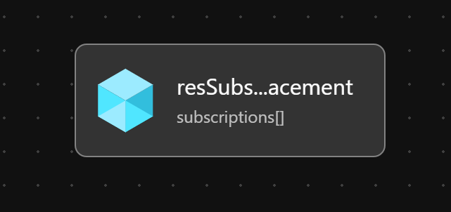

# Module:  Subscription Placement

This module moves one or more subscriptions to be a child of the specified management group. Once the subscription(s) are moved under the management group, Azure Policies assigned to the management group or its parent management group(s) will begin to govern the subscription(s).

## Parameters

The module requires the following required input parameters.

 | Parameter                  | Type            | Description                                                                 | Requirement                                  | Example                                                                                                                                                                                        |
 | -------------------------- | --------------- | --------------------------------------------------------------------------- | -------------------------------------------- | ---------------------------------------------------------------------------------------------------------------------------------------------------------------------------------------------- |
 | parSubscriptionIds         | Array of string | Array of Subscription Ids that should be moved to the new management group. | Mandatory input                              | Empty: `[]` or <br />1 Subscription: `["4f9f8765-911a-4a6d-af60-4bc0473268c0"]` or<br />Many Subscriptions: `["34b63c8f-1782-42e6-8fb9-ba6ee8b99735", "4f9f8765-911a-4a6d-af60-4bc0473268c0"]` |
 | parTargetManagementGroupId | string          | Target management group for the subscription.                               | Mandatory input, management group must exist | `alz-platform-connectivity`                                                                                                                                                                    |
 | parTelemetryOptOut         | bool            | Set Parameter to true to Opt-out of deployment telemetry                    | none                                         | `false`                                                                                                                                                                                        |

## Outputs
*This module does not produce any outputs.*

## Deployment

In this example, the subscriptions `34b63c8f-1782-42e6-8fb9-ba6ee8b99735` and `4f9f8765-911a-4a6d-af60-4bc0473268c0` will be moved to `alz-platform-connectivity` management group.  The inputs for this module are defined in `parameters/subscriptionPlacement.parameters.all.json`.

> For the  examples below we assume you have downloaded or cloned the Git repo as-is and are in the root of the repository as your selected directory in your terminal of choice.

### Azure CLI
```bash
# For Azure global regions
az deployment mg create \
  --template-file infra-as-code/bicep/modules/subscriptionPlacement/subscriptionPlacement.bicep \
  --parameters @infra-as-code/bicep/modules/subscriptionPlacement/parameters/subscriptionPlacement.parameters.all.json \
  --location eastus \
  --management-group-id alz
```
OR
```bash
# For Azure China regions
az deployment mg create \
  --template-file infra-as-code/bicep/modules/subscriptionPlacement/subscriptionPlacement.bicep \
  --parameters @infra-as-code/bicep/modules/subscriptionPlacement/parameters/subscriptionPlacement.parameters.all.json \
  --location chinaeast2 \
  --management-group-id alz
```

### PowerShell

```powershell
# For Azure global regions
New-AzManagementGroupDeployment `
  -TemplateFile infra-as-code/bicep/modules/subscriptionPlacement/subscriptionPlacement.bicep `
  -TemplateParameterFile infra-as-code/bicep/modules/subscriptionPlacement/parameters/subscriptionPlacement.parameters.all.json `
  -Location eastus `
  -ManagementGroupId alz
```
OR
```powershell
# For Azure China regions
New-AzManagementGroupDeployment `
  -TemplateFile infra-as-code/bicep/modules/subscriptionPlacement/subscriptionPlacement.bicep `
  -TemplateParameterFile infra-as-code/bicep/modules/subscriptionPlacement/parameters/subscriptionPlacement.parameters.all.json `
  -Location chinaeast2 `
  -ManagementGroupId alz
```

## Bicep Visualizer


