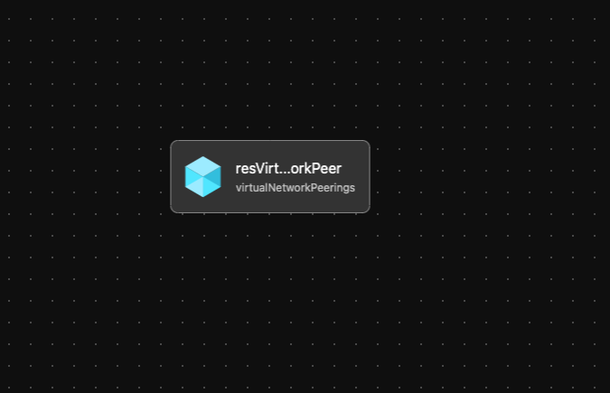

# Module: Virtual Network Peer

This module creates a virtual network peer between two virtual networks and is to be utilized by other modules.  Module will need to be called twice to create the completed peering.  Each time with a peering direction. This allows for peering between different subscriptions.  

**Peering Options Documentation:**

- [https://docs.microsoft.com/en-us/azure/virtual-network/virtual-network-manage-peering](https://docs.microsoft.com/en-us/azure/virtual-network/virtual-network-manage-peering)
- [https://docs.microsoft.com/en-us/azure/virtual-network/virtual-network-manage-peering#create-a-peering](https://docs.microsoft.com/en-us/azure/virtual-network/virtual-network-manage-peering#create-a-peering)

Module deploys the following resources:

- Virtual Network Peering

## Parameters

The module requires the following inputs:

 | Parameter                        | Type   | Default | Description                                                     | Requirement                                  | Example         |
 | -------------------------------- | ------ | ------- | --------------------------------------------------------------- | -------------------------------------------- | --------------- |
 | parDestinationVirtualNetworkID   | string | None    | ID of the Destination Virtual Network                           | Valid Virtual Network ID                     |
 | parSourceVirtualNetworkName      | string | None    | Name of Source Virtual Network                                  | Valid Azure Region                           | alz-spk-eastus2 |
 | parDestinationVirtualNetworkName | string | None    | Virtual Network Name of the destination/target Virtual Network. | 2-64 char, letters, numbers, and underscores | alz-hub-eastus2 |
 | parAllowVirtualNetworkAccess     | bool   | true    | Switch to enable virtual Network Access                         | None                                         | true            |
 | parAllowForwardedTraffic         | bool   | true    | Switch to enable Forwarded Traffic                              | None                                         | true            |
 | parAllowGatewayTransit           | bool   | false   | Switch to enable Gateway Transit                                | None                                         | false           |
 | parUseRemoteGateways             | bool   | false   | Switch to enable Remote Gateway                                 | None                                         | false           |
 | parTelemetryOptOut               | bool   | false   | Set Parameter to true to Opt-out of deployment telemetry        | None                                         | false           |

## Outputs

The module will generate the following outputs:

| Output | Type | Example |
| ------ | ---- | ------- |

## Deployment

Module is intended to be called from other modules as a reusable resource.

## Bicep Visualizer

